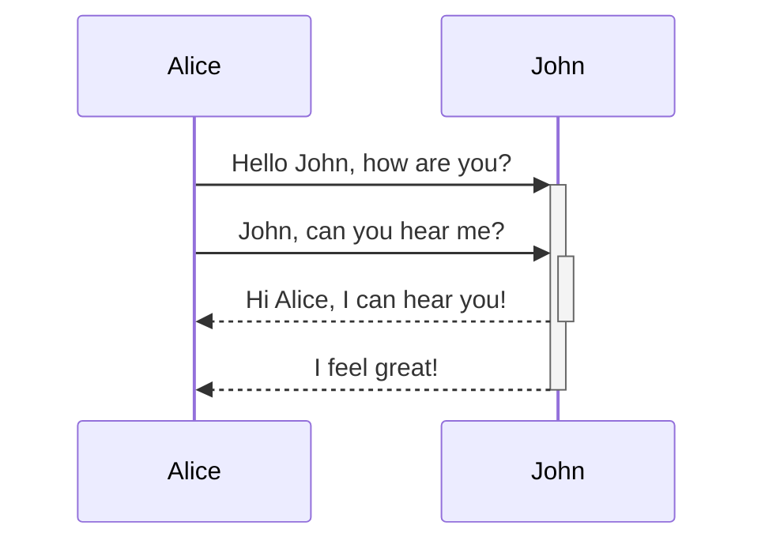
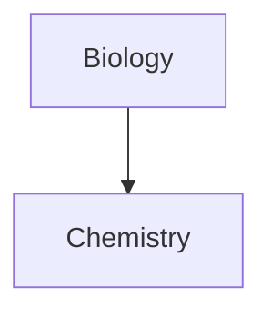

## Diagram

You can add diagrams and charts to your notes, using [Mermaid](https://mermaid-js.github.io/). Mermaid supports a range of diagrams, such as [flow charts](https://mermaid.js.org/syntax/flowchart.html), [sequence diagrams](https://mermaid.js.org/syntax/sequenceDiagram.html), and [timelines](https://mermaid.js.org/syntax/timeline.html).

> [!tip] there is a live editor that you can use before adding diagrams if you're unsure
> [Live Editor](https://mermaid-js.github.io/mermaid-live-editor)

To add a Mermaid diagram, create a `mermaid` [[00 Obsidian writing#Codeblock]].
as the language name at the end of the third backtick add `mermaid`
````md

````


````md

````


### Linking files in a diagram

You can create [internal links](https://help.obsidian.md/Linking+notes+and+files/Internal+links) in your diagrams by attaching the `internal-link` [class](https://mermaid.js.org/syntax/flowchart.html#classes) to your nodes.

````md

````

Internal links from diagrams don't show up in the [Graph view](https://help.obsidian.md/Plugins/Graph+view).
For more information about creating diagrams, refer to the [official Mermaid docs](https://mermaid.js.org/intro/).
