# ECE2004 Midterm 1 — Offline Practice Pack

> [!important]
> **Offline and self-contained.** This note contains the formula sheet, study cards, 200 original Midterm-1-level prompts, locally stored circuit diagrams, and answer keys. It does not require web access.

## Midterm level and method

The sample exam is introductory DC circuit analysis. The hard part is not algebra. It is choosing a sign convention, recognizing topology, and showing the work.

1. Draw current arrows and voltage polarities.
2. Reduce clear series/parallel portions first.
3. State one KVL or KCL sign convention and keep it.
4. Use $V=IR$ and $P=VI$.
5. Check $\sum P=0$ when source power is requested.

## Formula sheet

| Topic | Formula / rule |
|---|---|
| Ohm’s law | $V=IR$ |
| KVL | $\sum v=0$ around any closed loop |
| KCL | $\sum I_{in}=\sum I_{out}$ at a node |
| Power | $P=VI=I^2R=V^2/R$ |
| Series resistors | $R_T=\sum R_i$ |
| Parallel resistors | $1/R_T=\sum 1/R_i$ |
| Source sign | Current entering $+$: absorbed, $P>0$; leaving $+$: delivered, $P<0$ |
| Independent loops | $L=E-N+1$ for a connected circuit |

## Worked examples

### Example 1 — KVL


A $24\,\mathrm{V}$ source drives $2\,\Omega$, $4\,\Omega$, and $6\,\Omega$ in series.

- $R_T=2+4+6=12\,\Omega$
- $I=24/12=2\,\mathrm{A}$
- $V_1=4\,\mathrm{V}$, $V_2=8\,\mathrm{V}$, and $V_3=12\,\mathrm{V}$
- KVL check: $24-4-8-12=0$

### Example 2 — source power


A $12\,\mathrm{V}$ source has $0.5\,\mathrm{A}$ leaving its positive terminal.

- $P=-VI=-(12)(0.5)=-6\,\mathrm{W}$
- The source **delivers** $6\,\mathrm{W}$
- The rest of the circuit must absorb $6\,\mathrm{W}$

## Spaced-repetition cards #flashcards/ece

Kirchhoff’s voltage law (KVL):: $\sum_{\text{closed loop}} v_k=0$.

Kirchhoff’s current law (KCL):: At any node, $\sum I_{\text{entering}}=\sum I_{\text{leaving}}$.

Ohm’s law:: $V=IR$, so $I=V/R$ and $R=V/I$.

Resistor power formulas:: $P=VI=I^2R=V^2/R$.

Passive sign convention:: Current entering an element’s labeled $+$ terminal gives $P=+VI$; it absorbs power.

When does a source deliver power?:: When current leaves its labeled $+$ terminal, $P=-VI$ under the passive sign convention.

Circuit power check:: For a complete circuit, $\sum P=0$.

Series components share what?:: The same current.

Parallel components share what?:: The same voltage.

Series resistance:: $R_T=R_1+R_2+\cdots+R_n$.

Parallel resistance:: $\frac{1}{R_T}=\frac{1}{R_1}+\frac{1}{R_2}+\cdots+\frac{1}{R_n}$.

Two-resistor voltage divider:: $V_1=V_S\frac{R_1}{R_1+R_2}$ and $V_2=V_S\frac{R_2}{R_1+R_2}$.

Two-resistor current divider:: For two parallel resistors, $I_1=I_S\frac{R_2}{R_1+R_2}$ and $I_2=I_S\frac{R_1}{R_1+R_2}$.

How do you count an independent loop in a connected circuit?:: $L=E-N+1$, where $E$ is branches/elements and $N$ is unique nodes.

A negative current result means what?:: The actual current direction is opposite the assumed arrow.

A negative source power means what?:: The source delivers power.

A positive source power means what?:: The source absorbs power.

Before reducing a circuit, what must be true for two elements to be series?:: They share a node with no other connected branch.

Before reducing a circuit, what must be true for two elements to be parallel?:: Both terminals connect to the same two nodes.

Best first check after solving a circuit:: Check KVL, KCL, and $\sum P=0$ where applicable.


### Midterm and Lab 3 review cards #flashcards

What is the first step before writing KVL?:: Choose a loop traversal direction and mark voltage polarities/current arrows.

What does KVL say in words?:: Voltage rises and drops around any closed loop add to zero.

What does KCL say in words?:: Total current entering a node equals total current leaving it.

Which KCL form is often most intuitive?:: $\sum I_{in}=\sum I_{out}$.

Which KCL form is often useful for nodal analysis?:: The signed sum of currents at a node is $0$.

How is a resistor’s voltage polarity related to assumed current?:: Current enters the resistor’s labeled $+$ terminal and leaves its $-$ terminal.

In the direction of resistor current, is the voltage a rise or a drop?:: A drop.

What happens if an assumed loop current solves negative?:: The true current direction is opposite the assumed direction.

Can KVL be written using either all rises or all drops?:: Yes, if the sign convention is applied consistently.

What is the current through resistors in series?:: The same current flows through every series element.

What is the voltage across elements in parallel?:: The same voltage appears across every parallel element.

Can two components be series if their shared node has another branch?:: No; a direct series connection requires no other branch at the shared node.

Can two components be parallel if they share only one node?:: No; they must connect across the same two nodes.

What is the equivalent resistance of two parallel resistors?:: $R_{eq}=rac{R_1R_2}{R_1+R_2}$.

For parallel resistors, how does $R_{eq}$ compare with the smallest branch resistance?:: $R_{eq}$ is smaller than the smallest branch resistance.

What is the voltage-divider formula for $R_1$ and $R_2$ in series?:: $V_{R_1}=V_Srac{R_1}{R_1+R_2}$ and $V_{R_2}=V_Srac{R_2}{R_1+R_2}$.

What is the current-divider formula for two parallel resistors?:: $I_1=I_Srac{R_2}{R_1+R_2}$ and $I_2=I_Srac{R_1}{R_1+R_2}$.

What must be true for series-connected ideal voltage sources?:: Their voltages combine algebraically; follow their polarities.

What must be true for parallel ideal voltage sources?:: They must have the same voltage value and polarity.

What must be true for series ideal current sources?:: They must have the same current value and direction.

What must be true for parallel ideal current sources?:: Their currents combine algebraically based on direction.

What does $P>0$ mean under the passive sign convention?:: The element absorbs power.

What does $P<0$ mean under the passive sign convention?:: The element delivers power.

When does a voltage source deliver power?:: When current leaves its positive terminal.

When does a voltage source absorb power?:: When current enters its positive terminal.

What is the total-power check for a complete circuit?:: $\sum P=0$.

Can a resistor deliver power in an ordinary passive DC circuit?:: No; a resistor absorbs power.

What is an open circuit equivalent to?:: $R=\infty\,\Omega$ and $I=0$.

What is a short circuit equivalent to?:: $R=0\,\Omega$ and $V=0$ across it.

Can voltage across an open circuit be nonzero?:: Yes.

Can current through an ideal short circuit be nonzero?:: Yes.

What is a ground symbol in basic circuit analysis?:: A chosen $0\,\mathrm{V}$ reference node.

Does ground have to be physically connected to Earth?:: No; it is usually a circuit reference.

How many independent loops does a connected circuit have?:: $L=E-N+1$.

What does $E$ mean in $L=E-N+1$?:: The number of branches/elements.

What does $N$ mean in $L=E-N+1$?:: The number of unique nodes.

What is the nominal value of a $1\,\mathrm{k}\Omega$, $\pm5\%$ resistor?:: $1000\,\Omega$.

What is the allowed range of a $1\,\mathrm{k}\Omega$, $\pm5\%$ resistor?:: $950\,\Omega$ to $1050\,\Omega$.

What is the allowed range of a $1\,\mathrm{k}\Omega$, $\pm1\%$ resistor?:: $990\,\Omega$ to $1010\,\Omega$.

Does a $1024\,\Omega$ measurement meet a $1\,\mathrm{k}\Omega$, $\pm1\%$ specification?:: No. It is $+2.4\%$, outside the allowed $\pm1\%$ range.

How do you calculate a tolerance limit?:: $R_{min}=R_N(1-t)$ and $R_{max}=R_N(1+t)$.

What does a resistor power rating specify?:: The maximum safe power dissipation under stated conditions.

What is power derating?:: Reducing allowable resistor power as ambient temperature rises.

For the Lab 3 resistor curve, where is full $0.5\,\mathrm{W}$ allowed?:: Through $70^\circ\mathrm{C}$ ambient.

How is the Lab 3 derating curve used above $70^\circ\mathrm{C}$?:: Use the straight-line fraction from $100\%$ at $70^\circ\mathrm{C}$ to $0\%$ at $155^\circ\mathrm{C}$.

At fixed resistance, what happens to power if voltage doubles?:: Power quadruples because $P=V^2/R$.

How is a DC voltmeter connected?:: In parallel with the component.

How is an ohmmeter connected?:: In parallel with the component, with external power removed.

Can resistance be measured on an energized circuit?:: No. De-energize and discharge the circuit first.

How can two isolated $30\,\mathrm{V}$ supply channels make $45\,\mathrm{V}$?:: Connect them in series and set their voltages to sum to $45\,\mathrm{V}$.

What is the equivalent resistance of three equal $R$ resistors in parallel?:: $R/3$.

What is the power of three $10\,\mathrm{k}\Omega$ resistors in parallel across $40\,\mathrm{V}$?:: Each absorbs $0.160\,\mathrm{W}$; total is $0.480\,\mathrm{W}$.

What should you always show on Midterm 1 calculations?:: Equations, sign convention, intermediate work, units, and a check.


## A. KVL and Ohm’s Law — 50 questions

> [!note]
> Attempt each problem before opening its answer.

### 01


A 12 V source drives three series resistors: R1 = 2 Ω, R2 = 4 Ω, R3 = 6 Ω. Use KVL and Ohm’s law to find loop current and the voltage across each resistor. Verify the KVL sum.

> [!answer]- Answer
> - $R_T=12\,\Omega$
> - $I=1\,\mathrm{A}\approx 1\,\mathrm{A}$.
> - $V_1=2\,\mathrm{V}$, $V_2=4\,\mathrm{V}$, $V_3=6\,\mathrm{V}$
> - $V_1+V_2+V_3=12\,\mathrm{V}$.

### 02


A 18 V source drives three series resistors: R1 = 3 Ω, R2 = 6 Ω, R3 = 9 Ω. Use KVL and Ohm’s law to find loop current and the voltage across each resistor. Verify the KVL sum.

> [!answer]- Answer
> - $R_T=18\,\Omega$
> - $I=1\,\mathrm{A}\approx 1\,\mathrm{A}$.
> - $V_1=3\,\mathrm{V}$, $V_2=6\,\mathrm{V}$, $V_3=9\,\mathrm{V}$
> - $V_1+V_2+V_3=18\,\mathrm{V}$.

### 03


A 24 V source drives three series resistors: R1 = 5 Ω, R2 = 10 Ω, R3 = 15 Ω. Use KVL and Ohm’s law to find loop current and the voltage across each resistor. Verify the KVL sum.

> [!answer]- Answer
> - $R_T=30\,\Omega$
> - $I=4/5\,\mathrm{A}\approx 0.8\,\mathrm{A}$.
> - $V_1=4\,\mathrm{V}$, $V_2=8\,\mathrm{V}$, $V_3=12\,\mathrm{V}$
> - $V_1+V_2+V_3=24\,\mathrm{V}$.

### 04


A 30 V source drives three series resistors: R1 = 4 Ω, R2 = 8 Ω, R3 = 12 Ω. Use KVL and Ohm’s law to find loop current and the voltage across each resistor. Verify the KVL sum.

> [!answer]- Answer
> - $R_T=24\,\Omega$
> - $I=5/4\,\mathrm{A}\approx 1.25\,\mathrm{A}$.
> - $V_1=5\,\mathrm{V}$, $V_2=10\,\mathrm{V}$, $V_3=15\,\mathrm{V}$
> - $V_1+V_2+V_3=30\,\mathrm{V}$.

### 05


A 36 V source drives three series resistors: R1 = 6 Ω, R2 = 9 Ω, R3 = 15 Ω. Use KVL and Ohm’s law to find loop current and the voltage across each resistor. Verify the KVL sum.

> [!answer]- Answer
> - $R_T=30\,\Omega$
> - $I=6/5\,\mathrm{A}\approx 1.2\,\mathrm{A}$.
> - $V_1=36/5\,\mathrm{V}$, $V_2=54/5\,\mathrm{V}$, $V_3=18\,\mathrm{V}$
> - $V_1+V_2+V_3=36\,\mathrm{V}$.

### 06


A 48 V source drives three series resistors: R1 = 10 Ω, R2 = 20 Ω, R3 = 30 Ω. Use KVL and Ohm’s law to find loop current and the voltage across each resistor. Verify the KVL sum.

> [!answer]- Answer
> - $R_T=60\,\Omega$
> - $I=4/5\,\mathrm{A}\approx 0.8\,\mathrm{A}$.
> - $V_1=8\,\mathrm{V}$, $V_2=16\,\mathrm{V}$, $V_3=24\,\mathrm{V}$
> - $V_1+V_2+V_3=48\,\mathrm{V}$.

### 07


A 60 V source drives three series resistors: R1 = 8 Ω, R2 = 12 Ω, R3 = 20 Ω. Use KVL and Ohm’s law to find loop current and the voltage across each resistor. Verify the KVL sum.

> [!answer]- Answer
> - $R_T=40\,\Omega$
> - $I=3/2\,\mathrm{A}\approx 1.5\,\mathrm{A}$.
> - $V_1=12\,\mathrm{V}$, $V_2=18\,\mathrm{V}$, $V_3=30\,\mathrm{V}$
> - $V_1+V_2+V_3=60\,\mathrm{V}$.

### 08


A 72 V source drives three series resistors: R1 = 15 Ω, R2 = 25 Ω, R3 = 40 Ω. Use KVL and Ohm’s law to find loop current and the voltage across each resistor. Verify the KVL sum.

> [!answer]- Answer
> - $R_T=80\,\Omega$
> - $I=9/10\,\mathrm{A}\approx 0.9\,\mathrm{A}$.
> - $V_1=27/2\,\mathrm{V}$, $V_2=45/2\,\mathrm{V}$, $V_3=36\,\mathrm{V}$
> - $V_1+V_2+V_3=72\,\mathrm{V}$.

### 09


A 90 V source drives three series resistors: R1 = 12 Ω, R2 = 18 Ω, R3 = 30 Ω. Use KVL and Ohm’s law to find loop current and the voltage across each resistor. Verify the KVL sum.

> [!answer]- Answer
> - $R_T=60\,\Omega$
> - $I=3/2\,\mathrm{A}\approx 1.5\,\mathrm{A}$.
> - $V_1=18\,\mathrm{V}$, $V_2=27\,\mathrm{V}$, $V_3=45\,\mathrm{V}$
> - $V_1+V_2+V_3=90\,\mathrm{V}$.

### 10


A 120 V source drives three series resistors: R1 = 20 Ω, R2 = 30 Ω, R3 = 50 Ω. Use KVL and Ohm’s law to find loop current and the voltage across each resistor. Verify the KVL sum.

> [!answer]- Answer
> - $R_T=100\,\Omega$
> - $I=6/5\,\mathrm{A}\approx 1.2\,\mathrm{A}$.
> - $V_1=24\,\mathrm{V}$, $V_2=36\,\mathrm{V}$, $V_3=60\,\mathrm{V}$
> - $V_1+V_2+V_3=120\,\mathrm{V}$.

### 11


A 12 V source drives three series resistors: R1 = 4 Ω, R2 = 8 Ω, R3 = 12 Ω. Use KVL and Ohm’s law to find loop current and the voltage across each resistor. Verify the KVL sum.

> [!answer]- Answer
> - $R_T=24\,\Omega$
> - $I=1/2\,\mathrm{A}\approx 0.5\,\mathrm{A}$.
> - $V_1=2\,\mathrm{V}$, $V_2=4\,\mathrm{V}$, $V_3=6\,\mathrm{V}$
> - $V_1+V_2+V_3=12\,\mathrm{V}$.

### 12


A 18 V source drives three series resistors: R1 = 6 Ω, R2 = 12 Ω, R3 = 18 Ω. Use KVL and Ohm’s law to find loop current and the voltage across each resistor. Verify the KVL sum.

> [!answer]- Answer
> - $R_T=36\,\Omega$
> - $I=1/2\,\mathrm{A}\approx 0.5\,\mathrm{A}$.
> - $V_1=3\,\mathrm{V}$, $V_2=6\,\mathrm{V}$, $V_3=9\,\mathrm{V}$
> - $V_1+V_2+V_3=18\,\mathrm{V}$.

### 13


A 24 V source drives three series resistors: R1 = 10 Ω, R2 = 20 Ω, R3 = 30 Ω. Use KVL and Ohm’s law to find loop current and the voltage across each resistor. Verify the KVL sum.

> [!answer]- Answer
> - $R_T=60\,\Omega$
> - $I=2/5\,\mathrm{A}\approx 0.4\,\mathrm{A}$.
> - $V_1=4\,\mathrm{V}$, $V_2=8\,\mathrm{V}$, $V_3=12\,\mathrm{V}$
> - $V_1+V_2+V_3=24\,\mathrm{V}$.

### 14


A 30 V source drives three series resistors: R1 = 8 Ω, R2 = 16 Ω, R3 = 24 Ω. Use KVL and Ohm’s law to find loop current and the voltage across each resistor. Verify the KVL sum.

> [!answer]- Answer
> - $R_T=48\,\Omega$
> - $I=5/8\,\mathrm{A}\approx 0.625\,\mathrm{A}$.
> - $V_1=5\,\mathrm{V}$, $V_2=10\,\mathrm{V}$, $V_3=15\,\mathrm{V}$
> - $V_1+V_2+V_3=30\,\mathrm{V}$.

### 15


A 36 V source drives three series resistors: R1 = 12 Ω, R2 = 18 Ω, R3 = 30 Ω. Use KVL and Ohm’s law to find loop current and the voltage across each resistor. Verify the KVL sum.

> [!answer]- Answer
> - $R_T=60\,\Omega$
> - $I=3/5\,\mathrm{A}\approx 0.6\,\mathrm{A}$.
> - $V_1=36/5\,\mathrm{V}$, $V_2=54/5\,\mathrm{V}$, $V_3=18\,\mathrm{V}$
> - $V_1+V_2+V_3=36\,\mathrm{V}$.

### 16


A 48 V source drives three series resistors: R1 = 20 Ω, R2 = 40 Ω, R3 = 60 Ω. Use KVL and Ohm’s law to find loop current and the voltage across each resistor. Verify the KVL sum.

> [!answer]- Answer
> - $R_T=120\,\Omega$
> - $I=2/5\,\mathrm{A}\approx 0.4\,\mathrm{A}$.
> - $V_1=8\,\mathrm{V}$, $V_2=16\,\mathrm{V}$, $V_3=24\,\mathrm{V}$
> - $V_1+V_2+V_3=48\,\mathrm{V}$.

### 17


A 60 V source drives three series resistors: R1 = 16 Ω, R2 = 24 Ω, R3 = 40 Ω. Use KVL and Ohm’s law to find loop current and the voltage across each resistor. Verify the KVL sum.

> [!answer]- Answer
> - $R_T=80\,\Omega$
> - $I=3/4\,\mathrm{A}\approx 0.75\,\mathrm{A}$.
> - $V_1=12\,\mathrm{V}$, $V_2=18\,\mathrm{V}$, $V_3=30\,\mathrm{V}$
> - $V_1+V_2+V_3=60\,\mathrm{V}$.

### 18


A 72 V source drives three series resistors: R1 = 30 Ω, R2 = 50 Ω, R3 = 80 Ω. Use KVL and Ohm’s law to find loop current and the voltage across each resistor. Verify the KVL sum.

> [!answer]- Answer
> - $R_T=160\,\Omega$
> - $I=9/20\,\mathrm{A}\approx 0.45\,\mathrm{A}$.
> - $V_1=27/2\,\mathrm{V}$, $V_2=45/2\,\mathrm{V}$, $V_3=36\,\mathrm{V}$
> - $V_1+V_2+V_3=72\,\mathrm{V}$.

### 19


A 90 V source drives three series resistors: R1 = 24 Ω, R2 = 36 Ω, R3 = 60 Ω. Use KVL and Ohm’s law to find loop current and the voltage across each resistor. Verify the KVL sum.

> [!answer]- Answer
> - $R_T=120\,\Omega$
> - $I=3/4\,\mathrm{A}\approx 0.75\,\mathrm{A}$.
> - $V_1=18\,\mathrm{V}$, $V_2=27\,\mathrm{V}$, $V_3=45\,\mathrm{V}$
> - $V_1+V_2+V_3=90\,\mathrm{V}$.

### 20


A 120 V source drives three series resistors: R1 = 40 Ω, R2 = 60 Ω, R3 = 100 Ω. Use KVL and Ohm’s law to find loop current and the voltage across each resistor. Verify the KVL sum.

> [!answer]- Answer
> - $R_T=200\,\Omega$
> - $I=3/5\,\mathrm{A}\approx 0.6\,\mathrm{A}$.
> - $V_1=24\,\mathrm{V}$, $V_2=36\,\mathrm{V}$, $V_3=60\,\mathrm{V}$
> - $V_1+V_2+V_3=120\,\mathrm{V}$.

### 21


A 12 V source drives three series resistors: R1 = 6 Ω, R2 = 12 Ω, R3 = 18 Ω. Use KVL and Ohm’s law to find loop current and the voltage across each resistor. Verify the KVL sum.

> [!answer]- Answer
> - $R_T=36\,\Omega$
> - $I=1/3\,\mathrm{A}\approx 0.3333\,\mathrm{A}$.
> - $V_1=2\,\mathrm{V}$, $V_2=4\,\mathrm{V}$, $V_3=6\,\mathrm{V}$
> - $V_1+V_2+V_3=12\,\mathrm{V}$.

### 22

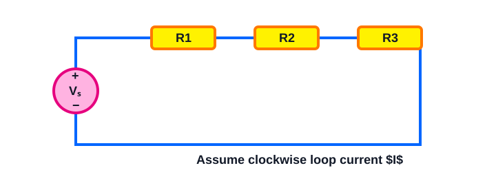

A 18 V source drives three series resistors: R1 = 9 Ω, R2 = 18 Ω, R3 = 27 Ω. Use KVL and Ohm’s law to find loop current and the voltage across each resistor. Verify the KVL sum.

> [!answer]- Answer
> - $R_T=54\,\Omega$
> - $I=1/3\,\mathrm{A}\approx 0.3333\,\mathrm{A}$.
> - $V_1=3\,\mathrm{V}$, $V_2=6\,\mathrm{V}$, $V_3=9\,\mathrm{V}$
> - $V_1+V_2+V_3=18\,\mathrm{V}$.

### 23


A 24 V source drives three series resistors: R1 = 15 Ω, R2 = 30 Ω, R3 = 45 Ω. Use KVL and Ohm’s law to find loop current and the voltage across each resistor. Verify the KVL sum.

> [!answer]- Answer
> - $R_T=90\,\Omega$
> - $I=4/15\,\mathrm{A}\approx 0.2667\,\mathrm{A}$.
> - $V_1=4\,\mathrm{V}$, $V_2=8\,\mathrm{V}$, $V_3=12\,\mathrm{V}$
> - $V_1+V_2+V_3=24\,\mathrm{V}$.

### 24


A 30 V source drives three series resistors: R1 = 12 Ω, R2 = 24 Ω, R3 = 36 Ω. Use KVL and Ohm’s law to find loop current and the voltage across each resistor. Verify the KVL sum.

> [!answer]- Answer
> - $R_T=72\,\Omega$
> - $I=5/12\,\mathrm{A}\approx 0.4167\,\mathrm{A}$.
> - $V_1=5\,\mathrm{V}$, $V_2=10\,\mathrm{V}$, $V_3=15\,\mathrm{V}$
> - $V_1+V_2+V_3=30\,\mathrm{V}$.

### 25


A 36 V source drives three series resistors: R1 = 18 Ω, R2 = 27 Ω, R3 = 45 Ω. Use KVL and Ohm’s law to find loop current and the voltage across each resistor. Verify the KVL sum.

> [!answer]- Answer
> - $R_T=90\,\Omega$
> - $I=2/5\,\mathrm{A}\approx 0.4\,\mathrm{A}$.
> - $V_1=36/5\,\mathrm{V}$, $V_2=54/5\,\mathrm{V}$, $V_3=18\,\mathrm{V}$
> - $V_1+V_2+V_3=36\,\mathrm{V}$.

### 26


A 48 V source drives three series resistors: R1 = 30 Ω, R2 = 60 Ω, R3 = 90 Ω. Use KVL and Ohm’s law to find loop current and the voltage across each resistor. Verify the KVL sum.

> [!answer]- Answer
> - $R_T=180\,\Omega$
> - $I=4/15\,\mathrm{A}\approx 0.2667\,\mathrm{A}$.
> - $V_1=8\,\mathrm{V}$, $V_2=16\,\mathrm{V}$, $V_3=24\,\mathrm{V}$
> - $V_1+V_2+V_3=48\,\mathrm{V}$.

### 27


A 60 V source drives three series resistors: R1 = 24 Ω, R2 = 36 Ω, R3 = 60 Ω. Use KVL and Ohm’s law to find loop current and the voltage across each resistor. Verify the KVL sum.

> [!answer]- Answer
> - $R_T=120\,\Omega$
> - $I=1/2\,\mathrm{A}\approx 0.5\,\mathrm{A}$.
> - $V_1=12\,\mathrm{V}$, $V_2=18\,\mathrm{V}$, $V_3=30\,\mathrm{V}$
> - $V_1+V_2+V_3=60\,\mathrm{V}$.

### 28


A 72 V source drives three series resistors: R1 = 45 Ω, R2 = 75 Ω, R3 = 120 Ω. Use KVL and Ohm’s law to find loop current and the voltage across each resistor. Verify the KVL sum.

> [!answer]- Answer
> - $R_T=240\,\Omega$
> - $I=3/10\,\mathrm{A}\approx 0.3\,\mathrm{A}$.
> - $V_1=27/2\,\mathrm{V}$, $V_2=45/2\,\mathrm{V}$, $V_3=36\,\mathrm{V}$
> - $V_1+V_2+V_3=72\,\mathrm{V}$.

### 29


A 90 V source drives three series resistors: R1 = 36 Ω, R2 = 54 Ω, R3 = 90 Ω. Use KVL and Ohm’s law to find loop current and the voltage across each resistor. Verify the KVL sum.

> [!answer]- Answer
> - $R_T=180\,\Omega$
> - $I=1/2\,\mathrm{A}\approx 0.5\,\mathrm{A}$.
> - $V_1=18\,\mathrm{V}$, $V_2=27\,\mathrm{V}$, $V_3=45\,\mathrm{V}$
> - $V_1+V_2+V_3=90\,\mathrm{V}$.

### 30


A 120 V source drives three series resistors: R1 = 60 Ω, R2 = 90 Ω, R3 = 150 Ω. Use KVL and Ohm’s law to find loop current and the voltage across each resistor. Verify the KVL sum.

> [!answer]- Answer
> - $R_T=300\,\Omega$
> - $I=2/5\,\mathrm{A}\approx 0.4\,\mathrm{A}$.
> - $V_1=24\,\mathrm{V}$, $V_2=36\,\mathrm{V}$, $V_3=60\,\mathrm{V}$
> - $V_1+V_2+V_3=120\,\mathrm{V}$.

### 31


One loop contains a 12 V source, a 3 V source opposing it, and a 10 Ω resistor. Traverse clockwise, write KVL, then find the current. State its actual direction if your answer is negative.

> [!answer]- Answer
> - With clockwise traversal, $+12-3-I(10)=0$, so $I=9/10\,\mathrm{A}\approx 0.9\,\mathrm{A}$.
> - Positive means clockwise.

### 32


One loop contains a 15 V source and two series resistors of 15 Ω and 7 Ω. A labeled resistor voltage Vx is across the 7 Ω resistor with polarity (+) where assumed clockwise current enters. Write KVL and solve for Vx and current.

> [!answer]- Answer
> - $+15-I(15)-I(7)=0$
> - $I=15/22\,\mathrm{A}\approx 0.6818\,\mathrm{A}$, and $V_x=I(7)=105/22\,\mathrm{V}\approx 4.773\,\mathrm{V}$.

### 33

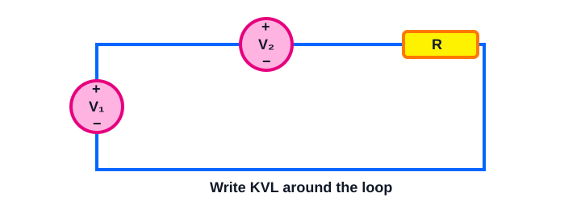

One loop contains a 18 V source, a 6 V source opposing it, and a 20 Ω resistor. Traverse clockwise, write KVL, then find the current. State its actual direction if your answer is negative.

> [!answer]- Answer
> - With clockwise traversal, $+18-6-I(20)=0$, so $I=3/5\,\mathrm{A}\approx 0.6\,\mathrm{A}$.
> - Positive means clockwise.

### 34


One loop contains a 20 V source and two series resistors of 25 Ω and 12 Ω. A labeled resistor voltage Vx is across the 12 Ω resistor with polarity (+) where assumed clockwise current enters. Write KVL and solve for Vx and current.

> [!answer]- Answer
> - $+20-I(25)-I(12)=0$
> - $I=20/37\,\mathrm{A}\approx 0.5405\,\mathrm{A}$, and $V_x=I(12)=240/37\,\mathrm{V}\approx 6.486\,\mathrm{V}$.

### 35


One loop contains a 24 V source, a 9 V source opposing it, and a 30 Ω resistor. Traverse clockwise, write KVL, then find the current. State its actual direction if your answer is negative.

> [!answer]- Answer
> - With clockwise traversal, $+24-9-I(30)=0$, so $I=1/2\,\mathrm{A}\approx 0.5\,\mathrm{A}$.
> - Positive means clockwise.

### 36


One loop contains a 30 V source and two series resistors of 40 Ω and 20 Ω. A labeled resistor voltage Vx is across the 20 Ω resistor with polarity (+) where assumed clockwise current enters. Write KVL and solve for Vx and current.

> [!answer]- Answer
> - $+30-I(40)-I(20)=0$
> - $I=1/2\,\mathrm{A}\approx 0.5\,\mathrm{A}$, and $V_x=I(20)=10\,\mathrm{V}\approx 10\,\mathrm{V}$.

### 37


One loop contains a 36 V source, a 12 V source opposing it, and a 50 Ω resistor. Traverse clockwise, write KVL, then find the current. State its actual direction if your answer is negative.

> [!answer]- Answer
> - With clockwise traversal, $+36-12-I(50)=0$, so $I=12/25\,\mathrm{A}\approx 0.48\,\mathrm{A}$.
> - Positive means clockwise.

### 38


One loop contains a 40 V source and two series resistors of 60 Ω and 30 Ω. A labeled resistor voltage Vx is across the 30 Ω resistor with polarity (+) where assumed clockwise current enters. Write KVL and solve for Vx and current.

> [!answer]- Answer
> - $+40-I(60)-I(30)=0$
> - $I=4/9\,\mathrm{A}\approx 0.4444\,\mathrm{A}$, and $V_x=I(30)=40/3\,\mathrm{V}\approx 13.33\,\mathrm{V}$.

### 39


One loop contains a 45 V source, a 18 V source opposing it, and a 75 Ω resistor. Traverse clockwise, write KVL, then find the current. State its actual direction if your answer is negative.

> [!answer]- Answer
> - With clockwise traversal, $+45-18-I(75)=0$, so $I=9/25\,\mathrm{A}\approx 0.36\,\mathrm{A}$.
> - Positive means clockwise.

### 40


One loop contains a 48 V source and two series resistors of 100 Ω and 50 Ω. A labeled resistor voltage Vx is across the 50 Ω resistor with polarity (+) where assumed clockwise current enters. Write KVL and solve for Vx and current.

> [!answer]- Answer
> - $+48-I(100)-I(50)=0$
> - $I=8/25\,\mathrm{A}\approx 0.32\,\mathrm{A}$, and $V_x=I(50)=16\,\mathrm{V}\approx 16\,\mathrm{V}$.

### 41


One loop contains a 12 V source, a 3 V source opposing it, and a 10 Ω resistor. Traverse clockwise, write KVL, then find the current. State its actual direction if your answer is negative.

> [!answer]- Answer
> - With clockwise traversal, $+12-3-I(10)=0$, so $I=9/10\,\mathrm{A}\approx 0.9\,\mathrm{A}$.
> - Positive means clockwise.

### 42


One loop contains a 15 V source and two series resistors of 15 Ω and 7 Ω. A labeled resistor voltage Vx is across the 7 Ω resistor with polarity (+) where assumed clockwise current enters. Write KVL and solve for Vx and current.

> [!answer]- Answer
> - $+15-I(15)-I(7)=0$
> - $I=15/22\,\mathrm{A}\approx 0.6818\,\mathrm{A}$, and $V_x=I(7)=105/22\,\mathrm{V}\approx 4.773\,\mathrm{V}$.

### 43


One loop contains a 18 V source, a 6 V source opposing it, and a 20 Ω resistor. Traverse clockwise, write KVL, then find the current. State its actual direction if your answer is negative.

> [!answer]- Answer
> - With clockwise traversal, $+18-6-I(20)=0$, so $I=3/5\,\mathrm{A}\approx 0.6\,\mathrm{A}$.
> - Positive means clockwise.

### 44


One loop contains a 20 V source and two series resistors of 25 Ω and 12 Ω. A labeled resistor voltage Vx is across the 12 Ω resistor with polarity (+) where assumed clockwise current enters. Write KVL and solve for Vx and current.

> [!answer]- Answer
> - $+20-I(25)-I(12)=0$
> - $I=20/37\,\mathrm{A}\approx 0.5405\,\mathrm{A}$, and $V_x=I(12)=240/37\,\mathrm{V}\approx 6.486\,\mathrm{V}$.

### 45


One loop contains a 24 V source, a 9 V source opposing it, and a 30 Ω resistor. Traverse clockwise, write KVL, then find the current. State its actual direction if your answer is negative.

> [!answer]- Answer
> - With clockwise traversal, $+24-9-I(30)=0$, so $I=1/2\,\mathrm{A}\approx 0.5\,\mathrm{A}$.
> - Positive means clockwise.

### 46


One loop contains a 30 V source and two series resistors of 40 Ω and 20 Ω. A labeled resistor voltage Vx is across the 20 Ω resistor with polarity (+) where assumed clockwise current enters. Write KVL and solve for Vx and current.

> [!answer]- Answer
> - $+30-I(40)-I(20)=0$
> - $I=1/2\,\mathrm{A}\approx 0.5\,\mathrm{A}$, and $V_x=I(20)=10\,\mathrm{V}\approx 10\,\mathrm{V}$.

### 47


One loop contains a 36 V source, a 12 V source opposing it, and a 50 Ω resistor. Traverse clockwise, write KVL, then find the current. State its actual direction if your answer is negative.

> [!answer]- Answer
> - With clockwise traversal, $+36-12-I(50)=0$, so $I=12/25\,\mathrm{A}\approx 0.48\,\mathrm{A}$.
> - Positive means clockwise.

### 48


One loop contains a 40 V source and two series resistors of 60 Ω and 30 Ω. A labeled resistor voltage Vx is across the 30 Ω resistor with polarity (+) where assumed clockwise current enters. Write KVL and solve for Vx and current.

> [!answer]- Answer
> - $+40-I(60)-I(30)=0$
> - $I=4/9\,\mathrm{A}\approx 0.4444\,\mathrm{A}$, and $V_x=I(30)=40/3\,\mathrm{V}\approx 13.33\,\mathrm{V}$.

### 49


One loop contains a 45 V source, a 18 V source opposing it, and a 75 Ω resistor. Traverse clockwise, write KVL, then find the current. State its actual direction if your answer is negative.

> [!answer]- Answer
> - With clockwise traversal, $+45-18-I(75)=0$, so $I=9/25\,\mathrm{A}\approx 0.36\,\mathrm{A}$.
> - Positive means clockwise.

### 50

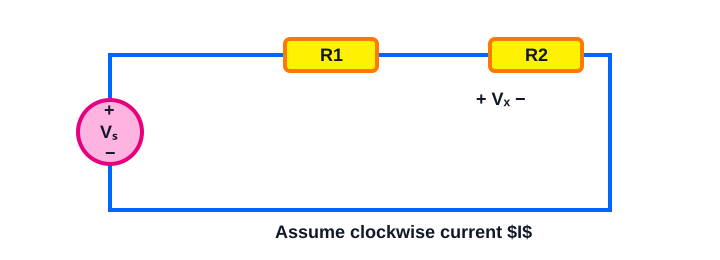

One loop contains a 48 V source and two series resistors of 100 Ω and 50 Ω. A labeled resistor voltage Vx is across the 50 Ω resistor with polarity (+) where assumed clockwise current enters. Write KVL and solve for Vx and current.

> [!answer]- Answer
> - $+48-I(100)-I(50)=0$
> - $I=8/25\,\mathrm{A}\approx 0.32\,\mathrm{A}$, and $V_x=I(50)=16\,\mathrm{V}\approx 16\,\mathrm{V}$.

## B. KCL and Circuit Reduction — 50 questions

> [!note]
> Attempt each problem before opening its answer.

### 01


A 10 V ideal source is connected across three parallel resistors: 100 Ω, 200 Ω, and 300 Ω. Find each branch current using Ohm’s law, then use KCL to find source current and equivalent resistance.

> [!answer]- Answer
> - $I_1=0.1\,\mathrm{A}$, $I_2=0.05\,\mathrm{A}$, $I_3=0.03333\,\mathrm{A}$
> - $I_S=I_1+I_2+I_3=0.1833\,\mathrm{A}$
> - $R_{eq}=54.55\,\Omega$.

### 02


A 12 V source feeds a 120 Ω resistor in series with a parallel pair of 240 Ω and 360 Ω. Reduce the network, find source current, then use KCL at the split node to find both branch currents.

> [!answer]- Answer
> - $R_P=144\,\Omega$, $R_T=264\,\Omega$, $I_S=0.04545\,\mathrm{A}$
> - branch currents: $I_{240}=0.02727\,\mathrm{A}$, $I_{360}=0.01818\,\mathrm{A}$, and $I_S=I_{240}+I_{360}$.

### 03

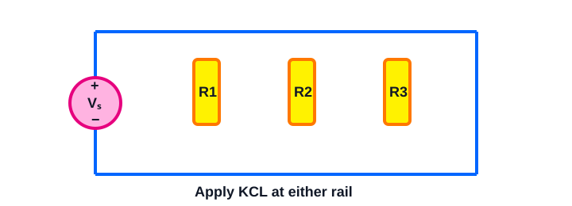

A 15 V ideal source is connected across three parallel resistors: 150 Ω, 300 Ω, and 450 Ω. Find each branch current using Ohm’s law, then use KCL to find source current and equivalent resistance.

> [!answer]- Answer
> - $I_1=0.1\,\mathrm{A}$, $I_2=0.05\,\mathrm{A}$, $I_3=0.03333\,\mathrm{A}$
> - $I_S=I_1+I_2+I_3=0.1833\,\mathrm{A}$
> - $R_{eq}=81.82\,\Omega$.

### 04


A 18 V source feeds a 180 Ω resistor in series with a parallel pair of 360 Ω and 540 Ω. Reduce the network, find source current, then use KCL at the split node to find both branch currents.

> [!answer]- Answer
> - $R_P=216\,\Omega$, $R_T=396\,\Omega$, $I_S=0.04545\,\mathrm{A}$
> - branch currents: $I_{360}=0.02727\,\mathrm{A}$, $I_{540}=0.01818\,\mathrm{A}$, and $I_S=I_{360}+I_{540}$.

### 05


A 20 V ideal source is connected across three parallel resistors: 200 Ω, 400 Ω, and 600 Ω. Find each branch current using Ohm’s law, then use KCL to find source current and equivalent resistance.

> [!answer]- Answer
> - $I_1=0.1\,\mathrm{A}$, $I_2=0.05\,\mathrm{A}$, $I_3=0.03333\,\mathrm{A}$
> - $I_S=I_1+I_2+I_3=0.1833\,\mathrm{A}$
> - $R_{eq}=109.1\,\Omega$.

### 06


A 24 V source feeds a 240 Ω resistor in series with a parallel pair of 480 Ω and 720 Ω. Reduce the network, find source current, then use KCL at the split node to find both branch currents.

> [!answer]- Answer
> - $R_P=288\,\Omega$, $R_T=528\,\Omega$, $I_S=0.04545\,\mathrm{A}$
> - branch currents: $I_{480}=0.02727\,\mathrm{A}$, $I_{720}=0.01818\,\mathrm{A}$, and $I_S=I_{480}+I_{720}$.

### 07


A 30 V ideal source is connected across three parallel resistors: 300 Ω, 600 Ω, and 900 Ω. Find each branch current using Ohm’s law, then use KCL to find source current and equivalent resistance.

> [!answer]- Answer
> - $I_1=0.1\,\mathrm{A}$, $I_2=0.05\,\mathrm{A}$, $I_3=0.03333\,\mathrm{A}$
> - $I_S=I_1+I_2+I_3=0.1833\,\mathrm{A}$
> - $R_{eq}=163.6\,\Omega$.

### 08


A 36 V source feeds a 360 Ω resistor in series with a parallel pair of 720 Ω and 1080 Ω. Reduce the network, find source current, then use KCL at the split node to find both branch currents.

> [!answer]- Answer
> - $R_P=432\,\Omega$, $R_T=792\,\Omega$, $I_S=0.04545\,\mathrm{A}$
> - branch currents: $I_{720}=0.02727\,\mathrm{A}$, $I_{1080}=0.01818\,\mathrm{A}$, and $I_S=I_{720}+I_{1080}$.

### 09


A 40 V ideal source is connected across three parallel resistors: 400 Ω, 800 Ω, and 1200 Ω. Find each branch current using Ohm’s law, then use KCL to find source current and equivalent resistance.

> [!answer]- Answer
> - $I_1=0.1\,\mathrm{A}$, $I_2=0.05\,\mathrm{A}$, $I_3=0.03333\,\mathrm{A}$
> - $I_S=I_1+I_2+I_3=0.1833\,\mathrm{A}$
> - $R_{eq}=218.2\,\Omega$.

### 10


A 48 V source feeds a 480 Ω resistor in series with a parallel pair of 960 Ω and 1440 Ω. Reduce the network, find source current, then use KCL at the split node to find both branch currents.

> [!answer]- Answer
> - $R_P=576\,\Omega$, $R_T=1056\,\Omega$, $I_S=0.04545\,\mathrm{A}$
> - branch currents: $I_{960}=0.02727\,\mathrm{A}$, $I_{1440}=0.01818\,\mathrm{A}$, and $I_S=I_{960}+I_{1440}$.

### 11


A 10 V ideal source is connected across three parallel resistors: 100 Ω, 200 Ω, and 300 Ω. Find each branch current using Ohm’s law, then use KCL to find source current and equivalent resistance.

> [!answer]- Answer
> - $I_1=0.1\,\mathrm{A}$, $I_2=0.05\,\mathrm{A}$, $I_3=0.03333\,\mathrm{A}$
> - $I_S=I_1+I_2+I_3=0.1833\,\mathrm{A}$
> - $R_{eq}=54.55\,\Omega$.

### 12


A 12 V source feeds a 120 Ω resistor in series with a parallel pair of 240 Ω and 360 Ω. Reduce the network, find source current, then use KCL at the split node to find both branch currents.

> [!answer]- Answer
> - $R_P=144\,\Omega$, $R_T=264\,\Omega$, $I_S=0.04545\,\mathrm{A}$
> - branch currents: $I_{240}=0.02727\,\mathrm{A}$, $I_{360}=0.01818\,\mathrm{A}$, and $I_S=I_{240}+I_{360}$.

### 13


A 15 V ideal source is connected across three parallel resistors: 150 Ω, 300 Ω, and 450 Ω. Find each branch current using Ohm’s law, then use KCL to find source current and equivalent resistance.

> [!answer]- Answer
> - $I_1=0.1\,\mathrm{A}$, $I_2=0.05\,\mathrm{A}$, $I_3=0.03333\,\mathrm{A}$
> - $I_S=I_1+I_2+I_3=0.1833\,\mathrm{A}$
> - $R_{eq}=81.82\,\Omega$.

### 14


A 18 V source feeds a 180 Ω resistor in series with a parallel pair of 360 Ω and 540 Ω. Reduce the network, find source current, then use KCL at the split node to find both branch currents.

> [!answer]- Answer
> - $R_P=216\,\Omega$, $R_T=396\,\Omega$, $I_S=0.04545\,\mathrm{A}$
> - branch currents: $I_{360}=0.02727\,\mathrm{A}$, $I_{540}=0.01818\,\mathrm{A}$, and $I_S=I_{360}+I_{540}$.

### 15


A 20 V ideal source is connected across three parallel resistors: 200 Ω, 400 Ω, and 600 Ω. Find each branch current using Ohm’s law, then use KCL to find source current and equivalent resistance.

> [!answer]- Answer
> - $I_1=0.1\,\mathrm{A}$, $I_2=0.05\,\mathrm{A}$, $I_3=0.03333\,\mathrm{A}$
> - $I_S=I_1+I_2+I_3=0.1833\,\mathrm{A}$
> - $R_{eq}=109.1\,\Omega$.

### 16


A 24 V source feeds a 240 Ω resistor in series with a parallel pair of 480 Ω and 720 Ω. Reduce the network, find source current, then use KCL at the split node to find both branch currents.

> [!answer]- Answer
> - $R_P=288\,\Omega$, $R_T=528\,\Omega$, $I_S=0.04545\,\mathrm{A}$
> - branch currents: $I_{480}=0.02727\,\mathrm{A}$, $I_{720}=0.01818\,\mathrm{A}$, and $I_S=I_{480}+I_{720}$.

### 17


A 30 V ideal source is connected across three parallel resistors: 300 Ω, 600 Ω, and 900 Ω. Find each branch current using Ohm’s law, then use KCL to find source current and equivalent resistance.

> [!answer]- Answer
> - $I_1=0.1\,\mathrm{A}$, $I_2=0.05\,\mathrm{A}$, $I_3=0.03333\,\mathrm{A}$
> - $I_S=I_1+I_2+I_3=0.1833\,\mathrm{A}$
> - $R_{eq}=163.6\,\Omega$.

### 18

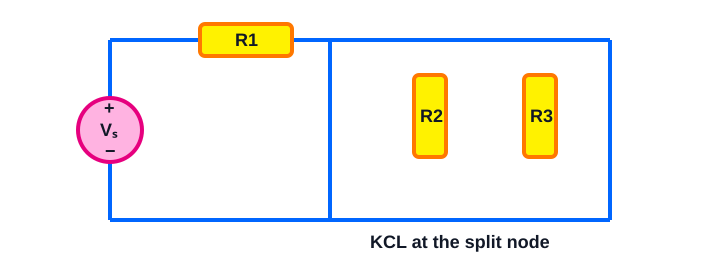

A 36 V source feeds a 360 Ω resistor in series with a parallel pair of 720 Ω and 1080 Ω. Reduce the network, find source current, then use KCL at the split node to find both branch currents.

> [!answer]- Answer
> - $R_P=432\,\Omega$, $R_T=792\,\Omega$, $I_S=0.04545\,\mathrm{A}$
> - branch currents: $I_{720}=0.02727\,\mathrm{A}$, $I_{1080}=0.01818\,\mathrm{A}$, and $I_S=I_{720}+I_{1080}$.

### 19


A 40 V ideal source is connected across three parallel resistors: 400 Ω, 800 Ω, and 1200 Ω. Find each branch current using Ohm’s law, then use KCL to find source current and equivalent resistance.

> [!answer]- Answer
> - $I_1=0.1\,\mathrm{A}$, $I_2=0.05\,\mathrm{A}$, $I_3=0.03333\,\mathrm{A}$
> - $I_S=I_1+I_2+I_3=0.1833\,\mathrm{A}$
> - $R_{eq}=218.2\,\Omega$.

### 20


A 48 V source feeds a 480 Ω resistor in series with a parallel pair of 960 Ω and 1440 Ω. Reduce the network, find source current, then use KCL at the split node to find both branch currents.

> [!answer]- Answer
> - $R_P=576\,\Omega$, $R_T=1056\,\Omega$, $I_S=0.04545\,\mathrm{A}$
> - branch currents: $I_{960}=0.02727\,\mathrm{A}$, $I_{1440}=0.01818\,\mathrm{A}$, and $I_S=I_{960}+I_{1440}$.

### 21


A 10 V ideal source is connected across three parallel resistors: 100 Ω, 200 Ω, and 300 Ω. Find each branch current using Ohm’s law, then use KCL to find source current and equivalent resistance.

> [!answer]- Answer
> - $I_1=0.1\,\mathrm{A}$, $I_2=0.05\,\mathrm{A}$, $I_3=0.03333\,\mathrm{A}$
> - $I_S=I_1+I_2+I_3=0.1833\,\mathrm{A}$
> - $R_{eq}=54.55\,\Omega$.

### 22


A 12 V source feeds a 120 Ω resistor in series with a parallel pair of 240 Ω and 360 Ω. Reduce the network, find source current, then use KCL at the split node to find both branch currents.

> [!answer]- Answer
> - $R_P=144\,\Omega$, $R_T=264\,\Omega$, $I_S=0.04545\,\mathrm{A}$
> - branch currents: $I_{240}=0.02727\,\mathrm{A}$, $I_{360}=0.01818\,\mathrm{A}$, and $I_S=I_{240}+I_{360}$.

### 23


A 15 V ideal source is connected across three parallel resistors: 150 Ω, 300 Ω, and 450 Ω. Find each branch current using Ohm’s law, then use KCL to find source current and equivalent resistance.

> [!answer]- Answer
> - $I_1=0.1\,\mathrm{A}$, $I_2=0.05\,\mathrm{A}$, $I_3=0.03333\,\mathrm{A}$
> - $I_S=I_1+I_2+I_3=0.1833\,\mathrm{A}$
> - $R_{eq}=81.82\,\Omega$.

### 24


A 18 V source feeds a 180 Ω resistor in series with a parallel pair of 360 Ω and 540 Ω. Reduce the network, find source current, then use KCL at the split node to find both branch currents.

> [!answer]- Answer
> - $R_P=216\,\Omega$, $R_T=396\,\Omega$, $I_S=0.04545\,\mathrm{A}$
> - branch currents: $I_{360}=0.02727\,\mathrm{A}$, $I_{540}=0.01818\,\mathrm{A}$, and $I_S=I_{360}+I_{540}$.

### 25


A 20 V ideal source is connected across three parallel resistors: 200 Ω, 400 Ω, and 600 Ω. Find each branch current using Ohm’s law, then use KCL to find source current and equivalent resistance.

> [!answer]- Answer
> - $I_1=0.1\,\mathrm{A}$, $I_2=0.05\,\mathrm{A}$, $I_3=0.03333\,\mathrm{A}$
> - $I_S=I_1+I_2+I_3=0.1833\,\mathrm{A}$
> - $R_{eq}=109.1\,\Omega$.

### 26


At node A, 20 mA enters from a current source. Currents of 5 mA and 3 mA leave through two branches. Define the third branch current as leaving node A. Write KCL and solve for it; interpret a negative result.

> [!answer]- Answer
> - With entering positive: $I_x=20-5-3=12\,\mathrm{mA}$.
> - It leaves as assumed.

### 27

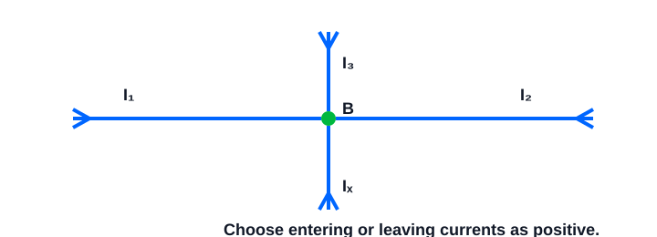

At node B, 30 mA and 8 mA enter. Two resistor-branch currents leave: one is 4 mA and the other is Ix. Write KCL with a stated sign convention and find Ix.

> [!answer]- Answer
> - Using entering = leaving: $30+8=4+I_x$, so $I_x=34\,\mathrm{mA}$ leaving.

### 28


At node A, 40 mA enters from a current source. Currents of 10 mA and 6 mA leave through two branches. Define the third branch current as leaving node A. Write KCL and solve for it; interpret a negative result.

> [!answer]- Answer
> - With entering positive: $I_x=40-10-6=24\,\mathrm{mA}$.
> - It leaves as assumed.

### 29


At node B, 50 mA and 12 mA enter. Two resistor-branch currents leave: one is 7 mA and the other is Ix. Write KCL with a stated sign convention and find Ix.

> [!answer]- Answer
> - Using entering = leaving: $50+12=7+I_x$, so $I_x=55\,\mathrm{mA}$ leaving.

### 30


At node A, 60 mA enters from a current source. Currents of 15 mA and 9 mA leave through two branches. Define the third branch current as leaving node A. Write KCL and solve for it; interpret a negative result.

> [!answer]- Answer
> - With entering positive: $I_x=60-15-9=36\,\mathrm{mA}$.
> - It leaves as assumed.

### 31


At node B, 75 mA and 18 mA enter. Two resistor-branch currents leave: one is 10 mA and the other is Ix. Write KCL with a stated sign convention and find Ix.

> [!answer]- Answer
> - Using entering = leaving: $75+18=10+I_x$, so $I_x=83\,\mathrm{mA}$ leaving.

### 32


At node A, 80 mA enters from a current source. Currents of 20 mA and 12 mA leave through two branches. Define the third branch current as leaving node A. Write KCL and solve for it; interpret a negative result.

> [!answer]- Answer
> - With entering positive: $I_x=80-20-12=48\,\mathrm{mA}$.
> - It leaves as assumed.

### 33


At node B, 90 mA and 25 mA enter. Two resistor-branch currents leave: one is 14 mA and the other is Ix. Write KCL with a stated sign convention and find Ix.

> [!answer]- Answer
> - Using entering = leaving: $90+25=14+I_x$, so $I_x=101\,\mathrm{mA}$ leaving.

### 34


At node A, 100 mA enters from a current source. Currents of 30 mA and 16 mA leave through two branches. Define the third branch current as leaving node A. Write KCL and solve for it; interpret a negative result.

> [!answer]- Answer
> - With entering positive: $I_x=100-30-16=54\,\mathrm{mA}$.
> - It leaves as assumed.

### 35


At node B, 120 mA and 35 mA enter. Two resistor-branch currents leave: one is 18 mA and the other is Ix. Write KCL with a stated sign convention and find Ix.

> [!answer]- Answer
> - Using entering = leaving: $120+35=18+I_x$, so $I_x=137\,\mathrm{mA}$ leaving.

### 36


At node A, 20 mA enters from a current source. Currents of 5 mA and 3 mA leave through two branches. Define the third branch current as leaving node A. Write KCL and solve for it; interpret a negative result.

> [!answer]- Answer
> - With entering positive: $I_x=20-5-3=12\,\mathrm{mA}$.
> - It leaves as assumed.

### 37


At node B, 30 mA and 8 mA enter. Two resistor-branch currents leave: one is 4 mA and the other is Ix. Write KCL with a stated sign convention and find Ix.

> [!answer]- Answer
> - Using entering = leaving: $30+8=4+I_x$, so $I_x=34\,\mathrm{mA}$ leaving.

### 38


At node A, 40 mA enters from a current source. Currents of 10 mA and 6 mA leave through two branches. Define the third branch current as leaving node A. Write KCL and solve for it; interpret a negative result.

> [!answer]- Answer
> - With entering positive: $I_x=40-10-6=24\,\mathrm{mA}$.
> - It leaves as assumed.

### 39


At node B, 50 mA and 12 mA enter. Two resistor-branch currents leave: one is 7 mA and the other is Ix. Write KCL with a stated sign convention and find Ix.

> [!answer]- Answer
> - Using entering = leaving: $50+12=7+I_x$, so $I_x=55\,\mathrm{mA}$ leaving.

### 40


At node A, 60 mA enters from a current source. Currents of 15 mA and 9 mA leave through two branches. Define the third branch current as leaving node A. Write KCL and solve for it; interpret a negative result.

> [!answer]- Answer
> - With entering positive: $I_x=60-15-9=36\,\mathrm{mA}$.
> - It leaves as assumed.

### 41


At node B, 75 mA and 18 mA enter. Two resistor-branch currents leave: one is 10 mA and the other is Ix. Write KCL with a stated sign convention and find Ix.

> [!answer]- Answer
> - Using entering = leaving: $75+18=10+I_x$, so $I_x=83\,\mathrm{mA}$ leaving.

### 42


At node A, 80 mA enters from a current source. Currents of 20 mA and 12 mA leave through two branches. Define the third branch current as leaving node A. Write KCL and solve for it; interpret a negative result.

> [!answer]- Answer
> - With entering positive: $I_x=80-20-12=48\,\mathrm{mA}$.
> - It leaves as assumed.

### 43


At node B, 90 mA and 25 mA enter. Two resistor-branch currents leave: one is 14 mA and the other is Ix. Write KCL with a stated sign convention and find Ix.

> [!answer]- Answer
> - Using entering = leaving: $90+25=14+I_x$, so $I_x=101\,\mathrm{mA}$ leaving.

### 44


At node A, 100 mA enters from a current source. Currents of 30 mA and 16 mA leave through two branches. Define the third branch current as leaving node A. Write KCL and solve for it; interpret a negative result.

> [!answer]- Answer
> - With entering positive: $I_x=100-30-16=54\,\mathrm{mA}$.
> - It leaves as assumed.

### 45


At node B, 120 mA and 35 mA enter. Two resistor-branch currents leave: one is 18 mA and the other is Ix. Write KCL with a stated sign convention and find Ix.

> [!answer]- Answer
> - Using entering = leaving: $120+35=18+I_x$, so $I_x=137\,\mathrm{mA}$ leaving.

### 46


At node A, 20 mA enters from a current source. Currents of 5 mA and 3 mA leave through two branches. Define the third branch current as leaving node A. Write KCL and solve for it; interpret a negative result.

> [!answer]- Answer
> - With entering positive: $I_x=20-5-3=12\,\mathrm{mA}$.
> - It leaves as assumed.

### 47


At node B, 30 mA and 8 mA enter. Two resistor-branch currents leave: one is 4 mA and the other is Ix. Write KCL with a stated sign convention and find Ix.

> [!answer]- Answer
> - Using entering = leaving: $30+8=4+I_x$, so $I_x=34\,\mathrm{mA}$ leaving.

### 48


At node A, 40 mA enters from a current source. Currents of 10 mA and 6 mA leave through two branches. Define the third branch current as leaving node A. Write KCL and solve for it; interpret a negative result.

> [!answer]- Answer
> - With entering positive: $I_x=40-10-6=24\,\mathrm{mA}$.
> - It leaves as assumed.

### 49


At node B, 50 mA and 12 mA enter. Two resistor-branch currents leave: one is 7 mA and the other is Ix. Write KCL with a stated sign convention and find Ix.

> [!answer]- Answer
> - Using entering = leaving: $50+12=7+I_x$, so $I_x=55\,\mathrm{mA}$ leaving.

### 50

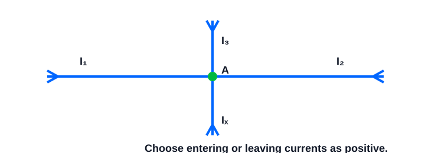

At node A, 60 mA enters from a current source. Currents of 15 mA and 9 mA leave through two branches. Define the third branch current as leaving node A. Write KCL and solve for it; interpret a negative result.

> [!answer]- Answer
> - With entering positive: $I_x=60-15-9=36\,\mathrm{mA}$.
> - It leaves as assumed.

## C. Source Power: Absorbed vs. Delivered — 50 questions

> [!note]
> Attempt each problem before opening its answer.

### 01


A 5 V voltage source has 0.1 A entering its positive terminal. Using the passive sign convention, calculate its power and state whether it absorbs or delivers power. Then state the power of a resistor that absorbs the same magnitude.

> [!answer]- Answer
> - $P_S=+VI=+0.5\,\mathrm{W}$: the source absorbs.
> - The matching resistor absorbs $0.5\,\mathrm{W}$.

### 02


A 9 V voltage source has 0.2 A leaving its positive terminal. Using P = VI with the passive sign convention, calculate signed power and state whether it absorbs or delivers power.

> [!answer]- Answer
> - Current leaves $+$, so $P_S=-VI=-1.8\,\mathrm{W}$: the source delivers $1.8\,\mathrm{W}$.

### 03


A 10 V voltage source has 0.25 A entering its positive terminal. Using the passive sign convention, calculate its power and state whether it absorbs or delivers power. Then state the power of a resistor that absorbs the same magnitude.

> [!answer]- Answer
> - $P_S=+VI=+2.5\,\mathrm{W}$: the source absorbs.
> - The matching resistor absorbs $2.5\,\mathrm{W}$.

### 04


A 12 V voltage source has 0.3 A leaving its positive terminal. Using P = VI with the passive sign convention, calculate signed power and state whether it absorbs or delivers power.

> [!answer]- Answer
> - Current leaves $+$, so $P_S=-VI=-3.6\,\mathrm{W}$: the source delivers $3.6\,\mathrm{W}$.

### 05


A 15 V voltage source has 0.4 A entering its positive terminal. Using the passive sign convention, calculate its power and state whether it absorbs or delivers power. Then state the power of a resistor that absorbs the same magnitude.

> [!answer]- Answer
> - $P_S=+VI=+6\,\mathrm{W}$: the source absorbs.
> - The matching resistor absorbs $6\,\mathrm{W}$.

### 06


A 18 V voltage source has 0.5 A leaving its positive terminal. Using P = VI with the passive sign convention, calculate signed power and state whether it absorbs or delivers power.

> [!answer]- Answer
> - Current leaves $+$, so $P_S=-VI=-9\,\mathrm{W}$: the source delivers $9\,\mathrm{W}$.

### 07


A 20 V voltage source has 0.6 A entering its positive terminal. Using the passive sign convention, calculate its power and state whether it absorbs or delivers power. Then state the power of a resistor that absorbs the same magnitude.

> [!answer]- Answer
> - $P_S=+VI=+12\,\mathrm{W}$: the source absorbs.
> - The matching resistor absorbs $12\,\mathrm{W}$.

### 08


A 24 V voltage source has 0.75 A leaving its positive terminal. Using P = VI with the passive sign convention, calculate signed power and state whether it absorbs or delivers power.

> [!answer]- Answer
> - Current leaves $+$, so $P_S=-VI=-18\,\mathrm{W}$: the source delivers $18\,\mathrm{W}$.

### 09


A 30 V voltage source has 0.8 A entering its positive terminal. Using the passive sign convention, calculate its power and state whether it absorbs or delivers power. Then state the power of a resistor that absorbs the same magnitude.

> [!answer]- Answer
> - $P_S=+VI=+24\,\mathrm{W}$: the source absorbs.
> - The matching resistor absorbs $24\,\mathrm{W}$.

### 10


A 36 V voltage source has 1.0 A leaving its positive terminal. Using P = VI with the passive sign convention, calculate signed power and state whether it absorbs or delivers power.

> [!answer]- Answer
> - Current leaves $+$, so $P_S=-VI=-36\,\mathrm{W}$: the source delivers $36\,\mathrm{W}$.

### 11


A 5 V voltage source has 0.1 A entering its positive terminal. Using the passive sign convention, calculate its power and state whether it absorbs or delivers power. Then state the power of a resistor that absorbs the same magnitude.

> [!answer]- Answer
> - $P_S=+VI=+0.5\,\mathrm{W}$: the source absorbs.
> - The matching resistor absorbs $0.5\,\mathrm{W}$.

### 12


A 9 V voltage source has 0.2 A leaving its positive terminal. Using P = VI with the passive sign convention, calculate signed power and state whether it absorbs or delivers power.

> [!answer]- Answer
> - Current leaves $+$, so $P_S=-VI=-1.8\,\mathrm{W}$: the source delivers $1.8\,\mathrm{W}$.

### 13


A 10 V voltage source has 0.25 A entering its positive terminal. Using the passive sign convention, calculate its power and state whether it absorbs or delivers power. Then state the power of a resistor that absorbs the same magnitude.

> [!answer]- Answer
> - $P_S=+VI=+2.5\,\mathrm{W}$: the source absorbs.
> - The matching resistor absorbs $2.5\,\mathrm{W}$.

### 14

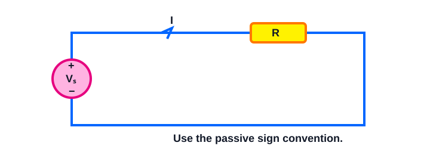

A 12 V voltage source has 0.3 A leaving its positive terminal. Using P = VI with the passive sign convention, calculate signed power and state whether it absorbs or delivers power.

> [!answer]- Answer
> - Current leaves $+$, so $P_S=-VI=-3.6\,\mathrm{W}$: the source delivers $3.6\,\mathrm{W}$.

### 15


A 15 V voltage source has 0.4 A entering its positive terminal. Using the passive sign convention, calculate its power and state whether it absorbs or delivers power. Then state the power of a resistor that absorbs the same magnitude.

> [!answer]- Answer
> - $P_S=+VI=+6\,\mathrm{W}$: the source absorbs.
> - The matching resistor absorbs $6\,\mathrm{W}$.

### 16


A 18 V voltage source has 0.5 A leaving its positive terminal. Using P = VI with the passive sign convention, calculate signed power and state whether it absorbs or delivers power.

> [!answer]- Answer
> - Current leaves $+$, so $P_S=-VI=-9\,\mathrm{W}$: the source delivers $9\,\mathrm{W}$.

### 17


A 20 V voltage source has 0.6 A entering its positive terminal. Using the passive sign convention, calculate its power and state whether it absorbs or delivers power. Then state the power of a resistor that absorbs the same magnitude.

> [!answer]- Answer
> - $P_S=+VI=+12\,\mathrm{W}$: the source absorbs.
> - The matching resistor absorbs $12\,\mathrm{W}$.

### 18


A 24 V voltage source has 0.75 A leaving its positive terminal. Using P = VI with the passive sign convention, calculate signed power and state whether it absorbs or delivers power.

> [!answer]- Answer
> - Current leaves $+$, so $P_S=-VI=-18\,\mathrm{W}$: the source delivers $18\,\mathrm{W}$.

### 19


A 30 V voltage source has 0.8 A entering its positive terminal. Using the passive sign convention, calculate its power and state whether it absorbs or delivers power. Then state the power of a resistor that absorbs the same magnitude.

> [!answer]- Answer
> - $P_S=+VI=+24\,\mathrm{W}$: the source absorbs.
> - The matching resistor absorbs $24\,\mathrm{W}$.

### 20


A 36 V voltage source has 1.0 A leaving its positive terminal. Using P = VI with the passive sign convention, calculate signed power and state whether it absorbs or delivers power.

> [!answer]- Answer
> - Current leaves $+$, so $P_S=-VI=-36\,\mathrm{W}$: the source delivers $36\,\mathrm{W}$.

### 21


A 5 V voltage source has 0.1 A entering its positive terminal. Using the passive sign convention, calculate its power and state whether it absorbs or delivers power. Then state the power of a resistor that absorbs the same magnitude.

> [!answer]- Answer
> - $P_S=+VI=+0.5\,\mathrm{W}$: the source absorbs.
> - The matching resistor absorbs $0.5\,\mathrm{W}$.

### 22


A 9 V voltage source has 0.2 A leaving its positive terminal. Using P = VI with the passive sign convention, calculate signed power and state whether it absorbs or delivers power.

> [!answer]- Answer
> - Current leaves $+$, so $P_S=-VI=-1.8\,\mathrm{W}$: the source delivers $1.8\,\mathrm{W}$.

### 23


A 10 V voltage source has 0.25 A entering its positive terminal. Using the passive sign convention, calculate its power and state whether it absorbs or delivers power. Then state the power of a resistor that absorbs the same magnitude.

> [!answer]- Answer
> - $P_S=+VI=+2.5\,\mathrm{W}$: the source absorbs.
> - The matching resistor absorbs $2.5\,\mathrm{W}$.

### 24


A 12 V voltage source has 0.3 A leaving its positive terminal. Using P = VI with the passive sign convention, calculate signed power and state whether it absorbs or delivers power.

> [!answer]- Answer
> - Current leaves $+$, so $P_S=-VI=-3.6\,\mathrm{W}$: the source delivers $3.6\,\mathrm{W}$.

### 25


A 15 V voltage source has 0.4 A entering its positive terminal. Using the passive sign convention, calculate its power and state whether it absorbs or delivers power. Then state the power of a resistor that absorbs the same magnitude.

> [!answer]- Answer
> - $P_S=+VI=+6\,\mathrm{W}$: the source absorbs.
> - The matching resistor absorbs $6\,\mathrm{W}$.

### 26


A 10 V source supplies two parallel resistors. Their currents are 0.1 A and 0.05 A, each flowing from the source positive terminal through a resistor to its negative terminal. Find source current, each resistor’s absorbed power, source power, and verify algebraic power balance.

> [!answer]- Answer
> - $I_S=0.15\,\mathrm{A}$
> - resistors absorb $P_1=1\,\mathrm{W}$, $P_2=0.5\,\mathrm{W}$.
> - Source $P_S=-10(0.15)=-1.5\,\mathrm{W}$ (delivers)
> - $P_1+P_2+P_S=0$.

### 27


A circuit has a 12 V source whose positive-terminal current is 0.15 A leaving, plus a current source of 0.1 A with voltage 6 V across it. Current enters the current source’s positive terminal. Find the signed power of both sources and the total resistor power required for power balance.

> [!answer]- Answer
> - Voltage source: $P_V=-12(0.15)=-1.8\,\mathrm{W}$ (delivers).
> - Current source: $P_I=(6)(0.1)=0.6\,\mathrm{W}$ (absorbs).
> - Resistors must absorb $P_R=1.2\,\mathrm{W}$ for $\sum P=0$.

### 28


A 15 V source supplies two parallel resistors. Their currents are 0.2 A and 0.1 A, each flowing from the source positive terminal through a resistor to its negative terminal. Find source current, each resistor’s absorbed power, source power, and verify algebraic power balance.

> [!answer]- Answer
> - $I_S=0.3\,\mathrm{A}$
> - resistors absorb $P_1=3\,\mathrm{W}$, $P_2=1.5\,\mathrm{W}$.
> - Source $P_S=-15(0.3)=-4.5\,\mathrm{W}$ (delivers)
> - $P_1+P_2+P_S=0$.

### 29


A circuit has a 18 V source whose positive-terminal current is 0.25 A leaving, plus a current source of 0.15 A with voltage 9 V across it. Current enters the current source’s positive terminal. Find the signed power of both sources and the total resistor power required for power balance.

> [!answer]- Answer
> - Voltage source: $P_V=-18(0.25)=-4.5\,\mathrm{W}$ (delivers).
> - Current source: $P_I=(9)(0.15)=1.35\,\mathrm{W}$ (absorbs).
> - Resistors must absorb $P_R=3.15\,\mathrm{W}$ for $\sum P=0$.

### 30


A 20 V source supplies two parallel resistors. Their currents are 0.3 A and 0.2 A, each flowing from the source positive terminal through a resistor to its negative terminal. Find source current, each resistor’s absorbed power, source power, and verify algebraic power balance.

> [!answer]- Answer
> - $I_S=0.5\,\mathrm{A}$
> - resistors absorb $P_1=6\,\mathrm{W}$, $P_2=4\,\mathrm{W}$.
> - Source $P_S=-20(0.5)=-10\,\mathrm{W}$ (delivers)
> - $P_1+P_2+P_S=0$.

### 31


A circuit has a 24 V source whose positive-terminal current is 0.4 A leaving, plus a current source of 0.2 A with voltage 12 V across it. Current enters the current source’s positive terminal. Find the signed power of both sources and the total resistor power required for power balance.

> [!answer]- Answer
> - Voltage source: $P_V=-24(0.4)=-9.6\,\mathrm{W}$ (delivers).
> - Current source: $P_I=(12)(0.2)=2.4\,\mathrm{W}$ (absorbs).
> - Resistors must absorb $P_R=7.2\,\mathrm{W}$ for $\sum P=0$.

### 32


A 30 V source supplies two parallel resistors. Their currents are 0.5 A and 0.25 A, each flowing from the source positive terminal through a resistor to its negative terminal. Find source current, each resistor’s absorbed power, source power, and verify algebraic power balance.

> [!answer]- Answer
> - $I_S=0.75\,\mathrm{A}$
> - resistors absorb $P_1=15\,\mathrm{W}$, $P_2=7.5\,\mathrm{W}$.
> - Source $P_S=-30(0.75)=-22.5\,\mathrm{W}$ (delivers)
> - $P_1+P_2+P_S=0$.

### 33


A circuit has a 36 V source whose positive-terminal current is 0.6 A leaving, plus a current source of 0.3 A with voltage 18 V across it. Current enters the current source’s positive terminal. Find the signed power of both sources and the total resistor power required for power balance.

> [!answer]- Answer
> - Voltage source: $P_V=-36(0.6)=-21.6\,\mathrm{W}$ (delivers).
> - Current source: $P_I=(18)(0.3)=5.4\,\mathrm{W}$ (absorbs).
> - Resistors must absorb $P_R=16.2\,\mathrm{W}$ for $\sum P=0$.

### 34


A 40 V source supplies two parallel resistors. Their currents are 0.75 A and 0.35 A, each flowing from the source positive terminal through a resistor to its negative terminal. Find source current, each resistor’s absorbed power, source power, and verify algebraic power balance.

> [!answer]- Answer
> - $I_S=1.1\,\mathrm{A}$
> - resistors absorb $P_1=30\,\mathrm{W}$, $P_2=14\,\mathrm{W}$.
> - Source $P_S=-40(1.1)=-44\,\mathrm{W}$ (delivers)
> - $P_1+P_2+P_S=0$.

### 35


A circuit has a 48 V source whose positive-terminal current is 0.8 A leaving, plus a current source of 0.4 A with voltage 24 V across it. Current enters the current source’s positive terminal. Find the signed power of both sources and the total resistor power required for power balance.

> [!answer]- Answer
> - Voltage source: $P_V=-48(0.8)=-38.4\,\mathrm{W}$ (delivers).
> - Current source: $P_I=(24)(0.4)=9.6\,\mathrm{W}$ (absorbs).
> - Resistors must absorb $P_R=28.8\,\mathrm{W}$ for $\sum P=0$.

### 36


A 10 V source supplies two parallel resistors. Their currents are 0.1 A and 0.05 A, each flowing from the source positive terminal through a resistor to its negative terminal. Find source current, each resistor’s absorbed power, source power, and verify algebraic power balance.

> [!answer]- Answer
> - $I_S=0.15\,\mathrm{A}$
> - resistors absorb $P_1=1\,\mathrm{W}$, $P_2=0.5\,\mathrm{W}$.
> - Source $P_S=-10(0.15)=-1.5\,\mathrm{W}$ (delivers)
> - $P_1+P_2+P_S=0$.

### 37


A circuit has a 12 V source whose positive-terminal current is 0.15 A leaving, plus a current source of 0.1 A with voltage 6 V across it. Current enters the current source’s positive terminal. Find the signed power of both sources and the total resistor power required for power balance.

> [!answer]- Answer
> - Voltage source: $P_V=-12(0.15)=-1.8\,\mathrm{W}$ (delivers).
> - Current source: $P_I=(6)(0.1)=0.6\,\mathrm{W}$ (absorbs).
> - Resistors must absorb $P_R=1.2\,\mathrm{W}$ for $\sum P=0$.

### 38

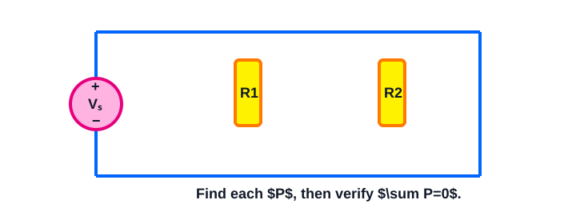

A 15 V source supplies two parallel resistors. Their currents are 0.2 A and 0.1 A, each flowing from the source positive terminal through a resistor to its negative terminal. Find source current, each resistor’s absorbed power, source power, and verify algebraic power balance.

> [!answer]- Answer
> - $I_S=0.3\,\mathrm{A}$
> - resistors absorb $P_1=3\,\mathrm{W}$, $P_2=1.5\,\mathrm{W}$.
> - Source $P_S=-15(0.3)=-4.5\,\mathrm{W}$ (delivers)
> - $P_1+P_2+P_S=0$.

### 39


A circuit has a 18 V source whose positive-terminal current is 0.25 A leaving, plus a current source of 0.15 A with voltage 9 V across it. Current enters the current source’s positive terminal. Find the signed power of both sources and the total resistor power required for power balance.

> [!answer]- Answer
> - Voltage source: $P_V=-18(0.25)=-4.5\,\mathrm{W}$ (delivers).
> - Current source: $P_I=(9)(0.15)=1.35\,\mathrm{W}$ (absorbs).
> - Resistors must absorb $P_R=3.15\,\mathrm{W}$ for $\sum P=0$.

### 40


A 20 V source supplies two parallel resistors. Their currents are 0.3 A and 0.2 A, each flowing from the source positive terminal through a resistor to its negative terminal. Find source current, each resistor’s absorbed power, source power, and verify algebraic power balance.

> [!answer]- Answer
> - $I_S=0.5\,\mathrm{A}$
> - resistors absorb $P_1=6\,\mathrm{W}$, $P_2=4\,\mathrm{W}$.
> - Source $P_S=-20(0.5)=-10\,\mathrm{W}$ (delivers)
> - $P_1+P_2+P_S=0$.

### 41


A circuit has a 24 V source whose positive-terminal current is 0.4 A leaving, plus a current source of 0.2 A with voltage 12 V across it. Current enters the current source’s positive terminal. Find the signed power of both sources and the total resistor power required for power balance.

> [!answer]- Answer
> - Voltage source: $P_V=-24(0.4)=-9.6\,\mathrm{W}$ (delivers).
> - Current source: $P_I=(12)(0.2)=2.4\,\mathrm{W}$ (absorbs).
> - Resistors must absorb $P_R=7.2\,\mathrm{W}$ for $\sum P=0$.

### 42


A 30 V source supplies two parallel resistors. Their currents are 0.5 A and 0.25 A, each flowing from the source positive terminal through a resistor to its negative terminal. Find source current, each resistor’s absorbed power, source power, and verify algebraic power balance.

> [!answer]- Answer
> - $I_S=0.75\,\mathrm{A}$
> - resistors absorb $P_1=15\,\mathrm{W}$, $P_2=7.5\,\mathrm{W}$.
> - Source $P_S=-30(0.75)=-22.5\,\mathrm{W}$ (delivers)
> - $P_1+P_2+P_S=0$.

### 43


A circuit has a 36 V source whose positive-terminal current is 0.6 A leaving, plus a current source of 0.3 A with voltage 18 V across it. Current enters the current source’s positive terminal. Find the signed power of both sources and the total resistor power required for power balance.

> [!answer]- Answer
> - Voltage source: $P_V=-36(0.6)=-21.6\,\mathrm{W}$ (delivers).
> - Current source: $P_I=(18)(0.3)=5.4\,\mathrm{W}$ (absorbs).
> - Resistors must absorb $P_R=16.2\,\mathrm{W}$ for $\sum P=0$.

### 44


A 40 V source supplies two parallel resistors. Their currents are 0.75 A and 0.35 A, each flowing from the source positive terminal through a resistor to its negative terminal. Find source current, each resistor’s absorbed power, source power, and verify algebraic power balance.

> [!answer]- Answer
> - $I_S=1.1\,\mathrm{A}$
> - resistors absorb $P_1=30\,\mathrm{W}$, $P_2=14\,\mathrm{W}$.
> - Source $P_S=-40(1.1)=-44\,\mathrm{W}$ (delivers)
> - $P_1+P_2+P_S=0$.

### 45


A circuit has a 48 V source whose positive-terminal current is 0.8 A leaving, plus a current source of 0.4 A with voltage 24 V across it. Current enters the current source’s positive terminal. Find the signed power of both sources and the total resistor power required for power balance.

> [!answer]- Answer
> - Voltage source: $P_V=-48(0.8)=-38.4\,\mathrm{W}$ (delivers).
> - Current source: $P_I=(24)(0.4)=9.6\,\mathrm{W}$ (absorbs).
> - Resistors must absorb $P_R=28.8\,\mathrm{W}$ for $\sum P=0$.

### 46


A 10 V source supplies two parallel resistors. Their currents are 0.1 A and 0.05 A, each flowing from the source positive terminal through a resistor to its negative terminal. Find source current, each resistor’s absorbed power, source power, and verify algebraic power balance.

> [!answer]- Answer
> - $I_S=0.15\,\mathrm{A}$
> - resistors absorb $P_1=1\,\mathrm{W}$, $P_2=0.5\,\mathrm{W}$.
> - Source $P_S=-10(0.15)=-1.5\,\mathrm{W}$ (delivers)
> - $P_1+P_2+P_S=0$.

### 47


A circuit has a 12 V source whose positive-terminal current is 0.15 A leaving, plus a current source of 0.1 A with voltage 6 V across it. Current enters the current source’s positive terminal. Find the signed power of both sources and the total resistor power required for power balance.

> [!answer]- Answer
> - Voltage source: $P_V=-12(0.15)=-1.8\,\mathrm{W}$ (delivers).
> - Current source: $P_I=(6)(0.1)=0.6\,\mathrm{W}$ (absorbs).
> - Resistors must absorb $P_R=1.2\,\mathrm{W}$ for $\sum P=0$.

### 48


A 15 V source supplies two parallel resistors. Their currents are 0.2 A and 0.1 A, each flowing from the source positive terminal through a resistor to its negative terminal. Find source current, each resistor’s absorbed power, source power, and verify algebraic power balance.

> [!answer]- Answer
> - $I_S=0.3\,\mathrm{A}$
> - resistors absorb $P_1=3\,\mathrm{W}$, $P_2=1.5\,\mathrm{W}$.
> - Source $P_S=-15(0.3)=-4.5\,\mathrm{W}$ (delivers)
> - $P_1+P_2+P_S=0$.

### 49


A circuit has a 18 V source whose positive-terminal current is 0.25 A leaving, plus a current source of 0.15 A with voltage 9 V across it. Current enters the current source’s positive terminal. Find the signed power of both sources and the total resistor power required for power balance.

> [!answer]- Answer
> - Voltage source: $P_V=-18(0.25)=-4.5\,\mathrm{W}$ (delivers).
> - Current source: $P_I=(9)(0.15)=1.35\,\mathrm{W}$ (absorbs).
> - Resistors must absorb $P_R=3.15\,\mathrm{W}$ for $\sum P=0$.

### 50


A 20 V source supplies two parallel resistors. Their currents are 0.3 A and 0.2 A, each flowing from the source positive terminal through a resistor to its negative terminal. Find source current, each resistor’s absorbed power, source power, and verify algebraic power balance.

> [!answer]- Answer
> - $I_S=0.5\,\mathrm{A}$
> - resistors absorb $P_1=6\,\mathrm{W}$, $P_2=4\,\mathrm{W}$.
> - Source $P_S=-20(0.5)=-10\,\mathrm{W}$ (delivers)
> - $P_1+P_2+P_S=0$.

## D. Series/Parallel, Nodes, and Loops — 50 questions

> [!note]
> Attempt each problem before opening its answer.

### 01

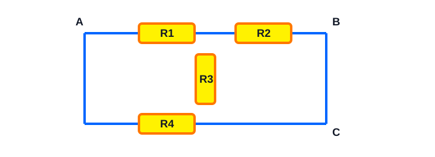

Circuit 1: Between nodes A and B are R1 and R2. From B to C is R3. From A to C is R4. Identify every pair that is directly in parallel, every pair that is directly in series, the number of unique nodes, and the number of independent loops.

> [!answer]- Answer
> - Parallel: $R_1\parallel R_2$.
> - No direct series pair because node B has three connected branches.
> - Nodes: A, B, C (3).
> - $L=E-N+1=4-3+1=2$ independent loops.

### 02


Circuit 2: A source connects A to B. R1 connects B to C, R2 connects C to D, and R3 connects B to D. List the unique nodes. State which elements share the same voltage and which (if any) must share the same current.

> [!answer]- Answer
> - Nodes: A, B, C, D (4).
> - No direct parallel elements.
> - No pair is forced to carry the same current because B is a branch node.
> - Elements sharing endpoints would share voltage
> - none do here.

### 03

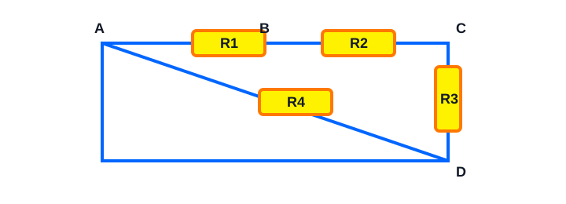

Circuit 3: R1 connects A-B, R2 connects B-C, R3 connects A-C, and R4 connects C-D. Determine whether R1 and R2 are series, parallel, or neither. Then count nodes and independent loops.

> [!answer]- Answer
> - $R_1$ and $R_2$ are directly in series because B connects only those two elements.
> - They are not parallel.
> - Nodes: A, B, C, D (4).
> - $L=4-4+1=1$ independent loop.

### 04


Circuit 4: R1 and R2 each connect A-B. R3 connects B-C. R4 and R5 each connect C-D. Identify all direct parallel groups and all direct series groups before any reduction. Then state one valid first reduction step.

> [!answer]- Answer
> - Direct parallel groups: $R_1\parallel R_2$ and $R_4\parallel R_5$.
> - No direct series group, because B and C are branching nodes.
> - A valid first reduction is $R_{12}=R_1\parallel R_2$.

### 05


Circuit 5: A source connects A-B. R1 connects B-C. R2 connects C-D. R3 connects D-A. R4 connects B-D. Count unique nodes and independent loops. Explain why the diagonal branch changes the loop count and whether any immediate series reduction is valid.

> [!answer]- Answer
> - Nodes: A, B, C, D (4).
> - $L=5-4+1=2$ independent loops.
> - The B–D diagonal creates a second independent loop.
> - No immediate series reduction is valid because B and D are branch nodes.

### 06


Circuit 6: Between nodes A and B are R1 and R2. From B to C is R3. From A to C is R4. Identify every pair that is directly in parallel, every pair that is directly in series, the number of unique nodes, and the number of independent loops.

> [!answer]- Answer
> - Parallel: $R_1\parallel R_2$.
> - No direct series pair because node B has three connected branches.
> - Nodes: A, B, C (3).
> - $L=E-N+1=4-3+1=2$ independent loops.

### 07


Circuit 7: A source connects A to B. R1 connects B to C, R2 connects C to D, and R3 connects B to D. List the unique nodes. State which elements share the same voltage and which (if any) must share the same current.

> [!answer]- Answer
> - Nodes: A, B, C, D (4).
> - No direct parallel elements.
> - No pair is forced to carry the same current because B is a branch node.
> - Elements sharing endpoints would share voltage
> - none do here.

### 08


Circuit 8: R1 connects A-B, R2 connects B-C, R3 connects A-C, and R4 connects C-D. Determine whether R1 and R2 are series, parallel, or neither. Then count nodes and independent loops.

> [!answer]- Answer
> - $R_1$ and $R_2$ are directly in series because B connects only those two elements.
> - They are not parallel.
> - Nodes: A, B, C, D (4).
> - $L=4-4+1=1$ independent loop.

### 09


Circuit 9: R1 and R2 each connect A-B. R3 connects B-C. R4 and R5 each connect C-D. Identify all direct parallel groups and all direct series groups before any reduction. Then state one valid first reduction step.

> [!answer]- Answer
> - Direct parallel groups: $R_1\parallel R_2$ and $R_4\parallel R_5$.
> - No direct series group, because B and C are branching nodes.
> - A valid first reduction is $R_{12}=R_1\parallel R_2$.

### 10


Circuit 10: A source connects A-B. R1 connects B-C. R2 connects C-D. R3 connects D-A. R4 connects B-D. Count unique nodes and independent loops. Explain why the diagonal branch changes the loop count and whether any immediate series reduction is valid.

> [!answer]- Answer
> - Nodes: A, B, C, D (4).
> - $L=5-4+1=2$ independent loops.
> - The B–D diagonal creates a second independent loop.
> - No immediate series reduction is valid because B and D are branch nodes.

### 11


Circuit 11: Between nodes A and B are R1 and R2. From B to C is R3. From A to C is R4. Identify every pair that is directly in parallel, every pair that is directly in series, the number of unique nodes, and the number of independent loops.

> [!answer]- Answer
> - Parallel: $R_1\parallel R_2$.
> - No direct series pair because node B has three connected branches.
> - Nodes: A, B, C (3).
> - $L=E-N+1=4-3+1=2$ independent loops.

### 12


Circuit 12: A source connects A to B. R1 connects B to C, R2 connects C to D, and R3 connects B to D. List the unique nodes. State which elements share the same voltage and which (if any) must share the same current.

> [!answer]- Answer
> - Nodes: A, B, C, D (4).
> - No direct parallel elements.
> - No pair is forced to carry the same current because B is a branch node.
> - Elements sharing endpoints would share voltage
> - none do here.

### 13


Circuit 13: R1 connects A-B, R2 connects B-C, R3 connects A-C, and R4 connects C-D. Determine whether R1 and R2 are series, parallel, or neither. Then count nodes and independent loops.

> [!answer]- Answer
> - $R_1$ and $R_2$ are directly in series because B connects only those two elements.
> - They are not parallel.
> - Nodes: A, B, C, D (4).
> - $L=4-4+1=1$ independent loop.

### 14


Circuit 14: R1 and R2 each connect A-B. R3 connects B-C. R4 and R5 each connect C-D. Identify all direct parallel groups and all direct series groups before any reduction. Then state one valid first reduction step.

> [!answer]- Answer
> - Direct parallel groups: $R_1\parallel R_2$ and $R_4\parallel R_5$.
> - No direct series group, because B and C are branching nodes.
> - A valid first reduction is $R_{12}=R_1\parallel R_2$.

### 15


Circuit 15: A source connects A-B. R1 connects B-C. R2 connects C-D. R3 connects D-A. R4 connects B-D. Count unique nodes and independent loops. Explain why the diagonal branch changes the loop count and whether any immediate series reduction is valid.

> [!answer]- Answer
> - Nodes: A, B, C, D (4).
> - $L=5-4+1=2$ independent loops.
> - The B–D diagonal creates a second independent loop.
> - No immediate series reduction is valid because B and D are branch nodes.

### 16


Circuit 16: Between nodes A and B are R1 and R2. From B to C is R3. From A to C is R4. Identify every pair that is directly in parallel, every pair that is directly in series, the number of unique nodes, and the number of independent loops.

> [!answer]- Answer
> - Parallel: $R_1\parallel R_2$.
> - No direct series pair because node B has three connected branches.
> - Nodes: A, B, C (3).
> - $L=E-N+1=4-3+1=2$ independent loops.

### 17

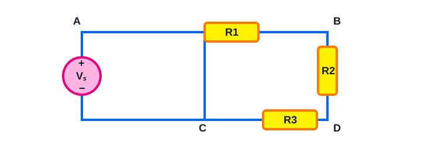

Circuit 17: A source connects A to B. R1 connects B to C, R2 connects C to D, and R3 connects B to D. List the unique nodes. State which elements share the same voltage and which (if any) must share the same current.

> [!answer]- Answer
> - Nodes: A, B, C, D (4).
> - No direct parallel elements.
> - No pair is forced to carry the same current because B is a branch node.
> - Elements sharing endpoints would share voltage
> - none do here.

### 18


Circuit 18: R1 connects A-B, R2 connects B-C, R3 connects A-C, and R4 connects C-D. Determine whether R1 and R2 are series, parallel, or neither. Then count nodes and independent loops.

> [!answer]- Answer
> - $R_1$ and $R_2$ are directly in series because B connects only those two elements.
> - They are not parallel.
> - Nodes: A, B, C, D (4).
> - $L=4-4+1=1$ independent loop.

### 19


Circuit 19: R1 and R2 each connect A-B. R3 connects B-C. R4 and R5 each connect C-D. Identify all direct parallel groups and all direct series groups before any reduction. Then state one valid first reduction step.

> [!answer]- Answer
> - Direct parallel groups: $R_1\parallel R_2$ and $R_4\parallel R_5$.
> - No direct series group, because B and C are branching nodes.
> - A valid first reduction is $R_{12}=R_1\parallel R_2$.

### 20


Circuit 20: A source connects A-B. R1 connects B-C. R2 connects C-D. R3 connects D-A. R4 connects B-D. Count unique nodes and independent loops. Explain why the diagonal branch changes the loop count and whether any immediate series reduction is valid.

> [!answer]- Answer
> - Nodes: A, B, C, D (4).
> - $L=5-4+1=2$ independent loops.
> - The B–D diagonal creates a second independent loop.
> - No immediate series reduction is valid because B and D are branch nodes.

### 21


Circuit 21: Between nodes A and B are R1 and R2. From B to C is R3. From A to C is R4. Identify every pair that is directly in parallel, every pair that is directly in series, the number of unique nodes, and the number of independent loops.

> [!answer]- Answer
> - Parallel: $R_1\parallel R_2$.
> - No direct series pair because node B has three connected branches.
> - Nodes: A, B, C (3).
> - $L=E-N+1=4-3+1=2$ independent loops.

### 22


Circuit 22: A source connects A to B. R1 connects B to C, R2 connects C to D, and R3 connects B to D. List the unique nodes. State which elements share the same voltage and which (if any) must share the same current.

> [!answer]- Answer
> - Nodes: A, B, C, D (4).
> - No direct parallel elements.
> - No pair is forced to carry the same current because B is a branch node.
> - Elements sharing endpoints would share voltage
> - none do here.

### 23


Circuit 23: R1 connects A-B, R2 connects B-C, R3 connects A-C, and R4 connects C-D. Determine whether R1 and R2 are series, parallel, or neither. Then count nodes and independent loops.

> [!answer]- Answer
> - $R_1$ and $R_2$ are directly in series because B connects only those two elements.
> - They are not parallel.
> - Nodes: A, B, C, D (4).
> - $L=4-4+1=1$ independent loop.

### 24


Circuit 24: R1 and R2 each connect A-B. R3 connects B-C. R4 and R5 each connect C-D. Identify all direct parallel groups and all direct series groups before any reduction. Then state one valid first reduction step.

> [!answer]- Answer
> - Direct parallel groups: $R_1\parallel R_2$ and $R_4\parallel R_5$.
> - No direct series group, because B and C are branching nodes.
> - A valid first reduction is $R_{12}=R_1\parallel R_2$.

### 25


Circuit 25: A source connects A-B. R1 connects B-C. R2 connects C-D. R3 connects D-A. R4 connects B-D. Count unique nodes and independent loops. Explain why the diagonal branch changes the loop count and whether any immediate series reduction is valid.

> [!answer]- Answer
> - Nodes: A, B, C, D (4).
> - $L=5-4+1=2$ independent loops.
> - The B–D diagonal creates a second independent loop.
> - No immediate series reduction is valid because B and D are branch nodes.

### 26


Circuit 26: Between nodes A and B are R1 and R2. From B to C is R3. From A to C is R4. Identify every pair that is directly in parallel, every pair that is directly in series, the number of unique nodes, and the number of independent loops.

> [!answer]- Answer
> - Parallel: $R_1\parallel R_2$.
> - No direct series pair because node B has three connected branches.
> - Nodes: A, B, C (3).
> - $L=E-N+1=4-3+1=2$ independent loops.

### 27


Circuit 27: A source connects A to B. R1 connects B to C, R2 connects C to D, and R3 connects B to D. List the unique nodes. State which elements share the same voltage and which (if any) must share the same current.

> [!answer]- Answer
> - Nodes: A, B, C, D (4).
> - No direct parallel elements.
> - No pair is forced to carry the same current because B is a branch node.
> - Elements sharing endpoints would share voltage
> - none do here.

### 28


Circuit 28: R1 connects A-B, R2 connects B-C, R3 connects A-C, and R4 connects C-D. Determine whether R1 and R2 are series, parallel, or neither. Then count nodes and independent loops.

> [!answer]- Answer
> - $R_1$ and $R_2$ are directly in series because B connects only those two elements.
> - They are not parallel.
> - Nodes: A, B, C, D (4).
> - $L=4-4+1=1$ independent loop.

### 29

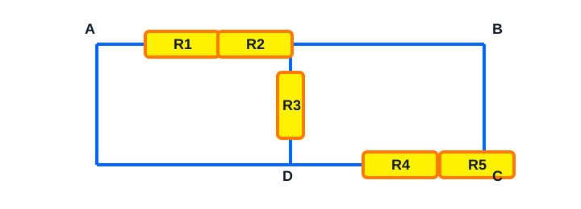

Circuit 29: R1 and R2 each connect A-B. R3 connects B-C. R4 and R5 each connect C-D. Identify all direct parallel groups and all direct series groups before any reduction. Then state one valid first reduction step.

> [!answer]- Answer
> - Direct parallel groups: $R_1\parallel R_2$ and $R_4\parallel R_5$.
> - No direct series group, because B and C are branching nodes.
> - A valid first reduction is $R_{12}=R_1\parallel R_2$.

### 30


Circuit 30: A source connects A-B. R1 connects B-C. R2 connects C-D. R3 connects D-A. R4 connects B-D. Count unique nodes and independent loops. Explain why the diagonal branch changes the loop count and whether any immediate series reduction is valid.

> [!answer]- Answer
> - Nodes: A, B, C, D (4).
> - $L=5-4+1=2$ independent loops.
> - The B–D diagonal creates a second independent loop.
> - No immediate series reduction is valid because B and D are branch nodes.

### 31


Circuit 31: Between nodes A and B are R1 and R2. From B to C is R3. From A to C is R4. Identify every pair that is directly in parallel, every pair that is directly in series, the number of unique nodes, and the number of independent loops.

> [!answer]- Answer
> - Parallel: $R_1\parallel R_2$.
> - No direct series pair because node B has three connected branches.
> - Nodes: A, B, C (3).
> - $L=E-N+1=4-3+1=2$ independent loops.

### 32


Circuit 32: A source connects A to B. R1 connects B to C, R2 connects C to D, and R3 connects B to D. List the unique nodes. State which elements share the same voltage and which (if any) must share the same current.

> [!answer]- Answer
> - Nodes: A, B, C, D (4).
> - No direct parallel elements.
> - No pair is forced to carry the same current because B is a branch node.
> - Elements sharing endpoints would share voltage
> - none do here.

### 33


Circuit 33: R1 connects A-B, R2 connects B-C, R3 connects A-C, and R4 connects C-D. Determine whether R1 and R2 are series, parallel, or neither. Then count nodes and independent loops.

> [!answer]- Answer
> - $R_1$ and $R_2$ are directly in series because B connects only those two elements.
> - They are not parallel.
> - Nodes: A, B, C, D (4).
> - $L=4-4+1=1$ independent loop.

### 34


Circuit 34: R1 and R2 each connect A-B. R3 connects B-C. R4 and R5 each connect C-D. Identify all direct parallel groups and all direct series groups before any reduction. Then state one valid first reduction step.

> [!answer]- Answer
> - Direct parallel groups: $R_1\parallel R_2$ and $R_4\parallel R_5$.
> - No direct series group, because B and C are branching nodes.
> - A valid first reduction is $R_{12}=R_1\parallel R_2$.

### 35

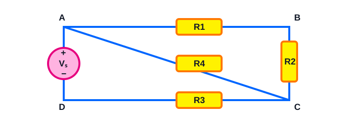

Circuit 35: A source connects A-B. R1 connects B-C. R2 connects C-D. R3 connects D-A. R4 connects B-D. Count unique nodes and independent loops. Explain why the diagonal branch changes the loop count and whether any immediate series reduction is valid.

> [!answer]- Answer
> - Nodes: A, B, C, D (4).
> - $L=5-4+1=2$ independent loops.
> - The B–D diagonal creates a second independent loop.
> - No immediate series reduction is valid because B and D are branch nodes.

### 36


Circuit 36: Between nodes A and B are R1 and R2. From B to C is R3. From A to C is R4. Identify every pair that is directly in parallel, every pair that is directly in series, the number of unique nodes, and the number of independent loops.

> [!answer]- Answer
> - Parallel: $R_1\parallel R_2$.
> - No direct series pair because node B has three connected branches.
> - Nodes: A, B, C (3).
> - $L=E-N+1=4-3+1=2$ independent loops.

### 37


Circuit 37: A source connects A to B. R1 connects B to C, R2 connects C to D, and R3 connects B to D. List the unique nodes. State which elements share the same voltage and which (if any) must share the same current.

> [!answer]- Answer
> - Nodes: A, B, C, D (4).
> - No direct parallel elements.
> - No pair is forced to carry the same current because B is a branch node.
> - Elements sharing endpoints would share voltage
> - none do here.

### 38


Circuit 38: R1 connects A-B, R2 connects B-C, R3 connects A-C, and R4 connects C-D. Determine whether R1 and R2 are series, parallel, or neither. Then count nodes and independent loops.

> [!answer]- Answer
> - $R_1$ and $R_2$ are directly in series because B connects only those two elements.
> - They are not parallel.
> - Nodes: A, B, C, D (4).
> - $L=4-4+1=1$ independent loop.

### 39


Circuit 39: R1 and R2 each connect A-B. R3 connects B-C. R4 and R5 each connect C-D. Identify all direct parallel groups and all direct series groups before any reduction. Then state one valid first reduction step.

> [!answer]- Answer
> - Direct parallel groups: $R_1\parallel R_2$ and $R_4\parallel R_5$.
> - No direct series group, because B and C are branching nodes.
> - A valid first reduction is $R_{12}=R_1\parallel R_2$.

### 40


Circuit 40: A source connects A-B. R1 connects B-C. R2 connects C-D. R3 connects D-A. R4 connects B-D. Count unique nodes and independent loops. Explain why the diagonal branch changes the loop count and whether any immediate series reduction is valid.

> [!answer]- Answer
> - Nodes: A, B, C, D (4).
> - $L=5-4+1=2$ independent loops.
> - The B–D diagonal creates a second independent loop.
> - No immediate series reduction is valid because B and D are branch nodes.

### 41


Circuit 41: Between nodes A and B are R1 and R2. From B to C is R3. From A to C is R4. Identify every pair that is directly in parallel, every pair that is directly in series, the number of unique nodes, and the number of independent loops.

> [!answer]- Answer
> - Parallel: $R_1\parallel R_2$.
> - No direct series pair because node B has three connected branches.
> - Nodes: A, B, C (3).
> - $L=E-N+1=4-3+1=2$ independent loops.

### 42


Circuit 42: A source connects A to B. R1 connects B to C, R2 connects C to D, and R3 connects B to D. List the unique nodes. State which elements share the same voltage and which (if any) must share the same current.

> [!answer]- Answer
> - Nodes: A, B, C, D (4).
> - No direct parallel elements.
> - No pair is forced to carry the same current because B is a branch node.
> - Elements sharing endpoints would share voltage
> - none do here.

### 43


Circuit 43: R1 connects A-B, R2 connects B-C, R3 connects A-C, and R4 connects C-D. Determine whether R1 and R2 are series, parallel, or neither. Then count nodes and independent loops.

> [!answer]- Answer
> - $R_1$ and $R_2$ are directly in series because B connects only those two elements.
> - They are not parallel.
> - Nodes: A, B, C, D (4).
> - $L=4-4+1=1$ independent loop.

### 44


Circuit 44: R1 and R2 each connect A-B. R3 connects B-C. R4 and R5 each connect C-D. Identify all direct parallel groups and all direct series groups before any reduction. Then state one valid first reduction step.

> [!answer]- Answer
> - Direct parallel groups: $R_1\parallel R_2$ and $R_4\parallel R_5$.
> - No direct series group, because B and C are branching nodes.
> - A valid first reduction is $R_{12}=R_1\parallel R_2$.

### 45


Circuit 45: A source connects A-B. R1 connects B-C. R2 connects C-D. R3 connects D-A. R4 connects B-D. Count unique nodes and independent loops. Explain why the diagonal branch changes the loop count and whether any immediate series reduction is valid.

> [!answer]- Answer
> - Nodes: A, B, C, D (4).
> - $L=5-4+1=2$ independent loops.
> - The B–D diagonal creates a second independent loop.
> - No immediate series reduction is valid because B and D are branch nodes.

### 46


Circuit 46: Between nodes A and B are R1 and R2. From B to C is R3. From A to C is R4. Identify every pair that is directly in parallel, every pair that is directly in series, the number of unique nodes, and the number of independent loops.

> [!answer]- Answer
> - Parallel: $R_1\parallel R_2$.
> - No direct series pair because node B has three connected branches.
> - Nodes: A, B, C (3).
> - $L=E-N+1=4-3+1=2$ independent loops.

### 47


Circuit 47: A source connects A to B. R1 connects B to C, R2 connects C to D, and R3 connects B to D. List the unique nodes. State which elements share the same voltage and which (if any) must share the same current.

> [!answer]- Answer
> - Nodes: A, B, C, D (4).
> - No direct parallel elements.
> - No pair is forced to carry the same current because B is a branch node.
> - Elements sharing endpoints would share voltage
> - none do here.

### 48


Circuit 48: R1 connects A-B, R2 connects B-C, R3 connects A-C, and R4 connects C-D. Determine whether R1 and R2 are series, parallel, or neither. Then count nodes and independent loops.

> [!answer]- Answer
> - $R_1$ and $R_2$ are directly in series because B connects only those two elements.
> - They are not parallel.
> - Nodes: A, B, C, D (4).
> - $L=4-4+1=1$ independent loop.

### 49


Circuit 49: R1 and R2 each connect A-B. R3 connects B-C. R4 and R5 each connect C-D. Identify all direct parallel groups and all direct series groups before any reduction. Then state one valid first reduction step.

> [!answer]- Answer
> - Direct parallel groups: $R_1\parallel R_2$ and $R_4\parallel R_5$.
> - No direct series group, because B and C are branching nodes.
> - A valid first reduction is $R_{12}=R_1\parallel R_2$.

### 50


Circuit 50: A source connects A-B. R1 connects B-C. R2 connects C-D. R3 connects D-A. R4 connects B-D. Count unique nodes and independent loops. Explain why the diagonal branch changes the loop count and whether any immediate series reduction is valid.

> [!answer]- Answer
> - Nodes: A, B, C, D (4).
> - $L=5-4+1=2$ independent loops.
> - The B–D diagonal creates a second independent loop.
> - No immediate series reduction is valid because B and D are branch nodes.

## E. Very Hard Mixed Circuits — 100 stretch questions

> [!warning]
> These are deliberately above Midterm 1 level. They require multi-node nodal KCL, branch-current signs, and full power-balance checks.

### 001


Bridge circuit: node A is fixed at $24\,\mathrm{V}$ by an ideal source. Use nodal KCL to find $V_B$ and $V_C$, the current through the B–C resistor (B to C positive), the source power, and verify $\sum P=0$.

> [!answer]- Answer
> - $V_B=15.855\,\mathrm{V}$, $V_C=15.204\,\mathrm{V}$.
> - $I_{BC}=0.0217\,\mathrm{A}$ (B to C positive).
> - $P_{V_s}=-33.622\,\mathrm{W}$
> - total resistor power $P_R=33.622\,\mathrm{W}$
> - check: $\sum P=0.00000\,\mathrm{W}\approx0$.

### 002


Bridge circuit with a $0.2\,\mathrm{A}$ current source from ground into B: use nodal KCL to find $V_B$, $V_C$, and B–C current. Find the powers of both sources and verify power balance.

> [!answer]- Answer
> - $V_B=17.070\,\mathrm{V}$, $V_C=15.745\,\mathrm{V}$.
> - $I_{BC}=0.0662\,\mathrm{A}$ (B to C positive).
> - $P_{V_s}=-24.866\,\mathrm{W}$
> - $P_{I_s}=-3.414\,\mathrm{W}$
> - total resistor power $P_R=28.280\,\mathrm{W}$
> - check: $\sum P=0.00000\,\mathrm{W}\approx0$.

### 003


Three-node resistive bridge: node A is $24\,\mathrm{V}$. Use three KCL equations to solve $V_B$, $V_C$, $V_D$, then find current from B to C and source power. Verify the resistor-power total.

> [!answer]- Answer
> - $V_B=15.418\,\mathrm{V}$, $V_C=10.254\,\mathrm{V}$, $V_D=11.571\,\mathrm{V}$.
> - $I_{BC}=0.3443\,\mathrm{A}$ (B to C positive).
> - $P_{V_s}=-29.120\,\mathrm{W}$
> - total resistor power $P_R=29.120\,\mathrm{W}$
> - check: $\sum P=0.00000\,\mathrm{W}\approx0$.

### 004


Mixed three-node bridge with a $0.15\,\mathrm{A}$ current source from ground into D: solve nodal KCL for $V_B$, $V_C$, $V_D$. Then find B–C current, both source powers, and the total resistor power.

> [!answer]- Answer
> - $V_B=18.488\,\mathrm{V}$, $V_C=15.668\,\mathrm{V}$, $V_D=10.848\,\mathrm{V}$.
> - $I_{BC}=0.1128\,\mathrm{A}$ (B to C positive).
> - $P_{V_s}=-18.818\,\mathrm{W}$
> - $P_{I_s}=-1.627\,\mathrm{W}$
> - total resistor power $P_R=20.445\,\mathrm{W}$
> - check: $\sum P=0.00000\,\mathrm{W}\approx0$.

### 005


Bridge circuit: node A is fixed at $30\,\mathrm{V}$ by an ideal source. Use nodal KCL to find $V_B$ and $V_C$, the current through the B–C resistor (B to C positive), the source power, and verify $\sum P=0$.

> [!answer]- Answer
> - $V_B=20.044\,\mathrm{V}$, $V_C=19.065\,\mathrm{V}$.
> - $I_{BC}=0.0280\,\mathrm{A}$ (B to C positive).
> - $P_{V_s}=-43.117\,\mathrm{W}$
> - total resistor power $P_R=43.117\,\mathrm{W}$
> - check: $\sum P=0.00000\,\mathrm{W}\approx0$.

### 006

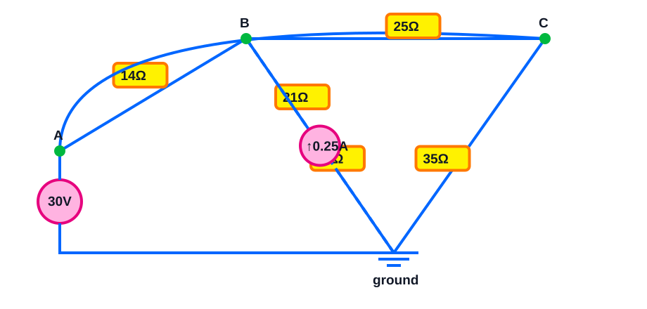

Bridge circuit with a $0.25\,\mathrm{A}$ current source from ground into B: use nodal KCL to find $V_B$, $V_C$, and B–C current. Find the powers of both sources and verify power balance.

> [!answer]- Answer
> - $V_B=21.629\,\mathrm{V}$, $V_C=19.741\,\mathrm{V}$.
> - $I_{BC}=0.0755\,\mathrm{A}$ (B to C positive).
> - $P_{V_s}=-32.594\,\mathrm{W}$
> - $P_{I_s}=-5.407\,\mathrm{W}$
> - total resistor power $P_R=38.002\,\mathrm{W}$
> - check: $\sum P=0.00000\,\mathrm{W}\approx0$.

### 007


Three-node resistive bridge: node A is $30\,\mathrm{V}$. Use three KCL equations to solve $V_B$, $V_C$, $V_D$, then find current from B to C and source power. Verify the resistor-power total.

> [!answer]- Answer
> - $V_B=19.160\,\mathrm{V}$, $V_C=12.754\,\mathrm{V}$, $V_D=14.416\,\mathrm{V}$.
> - $I_{BC}=0.3559\,\mathrm{A}$ (B to C positive).
> - $P_{V_s}=-38.788\,\mathrm{W}$
> - total resistor power $P_R=38.788\,\mathrm{W}$
> - check: $\sum P=0.00000\,\mathrm{W}\approx0$.

### 008


Mixed three-node bridge with a $0.2\,\mathrm{A}$ current source from ground into D: solve nodal KCL for $V_B$, $V_C$, $V_D$. Then find B–C current, both source powers, and the total resistor power.

> [!answer]- Answer
> - $V_B=23.538\,\mathrm{V}$, $V_C=19.787\,\mathrm{V}$, $V_D=14.611\,\mathrm{V}$.
> - $I_{BC}=0.1250\,\mathrm{A}$ (B to C positive).
> - $P_{V_s}=-24.725\,\mathrm{W}$
> - $P_{I_s}=-2.922\,\mathrm{W}$
> - total resistor power $P_R=27.647\,\mathrm{W}$
> - check: $\sum P=-0.00000\,\mathrm{W}\approx0$.

### 009


Bridge circuit: node A is fixed at $36\,\mathrm{V}$ by an ideal source. Use nodal KCL to find $V_B$ and $V_C$, the current through the B–C resistor (B to C positive), the source power, and verify $\sum P=0$.

> [!answer]- Answer
> - $V_B=24.234\,\mathrm{V}$, $V_C=22.928\,\mathrm{V}$.
> - $I_{BC}=0.0326\,\mathrm{A}$ (B to C positive).
> - $P_{V_s}=-52.664\,\mathrm{W}$
> - total resistor power $P_R=52.664\,\mathrm{W}$
> - check: $\sum P=0.00000\,\mathrm{W}\approx0$.

### 010

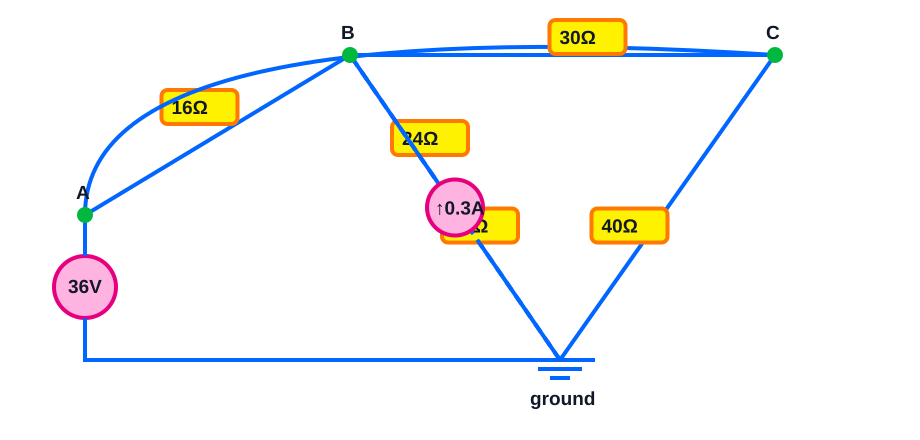

Bridge circuit with a $0.3\,\mathrm{A}$ current source from ground into B: use nodal KCL to find $V_B$, $V_C$, and B–C current. Find the powers of both sources and verify power balance.

> [!answer]- Answer
> - $V_B=26.299\,\mathrm{V}$, $V_C=23.766\,\mathrm{V}$.
> - $I_{BC}=0.0844\,\mathrm{A}$ (B to C positive).
> - $P_{V_s}=-40.177\,\mathrm{W}$
> - $P_{I_s}=-7.890\,\mathrm{W}$
> - total resistor power $P_R=48.066\,\mathrm{W}$
> - check: $\sum P=-0.00000\,\mathrm{W}\approx0$.

### 011

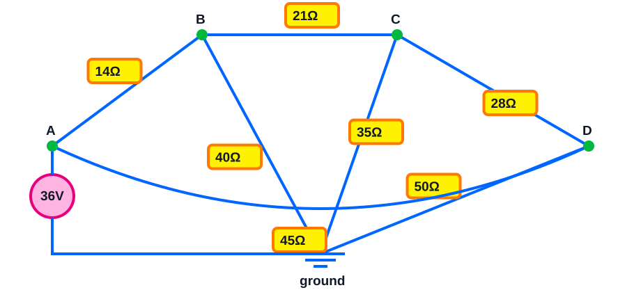

Three-node resistive bridge: node A is $36\,\mathrm{V}$. Use three KCL equations to solve $V_B$, $V_C$, $V_D$, then find current from B to C and source power. Verify the resistor-power total.

> [!answer]- Answer
> - $V_B=22.892\,\mathrm{V}$, $V_C=15.247\,\mathrm{V}$, $V_D=17.252\,\mathrm{V}$.
> - $I_{BC}=0.3640\,\mathrm{A}$ (B to C positive).
> - $P_{V_s}=-48.706\,\mathrm{W}$
> - total resistor power $P_R=48.706\,\mathrm{W}$
> - check: $\sum P=-0.00000\,\mathrm{W}\approx0$.

### 012


Mixed three-node bridge with a $0.25\,\mathrm{A}$ current source from ground into D: solve nodal KCL for $V_B$, $V_C$, $V_D$. Then find B–C current, both source powers, and the total resistor power.

> [!answer]- Answer
> - $V_B=28.665\,\mathrm{V}$, $V_C=23.954\,\mathrm{V}$, $V_D=18.608\,\mathrm{V}$.
> - $I_{BC}=0.1346\,\mathrm{A}$ (B to C positive).
> - $P_{V_s}=-30.576\,\mathrm{W}$
> - $P_{I_s}=-4.652\,\mathrm{W}$
> - total resistor power $P_R=35.228\,\mathrm{W}$
> - check: $\sum P=-0.00000\,\mathrm{W}\approx0$.

### 013


Bridge circuit: node A is fixed at $40\,\mathrm{V}$ by an ideal source. Use nodal KCL to find $V_B$ and $V_C$, the current through the B–C resistor (B to C positive), the source power, and verify $\sum P=0$.

> [!answer]- Answer
> - $V_B=26.970\,\mathrm{V}$, $V_C=25.657\,\mathrm{V}$.
> - $I_{BC}=0.0438\,\mathrm{A}$ (B to C positive).
> - $P_{V_s}=-56.480\,\mathrm{W}$
> - total resistor power $P_R=56.480\,\mathrm{W}$
> - check: $\sum P=-0.00000\,\mathrm{W}\approx0$.

### 014


Bridge circuit with a $0.35\,\mathrm{A}$ current source from ground into B: use nodal KCL to find $V_B$, $V_C$, and B–C current. Find the powers of both sources and verify power balance.

> [!answer]- Answer
> - $V_B=29.426\,\mathrm{V}$, $V_C=27.026\,\mathrm{V}$.
> - $I_{BC}=0.1200\,\mathrm{A}$ (B to C positive).
> - $P_{V_s}=-42.719\,\mathrm{W}$
> - $P_{I_s}=-10.299\,\mathrm{W}$
> - total resistor power $P_R=53.018\,\mathrm{W}$
> - check: $\sum P=0.00000\,\mathrm{W}\approx0$.

### 015


Three-node resistive bridge: node A is $40\,\mathrm{V}$. Use three KCL equations to solve $V_B$, $V_C$, $V_D$, then find current from B to C and source power. Verify the resistor-power total.

> [!answer]- Answer
> - $V_B=25.678\,\mathrm{V}$, $V_C=17.890\,\mathrm{V}$, $V_D=21.819\,\mathrm{V}$.
> - $I_{BC}=0.3245\,\mathrm{A}$ (B to C positive).
> - $P_{V_s}=-56.583\,\mathrm{W}$
> - total resistor power $P_R=56.583\,\mathrm{W}$
> - check: $\sum P=0.00000\,\mathrm{W}\approx0$.

### 016


Mixed three-node bridge with a $0.3\,\mathrm{A}$ current source from ground into D: solve nodal KCL for $V_B$, $V_C$, $V_D$. Then find B–C current, both source powers, and the total resistor power.

> [!answer]- Answer
> - $V_B=29.862\,\mathrm{V}$, $V_C=23.315\,\mathrm{V}$, $V_D=15.505\,\mathrm{V}$.
> - $I_{BC}=0.1637\,\mathrm{A}$ (B to C positive).
> - $P_{V_s}=-42.324\,\mathrm{W}$
> - $P_{I_s}=-4.651\,\mathrm{W}$
> - total resistor power $P_R=46.976\,\mathrm{W}$
> - check: $\sum P=0.00000\,\mathrm{W}\approx0$.

### 017


Bridge circuit: node A is fixed at $48\,\mathrm{V}$ by an ideal source. Use nodal KCL to find $V_B$ and $V_C$, the current through the B–C resistor (B to C positive), the source power, and verify $\sum P=0$.

> [!answer]- Answer
> - $V_B=24.903\,\mathrm{V}$, $V_C=23.571\,\mathrm{V}$.
> - $I_{BC}=0.0381\,\mathrm{A}$ (B to C positive).
> - $P_{V_s}=-105.022\,\mathrm{W}$
> - total resistor power $P_R=105.022\,\mathrm{W}$
> - check: $\sum P=-0.00000\,\mathrm{W}\approx0$.

### 018


Bridge circuit with a $0.4\,\mathrm{A}$ current source from ground into B: use nodal KCL to find $V_B$, $V_C$, and B–C current. Find the powers of both sources and verify power balance.

> [!answer]- Answer
> - $V_B=29.143\,\mathrm{V}$, $V_C=25.929\,\mathrm{V}$.
> - $I_{BC}=0.1286\,\mathrm{A}$ (B to C positive).
> - $P_{V_s}=-80.571\,\mathrm{W}$
> - $P_{I_s}=-11.657\,\mathrm{W}$
> - total resistor power $P_R=92.229\,\mathrm{W}$
> - check: $\sum P=-0.00000\,\mathrm{W}\approx0$.

### 019


Three-node resistive bridge: node A is $48\,\mathrm{V}$. Use three KCL equations to solve $V_B$, $V_C$, $V_D$, then find current from B to C and source power. Verify the resistor-power total.

> [!answer]- Answer
> - $V_B=25.423\,\mathrm{V}$, $V_C=14.439\,\mathrm{V}$, $V_D=20.585\,\mathrm{V}$.
> - $I_{BC}=0.4068\,\mathrm{A}$ (B to C positive).
> - $P_{V_s}=-93.102\,\mathrm{W}$
> - total resistor power $P_R=93.102\,\mathrm{W}$
> - check: $\sum P=0.00000\,\mathrm{W}\approx0$.

### 020


Mixed three-node bridge with a $0.35\,\mathrm{A}$ current source from ground into D: solve nodal KCL for $V_B$, $V_C$, $V_D$. Then find B–C current, both source powers, and the total resistor power.

> [!answer]- Answer
> - $V_B=34.215\,\mathrm{V}$, $V_C=28.820\,\mathrm{V}$, $V_D=22.707\,\mathrm{V}$.
> - $I_{BC}=0.2158\,\mathrm{A}$ (B to C positive).
> - $P_{V_s}=-57.539\,\mathrm{W}$
> - $P_{I_s}=-7.947\,\mathrm{W}$
> - total resistor power $P_R=65.486\,\mathrm{W}$
> - check: $\sum P=-0.00000\,\mathrm{W}\approx0$.

### 021


Bridge circuit: node A is fixed at $24\,\mathrm{V}$ by an ideal source. Use nodal KCL to find $V_B$ and $V_C$, the current through the B–C resistor (B to C positive), the source power, and verify $\sum P=0$.

> [!answer]- Answer
> - $V_B=17.000\,\mathrm{V}$, $V_C=16.200\,\mathrm{V}$.
> - $I_{BC}=0.0200\,\mathrm{A}$ (B to C positive).
> - $P_{V_s}=-29.280\,\mathrm{W}$
> - total resistor power $P_R=29.280\,\mathrm{W}$
> - check: $\sum P=0.00000\,\mathrm{W}\approx0$.

### 022


Bridge circuit with a $0.2\,\mathrm{A}$ current source from ground into B: use nodal KCL to find $V_B$, $V_C$, and B–C current. Find the powers of both sources and verify power balance.

> [!answer]- Answer
> - $V_B=18.041\,\mathrm{V}$, $V_C=16.471\,\mathrm{V}$.
> - $I_{BC}=0.0523\,\mathrm{A}$ (B to C positive).
> - $P_{V_s}=-21.958\,\mathrm{W}$
> - $P_{I_s}=-3.608\,\mathrm{W}$
> - total resistor power $P_R=25.566\,\mathrm{W}$
> - check: $\sum P=0.00000\,\mathrm{W}\approx0$.

### 023


Three-node resistive bridge: node A is $24\,\mathrm{V}$. Use three KCL equations to solve $V_B$, $V_C$, $V_D$, then find current from B to C and source power. Verify the resistor-power total.

> [!answer]- Answer
> - $V_B=16.027\,\mathrm{V}$, $V_C=10.935\,\mathrm{V}$, $V_D=11.436\,\mathrm{V}$.
> - $I_{BC}=0.3394\,\mathrm{A}$ (B to C positive).
> - $P_{V_s}=-25.837\,\mathrm{W}$
> - total resistor power $P_R=25.837\,\mathrm{W}$
> - check: $\sum P=-0.00000\,\mathrm{W}\approx0$.

### 024


Mixed three-node bridge with a $0.15\,\mathrm{A}$ current source from ground into D: solve nodal KCL for $V_B$, $V_C$, $V_D$. Then find B–C current, both source powers, and the total resistor power.

> [!answer]- Answer
> - $V_B=19.783\,\mathrm{V}$, $V_C=17.048\,\mathrm{V}$, $V_D=13.134\,\mathrm{V}$.
> - $I_{BC}=0.0912\,\mathrm{A}$ (B to C positive).
> - $P_{V_s}=-15.090\,\mathrm{W}$
> - $P_{I_s}=-1.970\,\mathrm{W}$
> - total resistor power $P_R=17.060\,\mathrm{W}$
> - check: $\sum P=0.00000\,\mathrm{W}\approx0$.

### 025


Bridge circuit: node A is fixed at $30\,\mathrm{V}$ by an ideal source. Use nodal KCL to find $V_B$ and $V_C$, the current through the B–C resistor (B to C positive), the source power, and verify $\sum P=0$.

> [!answer]- Answer
> - $V_B=21.154\,\mathrm{V}$, $V_C=20.192\,\mathrm{V}$.
> - $I_{BC}=0.0321\,\mathrm{A}$ (B to C positive).
> - $P_{V_s}=-38.462\,\mathrm{W}$
> - total resistor power $P_R=38.462\,\mathrm{W}$
> - check: $\sum P=0.00000\,\mathrm{W}\approx0$.

### 026


Bridge circuit with a $0.25\,\mathrm{A}$ current source from ground into B: use nodal KCL to find $V_B$, $V_C$, and B–C current. Find the powers of both sources and verify power balance.

> [!answer]- Answer
> - $V_B=22.491\,\mathrm{V}$, $V_C=20.822\,\mathrm{V}$.
> - $I_{BC}=0.0835\,\mathrm{A}$ (B to C positive).
> - $P_{V_s}=-29.202\,\mathrm{W}$
> - $P_{I_s}=-5.623\,\mathrm{W}$
> - total resistor power $P_R=34.825\,\mathrm{W}$
> - check: $\sum P=0.00000\,\mathrm{W}\approx0$.

### 027


Three-node resistive bridge: node A is $30\,\mathrm{V}$. Use three KCL equations to solve $V_B$, $V_C$, $V_D$, then find current from B to C and source power. Verify the resistor-power total.

> [!answer]- Answer
> - $V_B=20.058\,\mathrm{V}$, $V_C=14.172\,\mathrm{V}$, $V_D=16.043\,\mathrm{V}$.
> - $I_{BC}=0.3270\,\mathrm{A}$ (B to C positive).
> - $P_{V_s}=-36.817\,\mathrm{W}$
> - total resistor power $P_R=36.817\,\mathrm{W}$
> - check: $\sum P=-0.00000\,\mathrm{W}\approx0$.

### 028


Mixed three-node bridge with a $0.2\,\mathrm{A}$ current source from ground into D: solve nodal KCL for $V_B$, $V_C$, $V_D$. Then find B–C current, both source powers, and the total resistor power.

> [!answer]- Answer
> - $V_B=23.220\,\mathrm{V}$, $V_C=18.794\,\mathrm{V}$, $V_D=12.324\,\mathrm{V}$.
> - $I_{BC}=0.1264\,\mathrm{A}$ (B to C positive).
> - $P_{V_s}=-26.581\,\mathrm{W}$
> - $P_{I_s}=-2.465\,\mathrm{W}$
> - total resistor power $P_R=29.046\,\mathrm{W}$
> - check: $\sum P=0.00000\,\mathrm{W}\approx0$.

### 029


Bridge circuit: node A is fixed at $36\,\mathrm{V}$ by an ideal source. Use nodal KCL to find $V_B$ and $V_C$, the current through the B–C resistor (B to C positive), the source power, and verify $\sum P=0$.

> [!answer]- Answer
> - $V_B=25.356\,\mathrm{V}$, $V_C=24.100\,\mathrm{V}$.
> - $I_{BC}=0.0359\,\mathrm{A}$ (B to C positive).
> - $P_{V_s}=-47.770\,\mathrm{W}$
> - total resistor power $P_R=47.770\,\mathrm{W}$
> - check: $\sum P=0.00000\,\mathrm{W}\approx0$.

### 030


Bridge circuit with a $0.3\,\mathrm{A}$ current source from ground into B: use nodal KCL to find $V_B$, $V_C$, and B–C current. Find the powers of both sources and verify power balance.

> [!answer]- Answer
> - $V_B=27.225\,\mathrm{V}$, $V_C=24.921\,\mathrm{V}$.
> - $I_{BC}=0.0922\,\mathrm{A}$ (B to C positive).
> - $P_{V_s}=-36.362\,\mathrm{W}$
> - $P_{I_s}=-8.168\,\mathrm{W}$
> - total resistor power $P_R=44.529\,\mathrm{W}$
> - check: $\sum P=-0.00000\,\mathrm{W}\approx0$.

### 031


Three-node resistive bridge: node A is $36\,\mathrm{V}$. Use three KCL equations to solve $V_B$, $V_C$, $V_D$, then find current from B to C and source power. Verify the resistor-power total.

> [!answer]- Answer
> - $V_B=23.845\,\mathrm{V}$, $V_C=16.740\,\mathrm{V}$, $V_D=18.985\,\mathrm{V}$.
> - $I_{BC}=0.3383\,\mathrm{A}$ (B to C positive).
> - $P_{V_s}=-46.569\,\mathrm{W}$
> - total resistor power $P_R=46.569\,\mathrm{W}$
> - check: $\sum P=-0.00000\,\mathrm{W}\approx0$.

### 032


Mixed three-node bridge with a $0.25\,\mathrm{A}$ current source from ground into D: solve nodal KCL for $V_B$, $V_C$, $V_D$. Then find B–C current, both source powers, and the total resistor power.

> [!answer]- Answer
> - $V_B=28.322\,\mathrm{V}$, $V_C=22.878\,\mathrm{V}$, $V_D=16.260\,\mathrm{V}$.
> - $I_{BC}=0.1361\,\mathrm{A}$ (B to C positive).
> - $P_{V_s}=-32.717\,\mathrm{W}$
> - $P_{I_s}=-4.065\,\mathrm{W}$
> - total resistor power $P_R=36.782\,\mathrm{W}$
> - check: $\sum P=0.00000\,\mathrm{W}\approx0$.

### 033


Bridge circuit: node A is fixed at $40\,\mathrm{V}$ by an ideal source. Use nodal KCL to find $V_B$ and $V_C$, the current through the B–C resistor (B to C positive), the source power, and verify $\sum P=0$.

> [!answer]- Answer
> - $V_B=21.958\,\mathrm{V}$, $V_C=20.772\,\mathrm{V}$.
> - $I_{BC}=0.0297\,\mathrm{A}$ (B to C positive).
> - $P_{V_s}=-77.151\,\mathrm{W}$
> - total resistor power $P_R=77.151\,\mathrm{W}$
> - check: $\sum P=0.00000\,\mathrm{W}\approx0$.

### 034


Bridge circuit with a $0.35\,\mathrm{A}$ current source from ground into B: use nodal KCL to find $V_B$, $V_C$, and B–C current. Find the powers of both sources and verify power balance.

> [!answer]- Answer
> - $V_B=25.437\,\mathrm{V}$, $V_C=22.462\,\mathrm{V}$.
> - $I_{BC}=0.0992\,\mathrm{A}$ (B to C positive).
> - $P_{V_s}=-58.344\,\mathrm{W}$
> - $P_{I_s}=-8.903\,\mathrm{W}$
> - total resistor power $P_R=67.247\,\mathrm{W}$
> - check: $\sum P=0.00000\,\mathrm{W}\approx0$.

### 035


Three-node resistive bridge: node A is $40\,\mathrm{V}$. Use three KCL equations to solve $V_B$, $V_C$, $V_D$, then find current from B to C and source power. Verify the resistor-power total.

> [!answer]- Answer
> - $V_B=22.016\,\mathrm{V}$, $V_C=12.654\,\mathrm{V}$, $V_D=16.366\,\mathrm{V}$.
> - $I_{BC}=0.3901\,\mathrm{A}$ (B to C positive).
> - $P_{V_s}=-65.967\,\mathrm{W}$
> - total resistor power $P_R=65.967\,\mathrm{W}$
> - check: $\sum P=0.00000\,\mathrm{W}\approx0$.

### 036


Mixed three-node bridge with a $0.3\,\mathrm{A}$ current source from ground into D: solve nodal KCL for $V_B$, $V_C$, $V_D$. Then find B–C current, both source powers, and the total resistor power.

> [!answer]- Answer
> - $V_B=30.321\,\mathrm{V}$, $V_C=26.077\,\mathrm{V}$, $V_D=21.585\,\mathrm{V}$.
> - $I_{BC}=0.1698\,\mathrm{A}$ (B to C positive).
> - $P_{V_s}=-37.642\,\mathrm{W}$
> - $P_{I_s}=-6.476\,\mathrm{W}$
> - total resistor power $P_R=44.117\,\mathrm{W}$
> - check: $\sum P=-0.00000\,\mathrm{W}\approx0$.

### 037


Bridge circuit: node A is fixed at $48\,\mathrm{V}$ by an ideal source. Use nodal KCL to find $V_B$ and $V_C$, the current through the B–C resistor (B to C positive), the source power, and verify $\sum P=0$.

> [!answer]- Answer
> - $V_B=27.401\,\mathrm{V}$, $V_C=25.950\,\mathrm{V}$.
> - $I_{BC}=0.0484\,\mathrm{A}$ (B to C positive).
> - $P_{V_s}=-94.130\,\mathrm{W}$
> - total resistor power $P_R=94.130\,\mathrm{W}$
> - check: $\sum P=0.00000\,\mathrm{W}\approx0$.

### 038


Bridge circuit with a $0.4\,\mathrm{A}$ current source from ground into B: use nodal KCL to find $V_B$, $V_C$, and B–C current. Find the powers of both sources and verify power balance.

> [!answer]- Answer
> - $V_B=31.003\,\mathrm{V}$, $V_C=28.150\,\mathrm{V}$.
> - $I_{BC}=0.1426\,\mathrm{A}$ (B to C positive).
> - $P_{V_s}=-72.553\,\mathrm{W}$
> - $P_{I_s}=-12.401\,\mathrm{W}$
> - total resistor power $P_R=84.954\,\mathrm{W}$
> - check: $\sum P=0.00000\,\mathrm{W}\approx0$.

### 039


Three-node resistive bridge: node A is $48\,\mathrm{V}$. Use three KCL equations to solve $V_B$, $V_C$, $V_D$, then find current from B to C and source power. Verify the resistor-power total.

> [!answer]- Answer
> - $V_B=27.169\,\mathrm{V}$, $V_C=16.882\,\mathrm{V}$, $V_D=23.423\,\mathrm{V}$.
> - $I_{BC}=0.3810\,\mathrm{A}$ (B to C positive).
> - $P_{V_s}=-89.255\,\mathrm{W}$
> - total resistor power $P_R=89.255\,\mathrm{W}$
> - check: $\sum P=0.00000\,\mathrm{W}\approx0$.

### 040


Mixed three-node bridge with a $0.35\,\mathrm{A}$ current source from ground into D: solve nodal KCL for $V_B$, $V_C$, $V_D$. Then find B–C current, both source powers, and the total resistor power.

> [!answer]- Answer
> - $V_B=33.548\,\mathrm{V}$, $V_C=27.030\,\mathrm{V}$, $V_D=19.158\,\mathrm{V}$.
> - $I_{BC}=0.2172\,\mathrm{A}$ (B to C positive).
> - $P_{V_s}=-61.616\,\mathrm{W}$
> - $P_{I_s}=-6.705\,\mathrm{W}$
> - total resistor power $P_R=68.322\,\mathrm{W}$
> - check: $\sum P=0.00000\,\mathrm{W}\approx0$.

### 041


Bridge circuit: node A is fixed at $24\,\mathrm{V}$ by an ideal source. Use nodal KCL to find $V_B$ and $V_C$, the current through the B–C resistor (B to C positive), the source power, and verify $\sum P=0$.

> [!answer]- Answer
> - $V_B=17.830\,\mathrm{V}$, $V_C=17.038\,\mathrm{V}$.
> - $I_{BC}=0.0226\,\mathrm{A}$ (B to C positive).
> - $P_{V_s}=-25.947\,\mathrm{W}$
> - total resistor power $P_R=25.947\,\mathrm{W}$
> - check: $\sum P=0.00000\,\mathrm{W}\approx0$.

### 042


Bridge circuit with a $0.2\,\mathrm{A}$ current source from ground into B: use nodal KCL to find $V_B$, $V_C$, and B–C current. Find the powers of both sources and verify power balance.

> [!answer]- Answer
> - $V_B=18.699\,\mathrm{V}$, $V_C=17.264\,\mathrm{V}$.
> - $I_{BC}=0.0574\,\mathrm{A}$ (B to C positive).
> - $P_{V_s}=-19.583\,\mathrm{W}$
> - $P_{I_s}=-3.740\,\mathrm{W}$
> - total resistor power $P_R=23.323\,\mathrm{W}$
> - check: $\sum P=0.00000\,\mathrm{W}\approx0$.

### 043


Three-node resistive bridge: node A is $24\,\mathrm{V}$. Use three KCL equations to solve $V_B$, $V_C$, $V_D$, then find current from B to C and source power. Verify the resistor-power total.

> [!answer]- Answer
> - $V_B=16.702\,\mathrm{V}$, $V_C=12.018\,\mathrm{V}$, $V_D=12.641\,\mathrm{V}$.
> - $I_{BC}=0.3122\,\mathrm{A}$ (B to C positive).
> - $P_{V_s}=-24.330\,\mathrm{W}$
> - total resistor power $P_R=24.330\,\mathrm{W}$
> - check: $\sum P=0.00000\,\mathrm{W}\approx0$.

### 044


Mixed three-node bridge with a $0.15\,\mathrm{A}$ current source from ground into D: solve nodal KCL for $V_B$, $V_C$, $V_D$. Then find B–C current, both source powers, and the total resistor power.

> [!answer]- Answer
> - $V_B=19.594\,\mathrm{V}$, $V_C=16.385\,\mathrm{V}$, $V_D=11.510\,\mathrm{V}$.
> - $I_{BC}=0.0917\,\mathrm{A}$ (B to C positive).
> - $P_{V_s}=-16.188\,\mathrm{W}$
> - $P_{I_s}=-1.727\,\mathrm{W}$
> - total resistor power $P_R=17.915\,\mathrm{W}$
> - check: $\sum P=0.00000\,\mathrm{W}\approx0$.

### 045


Bridge circuit: node A is fixed at $30\,\mathrm{V}$ by an ideal source. Use nodal KCL to find $V_B$ and $V_C$, the current through the B–C resistor (B to C positive), the source power, and verify $\sum P=0$.

> [!answer]- Answer
> - $V_B=22.100\,\mathrm{V}$, $V_C=21.024\,\mathrm{V}$.
> - $I_{BC}=0.0269\,\mathrm{A}$ (B to C positive).
> - $P_{V_s}=-34.711\,\mathrm{W}$
> - total resistor power $P_R=34.711\,\mathrm{W}$
> - check: $\sum P=0.00000\,\mathrm{W}\approx0$.

### 046


Bridge circuit with a $0.25\,\mathrm{A}$ current source from ground into B: use nodal KCL to find $V_B$, $V_C$, and B–C current. Find the powers of both sources and verify power balance.

> [!answer]- Answer
> - $V_B=23.441\,\mathrm{V}$, $V_C=21.419\,\mathrm{V}$.
> - $I_{BC}=0.0674\,\mathrm{A}$ (B to C positive).
> - $P_{V_s}=-26.314\,\mathrm{W}$
> - $P_{I_s}=-5.860\,\mathrm{W}$
> - total resistor power $P_R=32.174\,\mathrm{W}$
> - check: $\sum P=-0.00000\,\mathrm{W}\approx0$.

### 047


Three-node resistive bridge: node A is $30\,\mathrm{V}$. Use three KCL equations to solve $V_B$, $V_C$, $V_D$, then find current from B to C and source power. Verify the resistor-power total.

> [!answer]- Answer
> - $V_B=20.571\,\mathrm{V}$, $V_C=14.656\,\mathrm{V}$, $V_D=15.564\,\mathrm{V}$.
> - $I_{BC}=0.3286\,\mathrm{A}$ (B to C positive).
> - $P_{V_s}=-33.196\,\mathrm{W}$
> - total resistor power $P_R=33.196\,\mathrm{W}$
> - check: $\sum P=-0.00000\,\mathrm{W}\approx0$.

### 048


Mixed three-node bridge with a $0.2\,\mathrm{A}$ current source from ground into D: solve nodal KCL for $V_B$, $V_C$, $V_D$. Then find B–C current, both source powers, and the total resistor power.

> [!answer]- Answer
> - $V_B=24.702\,\mathrm{V}$, $V_C=20.547\,\mathrm{V}$, $V_D=15.351\,\mathrm{V}$.
> - $I_{BC}=0.1039\,\mathrm{A}$ (B to C positive).
> - $P_{V_s}=-21.680\,\mathrm{W}$
> - $P_{I_s}=-3.070\,\mathrm{W}$
> - total resistor power $P_R=24.750\,\mathrm{W}$
> - check: $\sum P=0.00000\,\mathrm{W}\approx0$.

### 049


Bridge circuit: node A is fixed at $36\,\mathrm{V}$ by an ideal source. Use nodal KCL to find $V_B$ and $V_C$, the current through the B–C resistor (B to C positive), the source power, and verify $\sum P=0$.

> [!answer]- Answer
> - $V_B=20.909\,\mathrm{V}$, $V_C=19.936\,\mathrm{V}$.
> - $I_{BC}=0.0325\,\mathrm{A}$ (B to C positive).
> - $P_{V_s}=-66.344\,\mathrm{W}$
> - total resistor power $P_R=66.344\,\mathrm{W}$
> - check: $\sum P=-0.00000\,\mathrm{W}\approx0$.

### 050


Bridge circuit with a $0.3\,\mathrm{A}$ current source from ground into B: use nodal KCL to find $V_B$, $V_C$, and B–C current. Find the powers of both sources and verify power balance.

> [!answer]- Answer
> - $V_B=23.478\,\mathrm{V}$, $V_C=21.391\,\mathrm{V}$.
> - $I_{BC}=0.1043\,\mathrm{A}$ (B to C positive).
> - $P_{V_s}=-50.087\,\mathrm{W}$
> - $P_{I_s}=-7.043\,\mathrm{W}$
> - total resistor power $P_R=57.130\,\mathrm{W}$
> - check: $\sum P=-0.00000\,\mathrm{W}\approx0$.

### 051


> [!tip] Interactive CircuitJS simulation
> Edit and run this circuit offline in Obsidian.

```circuitjs
$ 1 5.0E-6 0.005 63 10.0 62
r 70 250 220 80 0 14.0
r 220 80 430 80 0 21.0
r 430 80 580 250 0 28.0
r 220 80 325 410 0 30.0
r 430 80 325 410 0 25.0
r 580 250 325 410 0 40.0
r 70 250 580 250 0 35.0
v 325 410 70 250 0 0 40.0 36.0 0.0
g 325 410 325 438 0
x 58 234 88 234 0 24 A
x 208 64 238 64 0 24 B
x 418 64 448 64 0 24 C
x 568 234 598 234 0 24 D
x 313 394 343 394 0 24 GND
x 20 24 200 24 0 20 Interactive nodal-analysis circuit
```

Three-node resistive bridge: node A is $36\,\mathrm{V}$. Use three KCL equations to solve $V_B$, $V_C$, $V_D$, then find current from B to C and source power. Verify the resistor-power total.

> [!answer]- Answer
> - $V_B=20.907\,\mathrm{V}$, $V_C=12.903\,\mathrm{V}$, $V_D=16.681\,\mathrm{V}$.
> - $I_{BC}=0.3812\,\mathrm{A}$ (B to C positive).
> - $P_{V_s}=-58.681\,\mathrm{W}$
> - total resistor power $P_R=58.681\,\mathrm{W}$
> - check: $\sum P=0.00000\,\mathrm{W}\approx0$.

### 052


> [!tip] Interactive CircuitJS simulation
> Edit and run this circuit offline in Obsidian.

```circuitjs
$ 1 5.0E-6 0.005 63 10.0 62
r 70 250 220 80 0 19.0
r 70 250 430 80 0 26.0
r 220 80 430 80 0 25.0
r 220 80 580 250 0 30.0
r 430 80 580 250 0 35.0
r 580 250 325 410 0 20.0
r 430 80 325 410 0 40.0
v 325 410 70 250 0 0 40.0 36.0 0.0
g 325 410 325 438 0
i 325 410 580 250 0 0.25
x 58 234 88 234 0 24 A
x 208 64 238 64 0 24 B
x 418 64 448 64 0 24 C
x 568 234 598 234 0 24 D
x 313 394 343 394 0 24 GND
x 20 24 200 24 0 20 Interactive nodal-analysis circuit
```

Mixed three-node bridge with a $0.25\,\mathrm{A}$ current source from ground into D: solve nodal KCL for $V_B$, $V_C$, $V_D$. Then find B–C current, both source powers, and the total resistor power.

> [!answer]- Answer
> - $V_B=26.063\,\mathrm{V}$, $V_C=21.748\,\mathrm{V}$, $V_D=15.550\,\mathrm{V}$.
> - $I_{BC}=0.1726\,\mathrm{A}$ (B to C positive).
> - $P_{V_s}=-38.563\,\mathrm{W}$
> - $P_{I_s}=-3.887\,\mathrm{W}$
> - total resistor power $P_R=42.450\,\mathrm{W}$
> - check: $\sum P=-0.00000\,\mathrm{W}\approx0$.

### 053


> [!tip] Interactive CircuitJS simulation
> Edit and run this circuit offline in Obsidian.

```circuitjs
$ 1 5.0E-6 0.005 63 10.0 62
r 70 250 220 80 0 21.0
r 70 250 430 80 0 29.0
r 220 80 430 80 0 30.0
r 220 80 580 250 0 35.0
r 430 80 580 250 0 40.0
r 580 250 325 410 0 25.0
r 430 80 325 410 0 45.0
v 325 410 70 250 0 0 40.0 40.0 0.0
g 325 410 325 438 0
i 325 410 580 250 0 0.3
x 58 234 88 234 0 24 A
x 208 64 238 64 0 24 B
x 418 64 448 64 0 24 C
x 568 234 598 234 0 24 D
x 313 394 343 394 0 24 GND
x 20 24 200 24 0 20 Interactive nodal-analysis circuit
```

Bridge circuit: node A is fixed at $40\,\mathrm{V}$ by an ideal source. Use nodal KCL to find $V_B$ and $V_C$, the current through the B–C resistor (B to C positive), the source power, and verify $\sum P=0$.

> [!answer]- Answer
> - $V_B=24.026\,\mathrm{V}$, $V_C=22.720\,\mathrm{V}$.
> - $I_{BC}=0.0373\,\mathrm{A}$ (B to C positive).
> - $P_{V_s}=-68.735\,\mathrm{W}$
> - total resistor power $P_R=68.735\,\mathrm{W}$
> - check: $\sum P=0.00000\,\mathrm{W}\approx0$.

### 054


> [!tip] Interactive CircuitJS simulation
> Edit and run this circuit offline in Obsidian.

```circuitjs
$ 1 5.0E-6 0.005 63 10.0 62
r 70 250 220 80 0 21.0
r 70 250 430 80 0 29.0
r 220 80 430 80 0 30.0
r 220 80 580 250 0 35.0
r 430 80 580 250 0 40.0
r 580 250 325 410 0 25.0
r 430 80 325 410 0 45.0
v 325 410 70 250 0 0 40.0 40.0 0.0
g 325 410 325 438 0
i 325 410 580 250 0 0.3
x 58 234 88 234 0 24 A
x 208 64 238 64 0 24 B
x 418 64 448 64 0 24 C
x 568 234 598 234 0 24 D
x 313 394 343 394 0 24 GND
x 20 24 200 24 0 20 Interactive nodal-analysis circuit
```

Bridge circuit with a $0.35\,\mathrm{A}$ current source from ground into B: use nodal KCL to find $V_B$, $V_C$, and B–C current. Find the powers of both sources and verify power balance.

> [!answer]- Answer
> - $V_B=26.984\,\mathrm{V}$, $V_C=24.248\,\mathrm{V}$.
> - $I_{BC}=0.1094\,\mathrm{A}$ (B to C positive).
> - $P_{V_s}=-52.261\,\mathrm{W}$
> - $P_{I_s}=-9.444\,\mathrm{W}$
> - total resistor power $P_R=61.705\,\mathrm{W}$
> - check: $\sum P=0.00000\,\mathrm{W}\approx0$.

### 055

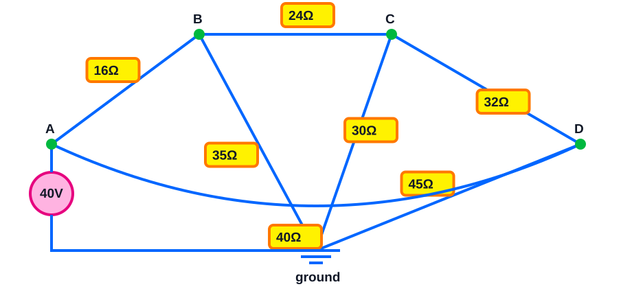

> [!tip] Interactive CircuitJS simulation
> Edit and run this circuit offline in Obsidian.

```circuitjs
$ 1 5.0E-6 0.005 63 10.0 62
r 70 250 220 80 0 16.0
r 220 80 430 80 0 24.0
r 430 80 580 250 0 32.0
r 220 80 325 410 0 35.0
r 430 80 325 410 0 30.0
r 580 250 325 410 0 45.0
r 70 250 580 250 0 40.0
v 325 410 70 250 0 0 40.0 40.0 0.0
g 325 410 325 438 0
x 58 234 88 234 0 24 A
x 208 64 238 64 0 24 B
x 418 64 448 64 0 24 C
x 568 234 598 234 0 24 D
x 313 394 343 394 0 24 GND
x 20 24 200 24 0 20 Interactive nodal-analysis circuit
```

Three-node resistive bridge: node A is $40\,\mathrm{V}$. Use three KCL equations to solve $V_B$, $V_C$, $V_D$, then find current from B to C and source power. Verify the resistor-power total.

> [!answer]- Answer
> - $V_B=23.434\,\mathrm{V}$, $V_C=14.654\,\mathrm{V}$, $V_D=18.579\,\mathrm{V}$.
> - $I_{BC}=0.3658\,\mathrm{A}$ (B to C positive).
> - $P_{V_s}=-62.836\,\mathrm{W}$
> - total resistor power $P_R=62.836\,\mathrm{W}$
> - check: $\sum P=-0.00000\,\mathrm{W}\approx0$.

### 056


> [!tip] Interactive CircuitJS simulation
> Edit and run this circuit offline in Obsidian.

```circuitjs
$ 1 5.0E-6 0.005 63 10.0 62
r 70 250 220 80 0 21.0
r 70 250 430 80 0 29.0
r 220 80 430 80 0 30.0
r 220 80 580 250 0 35.0
r 430 80 580 250 0 40.0
r 580 250 325 410 0 25.0
r 430 80 325 410 0 45.0
v 325 410 70 250 0 0 40.0 40.0 0.0
g 325 410 325 438 0
i 325 410 580 250 0 0.3
x 58 234 88 234 0 24 A
x 208 64 238 64 0 24 B
x 418 64 448 64 0 24 C
x 568 234 598 234 0 24 D
x 313 394 343 394 0 24 GND
x 20 24 200 24 0 20 Interactive nodal-analysis circuit
```

Mixed three-node bridge with a $0.3\,\mathrm{A}$ current source from ground into D: solve nodal KCL for $V_B$, $V_C$, $V_D$. Then find B–C current, both source powers, and the total resistor power.

> [!answer]- Answer
> - $V_B=29.869\,\mathrm{V}$, $V_C=24.761\,\mathrm{V}$, $V_D=18.942\,\mathrm{V}$.
> - $I_{BC}=0.1703\,\mathrm{A}$ (B to C positive).
> - $P_{V_s}=-40.317\,\mathrm{W}$
> - $P_{I_s}=-5.683\,\mathrm{W}$
> - total resistor power $P_R=45.999\,\mathrm{W}$
> - check: $\sum P=0.00000\,\mathrm{W}\approx0$.

### 057


> [!tip] Interactive CircuitJS simulation
> Edit and run this circuit offline in Obsidian.

```circuitjs
$ 1 5.0E-6 0.005 63 10.0 62
r 70 250 220 80 0 23.0
r 70 250 430 80 0 32.0
r 220 80 430 80 0 35.0
r 220 80 580 250 0 40.0
r 430 80 580 250 0 45.0
r 580 250 325 410 0 30.0
r 430 80 325 410 0 50.0
v 325 410 70 250 0 0 40.0 48.0 0.0
g 325 410 325 438 0
i 325 410 580 250 0 0.35
x 58 234 88 234 0 24 A
x 208 64 238 64 0 24 B
x 418 64 448 64 0 24 C
x 568 234 598 234 0 24 D
x 313 394 343 394 0 24 GND
x 20 24 200 24 0 20 Interactive nodal-analysis circuit
```

Bridge circuit: node A is fixed at $48\,\mathrm{V}$ by an ideal source. Use nodal KCL to find $V_B$ and $V_C$, the current through the B–C resistor (B to C positive), the source power, and verify $\sum P=0$.

> [!answer]- Answer
> - $V_B=29.509\,\mathrm{V}$, $V_C=27.762\,\mathrm{V}$.
> - $I_{BC}=0.0437\,\mathrm{A}$ (B to C positive).
> - $P_{V_s}=-85.288\,\mathrm{W}$
> - total resistor power $P_R=85.288\,\mathrm{W}$
> - check: $\sum P=0.00000\,\mathrm{W}\approx0$.

### 058


> [!tip] Interactive CircuitJS simulation
> Edit and run this circuit offline in Obsidian.

```circuitjs
$ 1 5.0E-6 0.005 63 10.0 62
r 70 250 220 80 0 23.0
r 70 250 430 80 0 32.0
r 220 80 430 80 0 35.0
r 220 80 580 250 0 40.0
r 430 80 580 250 0 45.0
r 580 250 325 410 0 30.0
r 430 80 325 410 0 50.0
v 325 410 70 250 0 0 40.0 48.0 0.0
g 325 410 325 438 0
i 325 410 580 250 0 0.35
x 58 234 88 234 0 24 A
x 208 64 238 64 0 24 B
x 418 64 448 64 0 24 C
x 568 234 598 234 0 24 D
x 313 394 343 394 0 24 GND
x 20 24 200 24 0 20 Interactive nodal-analysis circuit
```

Bridge circuit with a $0.4\,\mathrm{A}$ current source from ground into B: use nodal KCL to find $V_B$, $V_C$, and B–C current. Find the powers of both sources and verify power balance.

> [!answer]- Answer
> - $V_B=33.006\,\mathrm{V}$, $V_C=29.457\,\mathrm{V}$.
> - $I_{BC}=0.1183\,\mathrm{A}$ (B to C positive).
> - $P_{V_s}=-65.656\,\mathrm{W}$
> - $P_{I_s}=-13.202\,\mathrm{W}$
> - total resistor power $P_R=78.858\,\mathrm{W}$
> - check: $\sum P=0.00000\,\mathrm{W}\approx0$.

### 059


> [!tip] Interactive CircuitJS simulation
> Edit and run this circuit offline in Obsidian.

```circuitjs
$ 1 5.0E-6 0.005 63 10.0 62
r 70 250 220 80 0 18.0
r 220 80 430 80 0 27.0
r 430 80 580 250 0 36.0
r 220 80 325 410 0 40.0
r 430 80 325 410 0 35.0
r 580 250 325 410 0 50.0
r 70 250 580 250 0 45.0
v 325 410 70 250 0 0 40.0 48.0 0.0
g 325 410 325 438 0
x 58 234 88 234 0 24 A
x 208 64 238 64 0 24 B
x 418 64 448 64 0 24 C
x 568 234 598 234 0 24 D
x 313 394 343 394 0 24 GND
x 20 24 200 24 0 20 Interactive nodal-analysis circuit
```

Three-node resistive bridge: node A is $48\,\mathrm{V}$. Use three KCL equations to solve $V_B$, $V_C$, $V_D$, then find current from B to C and source power. Verify the resistor-power total.

> [!answer]- Answer
> - $V_B=28.305\,\mathrm{V}$, $V_C=17.867\,\mathrm{V}$, $V_D=22.328\,\mathrm{V}$.
> - $I_{BC}=0.3866\,\mathrm{A}$ (B to C positive).
> - $P_{V_s}=-79.904\,\mathrm{W}$
> - total resistor power $P_R=79.904\,\mathrm{W}$
> - check: $\sum P=-0.00000\,\mathrm{W}\approx0$.

### 060


> [!tip] Interactive CircuitJS simulation
> Edit and run this circuit offline in Obsidian.

```circuitjs
$ 1 5.0E-6 0.005 63 10.0 62
r 70 250 220 80 0 23.0
r 70 250 430 80 0 32.0
r 220 80 430 80 0 35.0
r 220 80 580 250 0 40.0
r 430 80 580 250 0 45.0
r 580 250 325 410 0 30.0
r 430 80 325 410 0 50.0
v 325 410 70 250 0 0 40.0 48.0 0.0
g 325 410 325 438 0
i 325 410 580 250 0 0.35
x 58 234 88 234 0 24 A
x 208 64 238 64 0 24 B
x 418 64 448 64 0 24 C
x 568 234 598 234 0 24 D
x 313 394 343 394 0 24 GND
x 20 24 200 24 0 20 Interactive nodal-analysis circuit
```

Mixed three-node bridge with a $0.35\,\mathrm{A}$ current source from ground into D: solve nodal KCL for $V_B$, $V_C$, $V_D$. Then find B–C current, both source powers, and the total resistor power.

> [!answer]- Answer
> - $V_B=36.573\,\mathrm{V}$, $V_C=30.170\,\mathrm{V}$, $V_D=24.018\,\mathrm{V}$.
> - $I_{BC}=0.1829\,\mathrm{A}$ (B to C positive).
> - $P_{V_s}=-50.592\,\mathrm{W}$
> - $P_{I_s}=-8.406\,\mathrm{W}$
> - total resistor power $P_R=58.998\,\mathrm{W}$
> - check: $\sum P=0.00000\,\mathrm{W}\approx0$.

### 061

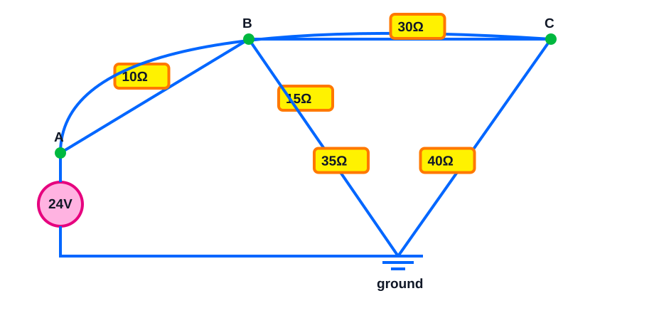

> [!tip] Interactive CircuitJS simulation
> Edit and run this circuit offline in Obsidian.

```circuitjs
$ 1 5.0E-6 0.005 63 10.0 62
r 70 250 220 80 0 15.0
r 70 250 430 80 0 20.0
r 220 80 430 80 0 40.0
r 220 80 580 250 0 45.0
r 430 80 580 250 0 50.0
r 580 250 325 410 0 20.0
r 430 80 325 410 0 40.0
v 325 410 70 250 0 0 40.0 24.0 0.0
g 325 410 325 438 0
i 325 410 580 250 0 0.15
x 58 234 88 234 0 24 A
x 208 64 238 64 0 24 B
x 418 64 448 64 0 24 C
x 568 234 598 234 0 24 D
x 313 394 343 394 0 24 GND
x 20 24 200 24 0 20 Interactive nodal-analysis circuit
```

Bridge circuit: node A is fixed at $24\,\mathrm{V}$ by an ideal source. Use nodal KCL to find $V_B$ and $V_C$, the current through the B–C resistor (B to C positive), the source power, and verify $\sum P=0$.

> [!answer]- Answer
> - $V_B=18.473\,\mathrm{V}$, $V_C=17.726\,\mathrm{V}$.
> - $I_{BC}=0.0249\,\mathrm{A}$ (B to C positive).
> - $P_{V_s}=-23.303\,\mathrm{W}$
> - total resistor power $P_R=23.303\,\mathrm{W}$
> - check: $\sum P=0.00000\,\mathrm{W}\approx0$.

### 062


> [!tip] Interactive CircuitJS simulation
> Edit and run this circuit offline in Obsidian.

```circuitjs
$ 1 5.0E-6 0.005 63 10.0 62
r 70 250 220 80 0 15.0
r 70 250 430 80 0 20.0
r 220 80 430 80 0 40.0
r 220 80 580 250 0 45.0
r 430 80 580 250 0 50.0
r 580 250 325 410 0 20.0
r 430 80 325 410 0 40.0
v 325 410 70 250 0 0 40.0 24.0 0.0
g 325 410 325 438 0
i 325 410 580 250 0 0.15
x 58 234 88 234 0 24 A
x 208 64 238 64 0 24 B
x 418 64 448 64 0 24 C
x 568 234 598 234 0 24 D
x 313 394 343 394 0 24 GND
x 20 24 200 24 0 20 Interactive nodal-analysis circuit
```

Bridge circuit with a $0.2\,\mathrm{A}$ current source from ground into B: use nodal KCL to find $V_B$, $V_C$, and B–C current. Find the powers of both sources and verify power balance.

> [!answer]- Answer
> - $V_B=19.229\,\mathrm{V}$, $V_C=17.959\,\mathrm{V}$.
> - $I_{BC}=0.0635\,\mathrm{A}$ (B to C positive).
> - $P_{V_s}=-17.597\,\mathrm{W}$
> - $P_{I_s}=-3.846\,\mathrm{W}$
> - total resistor power $P_R=21.443\,\mathrm{W}$
> - check: $\sum P=0.00000\,\mathrm{W}\approx0$.

### 063


> [!tip] Interactive CircuitJS simulation
> Edit and run this circuit offline in Obsidian.

```circuitjs
$ 1 5.0E-6 0.005 63 10.0 62
r 70 250 220 80 0 10.0
r 220 80 430 80 0 15.0
r 430 80 580 250 0 20.0
r 220 80 325 410 0 45.0
r 430 80 325 410 0 40.0
r 580 250 325 410 0 55.0
r 70 250 580 250 0 35.0
v 325 410 70 250 0 0 40.0 24.0 0.0
g 325 410 325 438 0
x 58 234 88 234 0 24 A
x 208 64 238 64 0 24 B
x 418 64 448 64 0 24 C
x 568 234 598 234 0 24 D
x 313 394 343 394 0 24 GND
x 20 24 200 24 0 20 Interactive nodal-analysis circuit
```

Three-node resistive bridge: node A is $24\,\mathrm{V}$. Use three KCL equations to solve $V_B$, $V_C$, $V_D$, then find current from B to C and source power. Verify the resistor-power total.

> [!answer]- Answer
> - $V_B=17.300\,\mathrm{V}$, $V_C=13.017\,\mathrm{V}$, $V_D=13.814\,\mathrm{V}$.
> - $I_{BC}=0.2856\,\mathrm{A}$ (B to C positive).
> - $P_{V_s}=-23.065\,\mathrm{W}$
> - total resistor power $P_R=23.065\,\mathrm{W}$
> - check: $\sum P=0.00000\,\mathrm{W}\approx0$.

### 064


> [!tip] Interactive CircuitJS simulation
> Edit and run this circuit offline in Obsidian.

```circuitjs
$ 1 5.0E-6 0.005 63 10.0 62
r 70 250 220 80 0 15.0
r 70 250 430 80 0 20.0
r 220 80 430 80 0 40.0
r 220 80 580 250 0 45.0
r 430 80 580 250 0 50.0
r 580 250 325 410 0 20.0
r 430 80 325 410 0 40.0
v 325 410 70 250 0 0 40.0 24.0 0.0
g 325 410 325 438 0
i 325 410 580 250 0 0.15
x 58 234 88 234 0 24 A
x 208 64 238 64 0 24 B
x 418 64 448 64 0 24 C
x 568 234 598 234 0 24 D
x 313 394 343 394 0 24 GND
x 20 24 200 24 0 20 Interactive nodal-analysis circuit
```

Mixed three-node bridge with a $0.15\,\mathrm{A}$ current source from ground into D: solve nodal KCL for $V_B$, $V_C$, $V_D$. Then find B–C current, both source powers, and the total resistor power.

> [!answer]- Answer
> - $V_B=19.375\,\mathrm{V}$, $V_C=15.651\,\mathrm{V}$, $V_D=9.689\,\mathrm{V}$.
> - $I_{BC}=0.0931\,\mathrm{A}$ (B to C positive).
> - $P_{V_s}=-17.418\,\mathrm{W}$
> - $P_{I_s}=-1.453\,\mathrm{W}$
> - total resistor power $P_R=18.872\,\mathrm{W}$
> - check: $\sum P=-0.00000\,\mathrm{W}\approx0$.

### 065


> [!tip] Interactive CircuitJS simulation
> Edit and run this circuit offline in Obsidian.

```circuitjs
$ 1 5.0E-6 0.005 63 10.0 62
r 70 250 220 80 0 17.0
r 70 250 430 80 0 23.0
r 220 80 430 80 0 25.0
r 220 80 580 250 0 30.0
r 430 80 580 250 0 35.0
r 580 250 325 410 0 25.0
r 430 80 325 410 0 45.0
v 325 410 70 250 0 0 40.0 30.0 0.0
g 325 410 325 438 0
i 325 410 580 250 0 0.2
x 58 234 88 234 0 24 A
x 208 64 238 64 0 24 B
x 418 64 448 64 0 24 C
x 568 234 598 234 0 24 D
x 313 394 343 394 0 24 GND
x 20 24 200 24 0 20 Interactive nodal-analysis circuit
```

Bridge circuit: node A is fixed at $30\,\mathrm{V}$ by an ideal source. Use nodal KCL to find $V_B$ and $V_C$, the current through the B–C resistor (B to C positive), the source power, and verify $\sum P=0$.

> [!answer]- Answer
> - $V_B=18.565\,\mathrm{V}$, $V_C=17.700\,\mathrm{V}$.
> - $I_{BC}=0.0247\,\mathrm{A}$ (B to C positive).
> - $P_{V_s}=-49.088\,\mathrm{W}$
> - total resistor power $P_R=49.088\,\mathrm{W}$
> - check: $\sum P=-0.00000\,\mathrm{W}\approx0$.

### 066


> [!tip] Interactive CircuitJS simulation
> Edit and run this circuit offline in Obsidian.

```circuitjs
$ 1 5.0E-6 0.005 63 10.0 62
r 70 250 220 80 0 17.0
r 70 250 430 80 0 23.0
r 220 80 430 80 0 25.0
r 220 80 580 250 0 30.0
r 430 80 580 250 0 35.0
r 580 250 325 410 0 25.0
r 430 80 325 410 0 45.0
v 325 410 70 250 0 0 40.0 30.0 0.0
g 325 410 325 438 0
i 325 410 580 250 0 0.2
x 58 234 88 234 0 24 A
x 208 64 238 64 0 24 B
x 418 64 448 64 0 24 C
x 568 234 598 234 0 24 D
x 313 394 343 394 0 24 GND
x 20 24 200 24 0 20 Interactive nodal-analysis circuit
```

Bridge circuit with a $0.25\,\mathrm{A}$ current source from ground into B: use nodal KCL to find $V_B$, $V_C$, and B–C current. Find the powers of both sources and verify power balance.

> [!answer]- Answer
> - $V_B=20.486\,\mathrm{V}$, $V_C=18.586\,\mathrm{V}$.
> - $I_{BC}=0.0760\,\mathrm{A}$ (B to C positive).
> - $P_{V_s}=-36.693\,\mathrm{W}$
> - $P_{I_s}=-5.121\,\mathrm{W}$
> - total resistor power $P_R=41.815\,\mathrm{W}$
> - check: $\sum P=0.00000\,\mathrm{W}\approx0$.

### 067


> [!tip] Interactive CircuitJS simulation
> Edit and run this circuit offline in Obsidian.

```circuitjs
$ 1 5.0E-6 0.005 63 10.0 62
r 70 250 220 80 0 12.0
r 220 80 430 80 0 18.0
r 430 80 580 250 0 24.0
r 220 80 325 410 0 30.0
r 430 80 325 410 0 25.0
r 580 250 325 410 0 40.0
r 70 250 580 250 0 40.0
v 325 410 70 250 0 0 40.0 30.0 0.0
g 325 410 325 438 0
x 58 234 88 234 0 24 A
x 208 64 238 64 0 24 B
x 418 64 448 64 0 24 C
x 568 234 598 234 0 24 D
x 313 394 343 394 0 24 GND
x 20 24 200 24 0 20 Interactive nodal-analysis circuit
```

Three-node resistive bridge: node A is $30\,\mathrm{V}$. Use three KCL equations to solve $V_B$, $V_C$, $V_D$, then find current from B to C and source power. Verify the resistor-power total.

> [!answer]- Answer
> - $V_B=18.204\,\mathrm{V}$, $V_C=11.432\,\mathrm{V}$, $V_D=13.378\,\mathrm{V}$.
> - $I_{BC}=0.3762\,\mathrm{A}$ (B to C positive).
> - $P_{V_s}=-41.956\,\mathrm{W}$
> - total resistor power $P_R=41.956\,\mathrm{W}$
> - check: $\sum P=0.00000\,\mathrm{W}\approx0$.

### 068


> [!tip] Interactive CircuitJS simulation
> Edit and run this circuit offline in Obsidian.

```circuitjs
$ 1 5.0E-6 0.005 63 10.0 62
r 70 250 220 80 0 17.0
r 70 250 430 80 0 23.0
r 220 80 430 80 0 25.0
r 220 80 580 250 0 30.0
r 430 80 580 250 0 35.0
r 580 250 325 410 0 25.0
r 430 80 325 410 0 45.0
v 325 410 70 250 0 0 40.0 30.0 0.0
g 325 410 325 438 0
i 325 410 580 250 0 0.2
x 58 234 88 234 0 24 A
x 208 64 238 64 0 24 B
x 418 64 448 64 0 24 C
x 568 234 598 234 0 24 D
x 313 394 343 394 0 24 GND
x 20 24 200 24 0 20 Interactive nodal-analysis circuit
```

Mixed three-node bridge with a $0.2\,\mathrm{A}$ current source from ground into D: solve nodal KCL for $V_B$, $V_C$, $V_D$. Then find B–C current, both source powers, and the total resistor power.

> [!answer]- Answer
> - $V_B=23.162\,\mathrm{V}$, $V_C=19.827\,\mathrm{V}$, $V_D=15.098\,\mathrm{V}$.
> - $I_{BC}=0.1334\,\mathrm{A}$ (B to C positive).
> - $P_{V_s}=-25.336\,\mathrm{W}$
> - $P_{I_s}=-3.020\,\mathrm{W}$
> - total resistor power $P_R=28.355\,\mathrm{W}$
> - check: $\sum P=0.00000\,\mathrm{W}\approx0$.

### 069


> [!tip] Interactive CircuitJS simulation
> Edit and run this circuit offline in Obsidian.

```circuitjs
$ 1 5.0E-6 0.005 63 10.0 62
r 70 250 220 80 0 19.0
r 70 250 430 80 0 26.0
r 220 80 430 80 0 30.0
r 220 80 580 250 0 35.0
r 430 80 580 250 0 40.0
r 580 250 325 410 0 30.0
r 430 80 325 410 0 50.0
v 325 410 70 250 0 0 40.0 36.0 0.0
g 325 410 325 438 0
i 325 410 580 250 0 0.25
x 58 234 88 234 0 24 A
x 208 64 238 64 0 24 B
x 418 64 448 64 0 24 C
x 568 234 598 234 0 24 D
x 313 394 343 394 0 24 GND
x 20 24 200 24 0 20 Interactive nodal-analysis circuit
```

Bridge circuit: node A is fixed at $36\,\mathrm{V}$ by an ideal source. Use nodal KCL to find $V_B$ and $V_C$, the current through the B–C resistor (B to C positive), the source power, and verify $\sum P=0$.

> [!answer]- Answer
> - $V_B=22.799\,\mathrm{V}$, $V_C=21.559\,\mathrm{V}$.
> - $I_{BC}=0.0310\,\mathrm{A}$ (B to C positive).
> - $P_{V_s}=-58.701\,\mathrm{W}$
> - total resistor power $P_R=58.701\,\mathrm{W}$
> - check: $\sum P=0.00000\,\mathrm{W}\approx0$.

### 070


> [!tip] Interactive CircuitJS simulation
> Edit and run this circuit offline in Obsidian.

```circuitjs
$ 1 5.0E-6 0.005 63 10.0 62
r 70 250 220 80 0 19.0
r 70 250 430 80 0 26.0
r 220 80 430 80 0 30.0
r 220 80 580 250 0 35.0
r 430 80 580 250 0 40.0
r 580 250 325 410 0 30.0
r 430 80 325 410 0 50.0
v 325 410 70 250 0 0 40.0 36.0 0.0
g 325 410 325 438 0
i 325 410 580 250 0 0.25
x 58 234 88 234 0 24 A
x 208 64 238 64 0 24 B
x 418 64 448 64 0 24 C
x 568 234 598 234 0 24 D
x 313 394 343 394 0 24 GND
x 20 24 200 24 0 20 Interactive nodal-analysis circuit
```

Bridge circuit with a $0.3\,\mathrm{A}$ current source from ground into B: use nodal KCL to find $V_B$, $V_C$, and B–C current. Find the powers of both sources and verify power balance.

> [!answer]- Answer
> - $V_B=25.102\,\mathrm{V}$, $V_C=22.561\,\mathrm{V}$.
> - $I_{BC}=0.0847\,\mathrm{A}$ (B to C positive).
> - $P_{V_s}=-44.679\,\mathrm{W}$
> - $P_{I_s}=-7.530\,\mathrm{W}$
> - total resistor power $P_R=52.210\,\mathrm{W}$
> - check: $\sum P=-0.00000\,\mathrm{W}\approx0$.

### 071


> [!tip] Interactive CircuitJS simulation
> Edit and run this circuit offline in Obsidian.

```circuitjs
$ 1 5.0E-6 0.005 63 10.0 62
r 70 250 220 80 0 14.0
r 220 80 430 80 0 21.0
r 430 80 580 250 0 28.0
r 220 80 325 410 0 35.0
r 430 80 325 410 0 30.0
r 580 250 325 410 0 45.0
r 70 250 580 250 0 45.0
v 325 410 70 250 0 0 40.0 36.0 0.0
g 325 410 325 438 0
x 58 234 88 234 0 24 A
x 208 64 238 64 0 24 B
x 418 64 448 64 0 24 C
x 568 234 598 234 0 24 D
x 313 394 343 394 0 24 GND
x 20 24 200 24 0 20 Interactive nodal-analysis circuit
```

Three-node resistive bridge: node A is $36\,\mathrm{V}$. Use three KCL equations to solve $V_B$, $V_C$, $V_D$, then find current from B to C and source power. Verify the resistor-power total.

> [!answer]- Answer
> - $V_B=21.899\,\mathrm{V}$, $V_C=13.888\,\mathrm{V}$, $V_D=16.168\,\mathrm{V}$.
> - $I_{BC}=0.3815\,\mathrm{A}$ (B to C positive).
> - $P_{V_s}=-52.125\,\mathrm{W}$
> - total resistor power $P_R=52.125\,\mathrm{W}$
> - check: $\sum P=-0.00000\,\mathrm{W}\approx0$.

### 072


> [!tip] Interactive CircuitJS simulation
> Edit and run this circuit offline in Obsidian.

```circuitjs
$ 1 5.0E-6 0.005 63 10.0 62
r 70 250 220 80 0 19.0
r 70 250 430 80 0 26.0
r 220 80 430 80 0 30.0
r 220 80 580 250 0 35.0
r 430 80 580 250 0 40.0
r 580 250 325 410 0 30.0
r 430 80 325 410 0 50.0
v 325 410 70 250 0 0 40.0 36.0 0.0
g 325 410 325 438 0
i 325 410 580 250 0 0.25
x 58 234 88 234 0 24 A
x 208 64 238 64 0 24 B
x 418 64 448 64 0 24 C
x 568 234 598 234 0 24 D
x 313 394 343 394 0 24 GND
x 20 24 200 24 0 20 Interactive nodal-analysis circuit
```

Mixed three-node bridge with a $0.25\,\mathrm{A}$ current source from ground into D: solve nodal KCL for $V_B$, $V_C$, $V_D$. Then find B–C current, both source powers, and the total resistor power.

> [!answer]- Answer
> - $V_B=28.293\,\mathrm{V}$, $V_C=24.016\,\mathrm{V}$, $V_D=19.087\,\mathrm{V}$.
> - $I_{BC}=0.1426\,\mathrm{A}$ (B to C positive).
> - $P_{V_s}=-31.196\,\mathrm{W}$
> - $P_{I_s}=-4.772\,\mathrm{W}$
> - total resistor power $P_R=35.968\,\mathrm{W}$
> - check: $\sum P=0.00000\,\mathrm{W}\approx0$.

### 073


> [!tip] Interactive CircuitJS simulation
> Edit and run this circuit offline in Obsidian.

```circuitjs
$ 1 5.0E-6 0.005 63 10.0 62
r 70 250 220 80 0 21.0
r 70 250 430 80 0 29.0
r 220 80 430 80 0 35.0
r 220 80 580 250 0 40.0
r 430 80 580 250 0 45.0
r 580 250 325 410 0 20.0
r 430 80 325 410 0 40.0
v 325 410 70 250 0 0 40.0 40.0 0.0
g 325 410 325 438 0
i 325 410 580 250 0 0.3
x 58 234 88 234 0 24 A
x 208 64 238 64 0 24 B
x 418 64 448 64 0 24 C
x 568 234 598 234 0 24 D
x 313 394 343 394 0 24 GND
x 20 24 200 24 0 20 Interactive nodal-analysis circuit
```

Bridge circuit: node A is fixed at $40\,\mathrm{V}$ by an ideal source. Use nodal KCL to find $V_B$ and $V_C$, the current through the B–C resistor (B to C positive), the source power, and verify $\sum P=0$.

> [!answer]- Answer
> - $V_B=25.637\,\mathrm{V}$, $V_C=24.343\,\mathrm{V}$.
> - $I_{BC}=0.0431\,\mathrm{A}$ (B to C positive).
> - $P_{V_s}=-62.003\,\mathrm{W}$
> - total resistor power $P_R=62.003\,\mathrm{W}$
> - check: $\sum P=0.00000\,\mathrm{W}\approx0$.

### 074


> [!tip] Interactive CircuitJS simulation
> Edit and run this circuit offline in Obsidian.

```circuitjs
$ 1 5.0E-6 0.005 63 10.0 62
r 70 250 220 80 0 21.0
r 70 250 430 80 0 29.0
r 220 80 430 80 0 35.0
r 220 80 580 250 0 40.0
r 430 80 580 250 0 45.0
r 580 250 325 410 0 20.0
r 430 80 325 410 0 40.0
v 325 410 70 250 0 0 40.0 40.0 0.0
g 325 410 325 438 0
i 325 410 580 250 0 0.3
x 58 234 88 234 0 24 A
x 208 64 238 64 0 24 B
x 418 64 448 64 0 24 C
x 568 234 598 234 0 24 D
x 313 394 343 394 0 24 GND
x 20 24 200 24 0 20 Interactive nodal-analysis circuit
```

Bridge circuit with a $0.35\,\mathrm{A}$ current source from ground into B: use nodal KCL to find $V_B$, $V_C$, and B–C current. Find the powers of both sources and verify power balance.

> [!answer]- Answer
> - $V_B=28.241\,\mathrm{V}$, $V_C=25.827\,\mathrm{V}$.
> - $I_{BC}=0.1207\,\mathrm{A}$ (B to C positive).
> - $P_{V_s}=-47.128\,\mathrm{W}$
> - $P_{I_s}=-9.884\,\mathrm{W}$
> - total resistor power $P_R=57.013\,\mathrm{W}$
> - check: $\sum P=-0.00000\,\mathrm{W}\approx0$.

### 075


> [!tip] Interactive CircuitJS simulation
> Edit and run this circuit offline in Obsidian.

```circuitjs
$ 1 5.0E-6 0.005 63 10.0 62
r 70 250 220 80 0 16.0
r 220 80 430 80 0 24.0
r 430 80 580 250 0 32.0
r 220 80 325 410 0 40.0
r 430 80 325 410 0 35.0
r 580 250 325 410 0 50.0
r 70 250 580 250 0 35.0
v 325 410 70 250 0 0 40.0 40.0 0.0
g 325 410 325 438 0
x 58 234 88 234 0 24 A
x 208 64 238 64 0 24 B
x 418 64 448 64 0 24 C
x 568 234 598 234 0 24 D
x 313 394 343 394 0 24 GND
x 20 24 200 24 0 20 Interactive nodal-analysis circuit
```

Three-node resistive bridge: node A is $40\,\mathrm{V}$. Use three KCL equations to solve $V_B$, $V_C$, $V_D$, then find current from B to C and source power. Verify the resistor-power total.

> [!answer]- Answer
> - $V_B=24.690\,\mathrm{V}$, $V_C=16.539\,\mathrm{V}$, $V_D=20.793\,\mathrm{V}$.
> - $I_{BC}=0.3396\,\mathrm{A}$ (B to C positive).
> - $P_{V_s}=-60.226\,\mathrm{W}$
> - total resistor power $P_R=60.226\,\mathrm{W}$
> - check: $\sum P=0.00000\,\mathrm{W}\approx0$.

### 076


> [!tip] Interactive CircuitJS simulation
> Edit and run this circuit offline in Obsidian.

```circuitjs
$ 1 5.0E-6 0.005 63 10.0 62
r 70 250 220 80 0 21.0
r 70 250 430 80 0 29.0
r 220 80 430 80 0 35.0
r 220 80 580 250 0 40.0
r 430 80 580 250 0 45.0
r 580 250 325 410 0 20.0
r 430 80 325 410 0 40.0
v 325 410 70 250 0 0 40.0 40.0 0.0
g 325 410 325 438 0
i 325 410 580 250 0 0.3
x 58 234 88 234 0 24 A
x 208 64 238 64 0 24 B
x 418 64 448 64 0 24 C
x 568 234 598 234 0 24 D
x 313 394 343 394 0 24 GND
x 20 24 200 24 0 20 Interactive nodal-analysis circuit
```

Mixed three-node bridge with a $0.3\,\mathrm{A}$ current source from ground into D: solve nodal KCL for $V_B$, $V_C$, $V_D$. Then find B–C current, both source powers, and the total resistor power.

> [!answer]- Answer
> - $V_B=29.356\,\mathrm{V}$, $V_C=23.331\,\mathrm{V}$, $V_D=15.967\,\mathrm{V}$.
> - $I_{BC}=0.1721\,\mathrm{A}$ (B to C positive).
> - $P_{V_s}=-43.266\,\mathrm{W}$
> - $P_{I_s}=-4.790\,\mathrm{W}$
> - total resistor power $P_R=48.056\,\mathrm{W}$
> - check: $\sum P=0.00000\,\mathrm{W}\approx0$.

### 077


> [!tip] Interactive CircuitJS simulation
> Edit and run this circuit offline in Obsidian.

```circuitjs
$ 1 5.0E-6 0.005 63 10.0 62
r 70 250 220 80 0 23.0
r 70 250 430 80 0 32.0
r 220 80 430 80 0 40.0
r 220 80 580 250 0 45.0
r 430 80 580 250 0 50.0
r 580 250 325 410 0 25.0
r 430 80 325 410 0 45.0
v 325 410 70 250 0 0 40.0 48.0 0.0
g 325 410 325 438 0
i 325 410 580 250 0 0.35
x 58 234 88 234 0 24 A
x 208 64 238 64 0 24 B
x 418 64 448 64 0 24 C
x 568 234 598 234 0 24 D
x 313 394 343 394 0 24 GND
x 20 24 200 24 0 20 Interactive nodal-analysis circuit
```

Bridge circuit: node A is fixed at $48\,\mathrm{V}$ by an ideal source. Use nodal KCL to find $V_B$ and $V_C$, the current through the B–C resistor (B to C positive), the source power, and verify $\sum P=0$.

> [!answer]- Answer
> - $V_B=31.124\,\mathrm{V}$, $V_C=29.435\,\mathrm{V}$.
> - $I_{BC}=0.0483\,\mathrm{A}$ (B to C positive).
> - $P_{V_s}=-78.007\,\mathrm{W}$
> - total resistor power $P_R=78.007\,\mathrm{W}$
> - check: $\sum P=-0.00000\,\mathrm{W}\approx0$.

### 078


> [!tip] Interactive CircuitJS simulation
> Edit and run this circuit offline in Obsidian.

```circuitjs
$ 1 5.0E-6 0.005 63 10.0 62
r 70 250 220 80 0 23.0
r 70 250 430 80 0 32.0
r 220 80 430 80 0 40.0
r 220 80 580 250 0 45.0
r 430 80 580 250 0 50.0
r 580 250 325 410 0 25.0
r 430 80 325 410 0 45.0
v 325 410 70 250 0 0 40.0 48.0 0.0
g 325 410 325 438 0
i 325 410 580 250 0 0.35
x 58 234 88 234 0 24 A
x 208 64 238 64 0 24 B
x 418 64 448 64 0 24 C
x 568 234 598 234 0 24 D
x 313 394 343 394 0 24 GND
x 20 24 200 24 0 20 Interactive nodal-analysis circuit
```

Bridge circuit with a $0.4\,\mathrm{A}$ current source from ground into B: use nodal KCL to find $V_B$, $V_C$, and B–C current. Find the powers of both sources and verify power balance.

> [!answer]- Answer
> - $V_B=34.343\,\mathrm{V}$, $V_C=31.120\,\mathrm{V}$.
> - $I_{BC}=0.1289\,\mathrm{A}$ (B to C positive).
> - $P_{V_s}=-59.785\,\mathrm{W}$
> - $P_{I_s}=-13.737\,\mathrm{W}$
> - total resistor power $P_R=73.522\,\mathrm{W}$
> - check: $\sum P=0.00000\,\mathrm{W}\approx0$.

### 079


> [!tip] Interactive CircuitJS simulation
> Edit and run this circuit offline in Obsidian.

```circuitjs
$ 1 5.0E-6 0.005 63 10.0 62
r 70 250 220 80 0 18.0
r 220 80 430 80 0 27.0
r 430 80 580 250 0 36.0
r 220 80 325 410 0 45.0
r 430 80 325 410 0 40.0
r 580 250 325 410 0 55.0
r 70 250 580 250 0 40.0
v 325 410 70 250 0 0 40.0 48.0 0.0
g 325 410 325 438 0
x 58 234 88 234 0 24 A
x 208 64 238 64 0 24 B
x 418 64 448 64 0 24 C
x 568 234 598 234 0 24 D
x 313 394 343 394 0 24 GND
x 20 24 200 24 0 20 Interactive nodal-analysis circuit
```

Three-node resistive bridge: node A is $48\,\mathrm{V}$. Use three KCL equations to solve $V_B$, $V_C$, $V_D$, then find current from B to C and source power. Verify the resistor-power total.

> [!answer]- Answer
> - $V_B=29.630\,\mathrm{V}$, $V_C=19.852\,\mathrm{V}$, $V_D=24.682\,\mathrm{V}$.
> - $I_{BC}=0.3621\,\mathrm{A}$ (B to C positive).
> - $P_{V_s}=-76.969\,\mathrm{W}$
> - total resistor power $P_R=76.969\,\mathrm{W}$
> - check: $\sum P=0.00000\,\mathrm{W}\approx0$.

### 080


> [!tip] Interactive CircuitJS simulation
> Edit and run this circuit offline in Obsidian.

```circuitjs
$ 1 5.0E-6 0.005 63 10.0 62
r 70 250 220 80 0 23.0
r 70 250 430 80 0 32.0
r 220 80 430 80 0 40.0
r 220 80 580 250 0 45.0
r 430 80 580 250 0 50.0
r 580 250 325 410 0 25.0
r 430 80 325 410 0 45.0
v 325 410 70 250 0 0 40.0 48.0 0.0
g 325 410 325 438 0
i 325 410 580 250 0 0.35
x 58 234 88 234 0 24 A
x 208 64 238 64 0 24 B
x 418 64 448 64 0 24 C
x 568 234 598 234 0 24 D
x 313 394 343 394 0 24 GND
x 20 24 200 24 0 20 Interactive nodal-analysis circuit
```

Mixed three-node bridge with a $0.35\,\mathrm{A}$ current source from ground into D: solve nodal KCL for $V_B$, $V_C$, $V_D$. Then find B–C current, both source powers, and the total resistor power.

> [!answer]- Answer
> - $V_B=36.040\,\mathrm{V}$, $V_C=28.640\,\mathrm{V}$, $V_D=20.964\,\mathrm{V}$.
> - $I_{BC}=0.1850\,\mathrm{A}$ (B to C positive).
> - $P_{V_s}=-54.000\,\mathrm{W}$
> - $P_{I_s}=-7.337\,\mathrm{W}$
> - total resistor power $P_R=61.337\,\mathrm{W}$
> - check: $\sum P=0.00000\,\mathrm{W}\approx0$.

### 081


> [!tip] Interactive CircuitJS simulation
> Edit and run this circuit offline in Obsidian.

```circuitjs
$ 1 5.0E-6 0.005 63 10.0 62
r 70 250 220 80 0 15.0
r 70 250 430 80 0 20.0
r 220 80 430 80 0 25.0
r 220 80 580 250 0 30.0
r 430 80 580 250 0 35.0
r 580 250 325 410 0 30.0
r 430 80 325 410 0 50.0
v 325 410 70 250 0 0 40.0 24.0 0.0
g 325 410 325 438 0
i 325 410 580 250 0 0.15
x 58 234 88 234 0 24 A
x 208 64 238 64 0 24 B
x 418 64 448 64 0 24 C
x 568 234 598 234 0 24 D
x 313 394 343 394 0 24 GND
x 20 24 200 24 0 20 Interactive nodal-analysis circuit
```

Bridge circuit: node A is fixed at $24\,\mathrm{V}$ by an ideal source. Use nodal KCL to find $V_B$ and $V_C$, the current through the B–C resistor (B to C positive), the source power, and verify $\sum P=0$.

> [!answer]- Answer
> - $V_B=15.881\,\mathrm{V}$, $V_C=15.167\,\mathrm{V}$.
> - $I_{BC}=0.0178\,\mathrm{A}$ (B to C positive).
> - $P_{V_s}=-33.618\,\mathrm{W}$
> - total resistor power $P_R=33.618\,\mathrm{W}$
> - check: $\sum P=0.00000\,\mathrm{W}\approx0$.

### 082


> [!tip] Interactive CircuitJS simulation
> Edit and run this circuit offline in Obsidian.

```circuitjs
$ 1 5.0E-6 0.005 63 10.0 62
r 70 250 220 80 0 15.0
r 70 250 430 80 0 20.0
r 220 80 430 80 0 25.0
r 220 80 580 250 0 30.0
r 430 80 580 250 0 35.0
r 580 250 325 410 0 30.0
r 430 80 325 410 0 50.0
v 325 410 70 250 0 0 40.0 24.0 0.0
g 325 410 325 438 0
i 325 410 580 250 0 0.15
x 58 234 88 234 0 24 A
x 208 64 238 64 0 24 B
x 418 64 448 64 0 24 C
x 568 234 598 234 0 24 D
x 313 394 343 394 0 24 GND
x 20 24 200 24 0 20 Interactive nodal-analysis circuit
```

Bridge circuit with a $0.2\,\mathrm{A}$ current source from ground into B: use nodal KCL to find $V_B$, $V_C$, and B–C current. Find the powers of both sources and verify power balance.

> [!answer]- Answer
> - $V_B=17.178\,\mathrm{V}$, $V_C=15.594\,\mathrm{V}$.
> - $I_{BC}=0.0528\,\mathrm{A}$ (B to C positive).
> - $P_{V_s}=-24.853\,\mathrm{W}$
> - $P_{I_s}=-3.436\,\mathrm{W}$
> - total resistor power $P_R=28.288\,\mathrm{W}$
> - check: $\sum P=0.00000\,\mathrm{W}\approx0$.

### 083


> [!tip] Interactive CircuitJS simulation
> Edit and run this circuit offline in Obsidian.

```circuitjs
$ 1 5.0E-6 0.005 63 10.0 62
r 70 250 220 80 0 10.0
r 220 80 430 80 0 15.0
r 430 80 580 250 0 20.0
r 220 80 325 410 0 30.0
r 430 80 325 410 0 25.0
r 580 250 325 410 0 40.0
r 70 250 580 250 0 45.0
v 325 410 70 250 0 0 40.0 24.0 0.0
g 325 410 325 438 0
x 58 234 88 234 0 24 A
x 208 64 238 64 0 24 B
x 418 64 448 64 0 24 C
x 568 234 598 234 0 24 D
x 313 394 343 394 0 24 GND
x 20 24 200 24 0 20 Interactive nodal-analysis circuit
```

Three-node resistive bridge: node A is $24\,\mathrm{V}$. Use three KCL equations to solve $V_B$, $V_C$, $V_D$, then find current from B to C and source power. Verify the resistor-power total.

> [!answer]- Answer
> - $V_B=15.293\,\mathrm{V}$, $V_C=9.880\,\mathrm{V}$, $V_D=10.567\,\mathrm{V}$.
> - $I_{BC}=0.3609\,\mathrm{A}$ (B to C positive).
> - $P_{V_s}=-28.060\,\mathrm{W}$
> - total resistor power $P_R=28.060\,\mathrm{W}$
> - check: $\sum P=0.00000\,\mathrm{W}\approx0$.

### 084


> [!tip] Interactive CircuitJS simulation
> Edit and run this circuit offline in Obsidian.

```circuitjs
$ 1 5.0E-6 0.005 63 10.0 62
r 70 250 220 80 0 15.0
r 70 250 430 80 0 20.0
r 220 80 430 80 0 25.0
r 220 80 580 250 0 30.0
r 430 80 580 250 0 35.0
r 580 250 325 410 0 30.0
r 430 80 325 410 0 50.0
v 325 410 70 250 0 0 40.0 24.0 0.0
g 325 410 325 438 0
i 325 410 580 250 0 0.15
x 58 234 88 234 0 24 A
x 208 64 238 64 0 24 B
x 418 64 448 64 0 24 C
x 568 234 598 234 0 24 D
x 313 394 343 394 0 24 GND
x 20 24 200 24 0 20 Interactive nodal-analysis circuit
```

Mixed three-node bridge with a $0.15\,\mathrm{A}$ current source from ground into D: solve nodal KCL for $V_B$, $V_C$, $V_D$. Then find B–C current, both source powers, and the total resistor power.

> [!answer]- Answer
> - $V_B=19.535\,\mathrm{V}$, $V_C=17.090\,\mathrm{V}$, $V_D=13.539\,\mathrm{V}$.
> - $I_{BC}=0.0978\,\mathrm{A}$ (B to C positive).
> - $P_{V_s}=-15.435\,\mathrm{W}$
> - $P_{I_s}=-2.031\,\mathrm{W}$
> - total resistor power $P_R=17.466\,\mathrm{W}$
> - check: $\sum P=0.00000\,\mathrm{W}\approx0$.

### 085


> [!tip] Interactive CircuitJS simulation
> Edit and run this circuit offline in Obsidian.

```circuitjs
$ 1 5.0E-6 0.005 63 10.0 62
r 70 250 220 80 0 17.0
r 70 250 430 80 0 23.0
r 220 80 430 80 0 30.0
r 220 80 580 250 0 35.0
r 430 80 580 250 0 40.0
r 580 250 325 410 0 20.0
r 430 80 325 410 0 40.0
v 325 410 70 250 0 0 40.0 30.0 0.0
g 325 410 325 438 0
i 325 410 580 250 0 0.2
x 58 234 88 234 0 24 A
x 208 64 238 64 0 24 B
x 418 64 448 64 0 24 C
x 568 234 598 234 0 24 D
x 313 394 343 394 0 24 GND
x 20 24 200 24 0 20 Interactive nodal-analysis circuit
```

Bridge circuit: node A is fixed at $30\,\mathrm{V}$ by an ideal source. Use nodal KCL to find $V_B$ and $V_C$, the current through the B–C resistor (B to C positive), the source power, and verify $\sum P=0$.

> [!answer]- Answer
> - $V_B=20.021\,\mathrm{V}$, $V_C=19.097\,\mathrm{V}$.
> - $I_{BC}=0.0308\,\mathrm{A}$ (B to C positive).
> - $P_{V_s}=-43.121\,\mathrm{W}$
> - total resistor power $P_R=43.121\,\mathrm{W}$
> - check: $\sum P=0.00000\,\mathrm{W}\approx0$.

### 086


> [!tip] Interactive CircuitJS simulation
> Edit and run this circuit offline in Obsidian.

```circuitjs
$ 1 5.0E-6 0.005 63 10.0 62
r 70 250 220 80 0 17.0
r 70 250 430 80 0 23.0
r 220 80 430 80 0 30.0
r 220 80 580 250 0 35.0
r 430 80 580 250 0 40.0
r 580 250 325 410 0 20.0
r 430 80 325 410 0 40.0
v 325 410 70 250 0 0 40.0 30.0 0.0
g 325 410 325 438 0
i 325 410 580 250 0 0.2
x 58 234 88 234 0 24 A
x 208 64 238 64 0 24 B
x 418 64 448 64 0 24 C
x 568 234 598 234 0 24 D
x 313 394 343 394 0 24 GND
x 20 24 200 24 0 20 Interactive nodal-analysis circuit
```

Bridge circuit with a $0.25\,\mathrm{A}$ current source from ground into B: use nodal KCL to find $V_B$, $V_C$, and B–C current. Find the powers of both sources and verify power balance.

> [!answer]- Answer
> - $V_B=21.546\,\mathrm{V}$, $V_C=19.858\,\mathrm{V}$.
> - $I_{BC}=0.0844\,\mathrm{A}$ (B to C positive).
> - $P_{V_s}=-32.605\,\mathrm{W}$
> - $P_{I_s}=-5.386\,\mathrm{W}$
> - total resistor power $P_R=37.992\,\mathrm{W}$
> - check: $\sum P=-0.00000\,\mathrm{W}\approx0$.

### 087


> [!tip] Interactive CircuitJS simulation
> Edit and run this circuit offline in Obsidian.

```circuitjs
$ 1 5.0E-6 0.005 63 10.0 62
r 70 250 220 80 0 12.0
r 220 80 430 80 0 18.0
r 430 80 580 250 0 24.0
r 220 80 325 410 0 35.0
r 430 80 325 410 0 30.0
r 580 250 325 410 0 45.0
r 70 250 580 250 0 35.0
v 325 410 70 250 0 0 40.0 30.0 0.0
g 325 410 325 438 0
x 58 234 88 234 0 24 A
x 208 64 238 64 0 24 B
x 418 64 448 64 0 24 C
x 568 234 598 234 0 24 D
x 313 394 343 394 0 24 GND
x 20 24 200 24 0 20 Interactive nodal-analysis circuit
```

Three-node resistive bridge: node A is $30\,\mathrm{V}$. Use three KCL equations to solve $V_B$, $V_C$, $V_D$, then find current from B to C and source power. Verify the resistor-power total.

> [!answer]- Answer
> - $V_B=19.249\,\mathrm{V}$, $V_C=13.023\,\mathrm{V}$, $V_D=15.139\,\mathrm{V}$.
> - $I_{BC}=0.3459\,\mathrm{A}$ (B to C positive).
> - $P_{V_s}=-39.615\,\mathrm{W}$
> - total resistor power $P_R=39.615\,\mathrm{W}$
> - check: $\sum P=0.00000\,\mathrm{W}\approx0$.

### 088


> [!tip] Interactive CircuitJS simulation
> Edit and run this circuit offline in Obsidian.

```circuitjs
$ 1 5.0E-6 0.005 63 10.0 62
r 70 250 220 80 0 17.0
r 70 250 430 80 0 23.0
r 220 80 430 80 0 30.0
r 220 80 580 250 0 35.0
r 430 80 580 250 0 40.0
r 580 250 325 410 0 20.0
r 430 80 325 410 0 40.0
v 325 410 70 250 0 0 40.0 30.0 0.0
g 325 410 325 438 0
i 325 410 580 250 0 0.2
x 58 234 88 234 0 24 A
x 208 64 238 64 0 24 B
x 418 64 448 64 0 24 C
x 568 234 598 234 0 24 D
x 313 394 343 394 0 24 GND
x 20 24 200 24 0 20 Interactive nodal-analysis circuit
```

Mixed three-node bridge with a $0.2\,\mathrm{A}$ current source from ground into D: solve nodal KCL for $V_B$, $V_C$, $V_D$. Then find B–C current, both source powers, and the total resistor power.

> [!answer]- Answer
> - $V_B=22.831\,\mathrm{V}$, $V_C=18.804\,\mathrm{V}$, $V_D=12.768\,\mathrm{V}$.
> - $I_{BC}=0.1342\,\mathrm{A}$ (B to C positive).
> - $P_{V_s}=-27.255\,\mathrm{W}$
> - $P_{I_s}=-2.554\,\mathrm{W}$
> - total resistor power $P_R=29.809\,\mathrm{W}$
> - check: $\sum P=-0.00000\,\mathrm{W}\approx0$.

### 089


> [!tip] Interactive CircuitJS simulation
> Edit and run this circuit offline in Obsidian.

```circuitjs
$ 1 5.0E-6 0.005 63 10.0 62
r 70 250 220 80 0 19.0
r 70 250 430 80 0 26.0
r 220 80 430 80 0 35.0
r 220 80 580 250 0 40.0
r 430 80 580 250 0 45.0
r 580 250 325 410 0 25.0
r 430 80 325 410 0 45.0
v 325 410 70 250 0 0 40.0 36.0 0.0
g 325 410 325 438 0
i 325 410 580 250 0 0.25
x 58 234 88 234 0 24 A
x 208 64 238 64 0 24 B
x 418 64 448 64 0 24 C
x 568 234 598 234 0 24 D
x 313 394 343 394 0 24 GND
x 20 24 200 24 0 20 Interactive nodal-analysis circuit
```

Bridge circuit: node A is fixed at $36\,\mathrm{V}$ by an ideal source. Use nodal KCL to find $V_B$ and $V_C$, the current through the B–C resistor (B to C positive), the source power, and verify $\sum P=0$.

> [!answer]- Answer
> - $V_B=24.207\,\mathrm{V}$, $V_C=22.966\,\mathrm{V}$.
> - $I_{BC}=0.0355\,\mathrm{A}$ (B to C positive).
> - $P_{V_s}=-52.670\,\mathrm{W}$
> - total resistor power $P_R=52.670\,\mathrm{W}$
> - check: $\sum P=-0.00000\,\mathrm{W}\approx0$.

### 090


> [!tip] Interactive CircuitJS simulation
> Edit and run this circuit offline in Obsidian.

```circuitjs
$ 1 5.0E-6 0.005 63 10.0 62
r 70 250 220 80 0 19.0
r 70 250 430 80 0 26.0
r 220 80 430 80 0 35.0
r 220 80 580 250 0 40.0
r 430 80 580 250 0 45.0
r 580 250 325 410 0 25.0
r 430 80 325 410 0 45.0
v 325 410 70 250 0 0 40.0 36.0 0.0
g 325 410 325 438 0
i 325 410 580 250 0 0.25
x 58 234 88 234 0 24 A
x 208 64 238 64 0 24 B
x 418 64 448 64 0 24 C
x 568 234 598 234 0 24 D
x 313 394 343 394 0 24 GND
x 20 24 200 24 0 20 Interactive nodal-analysis circuit
```

Bridge circuit with a $0.3\,\mathrm{A}$ current source from ground into B: use nodal KCL to find $V_B$, $V_C$, and B–C current. Find the powers of both sources and verify power balance.

> [!answer]- Answer
> - $V_B=26.211\,\mathrm{V}$, $V_C=23.891\,\mathrm{V}$.
> - $I_{BC}=0.0928\,\mathrm{A}$ (B to C positive).
> - $P_{V_s}=-40.189\,\mathrm{W}$
> - $P_{I_s}=-7.863\,\mathrm{W}$
> - total resistor power $P_R=48.052\,\mathrm{W}$
> - check: $\sum P=0.00000\,\mathrm{W}\approx0$.

### 091


> [!tip] Interactive CircuitJS simulation
> Edit and run this circuit offline in Obsidian.

```circuitjs
$ 1 5.0E-6 0.005 63 10.0 62
r 70 250 220 80 0 14.0
r 220 80 430 80 0 21.0
r 430 80 580 250 0 28.0
r 220 80 325 410 0 40.0
r 430 80 325 410 0 35.0
r 580 250 325 410 0 50.0
r 70 250 580 250 0 40.0
v 325 410 70 250 0 0 40.0 36.0 0.0
g 325 410 325 438 0
x 58 234 88 234 0 24 A
x 208 64 238 64 0 24 B
x 418 64 448 64 0 24 C
x 568 234 598 234 0 24 D
x 313 394 343 394 0 24 GND
x 20 24 200 24 0 20 Interactive nodal-analysis circuit
```

Three-node resistive bridge: node A is $36\,\mathrm{V}$. Use three KCL equations to solve $V_B$, $V_C$, $V_D$, then find current from B to C and source power. Verify the resistor-power total.

> [!answer]- Answer
> - $V_B=22.986\,\mathrm{V}$, $V_C=15.534\,\mathrm{V}$, $V_D=18.024\,\mathrm{V}$.
> - $I_{BC}=0.3549\,\mathrm{A}$ (B to C positive).
> - $P_{V_s}=-49.642\,\mathrm{W}$
> - total resistor power $P_R=49.642\,\mathrm{W}$
> - check: $\sum P=0.00000\,\mathrm{W}\approx0$.

### 092


> [!tip] Interactive CircuitJS simulation
> Edit and run this circuit offline in Obsidian.

```circuitjs
$ 1 5.0E-6 0.005 63 10.0 62
r 70 250 220 80 0 19.0
r 70 250 430 80 0 26.0
r 220 80 430 80 0 35.0
r 220 80 580 250 0 40.0
r 430 80 580 250 0 45.0
r 580 250 325 410 0 25.0
r 430 80 325 410 0 45.0
v 325 410 70 250 0 0 40.0 36.0 0.0
g 325 410 325 438 0
i 325 410 580 250 0 0.25
x 58 234 88 234 0 24 A
x 208 64 238 64 0 24 B
x 418 64 448 64 0 24 C
x 568 234 598 234 0 24 D
x 313 394 343 394 0 24 GND
x 20 24 200 24 0 20 Interactive nodal-analysis circuit
```

Mixed three-node bridge with a $0.25\,\mathrm{A}$ current source from ground into D: solve nodal KCL for $V_B$, $V_C$, $V_D$. Then find B–C current, both source powers, and the total resistor power.

> [!answer]- Answer
> - $V_B=27.939\,\mathrm{V}$, $V_C=22.913\,\mathrm{V}$, $V_D=16.712\,\mathrm{V}$.
> - $I_{BC}=0.1436\,\mathrm{A}$ (B to C positive).
> - $P_{V_s}=-33.395\,\mathrm{W}$
> - $P_{I_s}=-4.178\,\mathrm{W}$
> - total resistor power $P_R=37.573\,\mathrm{W}$
> - check: $\sum P=0.00000\,\mathrm{W}\approx0$.

### 093


> [!tip] Interactive CircuitJS simulation
> Edit and run this circuit offline in Obsidian.

```circuitjs
$ 1 5.0E-6 0.005 63 10.0 62
r 70 250 220 80 0 21.0
r 70 250 430 80 0 29.0
r 220 80 430 80 0 40.0
r 220 80 580 250 0 45.0
r 430 80 580 250 0 50.0
r 580 250 325 410 0 30.0
r 430 80 325 410 0 50.0
v 325 410 70 250 0 0 40.0 40.0 0.0
g 325 410 325 438 0
i 325 410 580 250 0 0.3
x 58 234 88 234 0 24 A
x 208 64 238 64 0 24 B
x 418 64 448 64 0 24 C
x 568 234 598 234 0 24 D
x 313 394 343 394 0 24 GND
x 20 24 200 24 0 20 Interactive nodal-analysis circuit
```

Bridge circuit: node A is fixed at $40\,\mathrm{V}$ by an ideal source. Use nodal KCL to find $V_B$ and $V_C$, the current through the B–C resistor (B to C positive), the source power, and verify $\sum P=0$.

> [!answer]- Answer
> - $V_B=27.043\,\mathrm{V}$, $V_C=25.557\,\mathrm{V}$.
> - $I_{BC}=0.0371\,\mathrm{A}$ (B to C positive).
> - $P_{V_s}=-56.464\,\mathrm{W}$
> - total resistor power $P_R=56.464\,\mathrm{W}$
> - check: $\sum P=0.00000\,\mathrm{W}\approx0$.

### 094


> [!tip] Interactive CircuitJS simulation
> Edit and run this circuit offline in Obsidian.

```circuitjs
$ 1 5.0E-6 0.005 63 10.0 62
r 70 250 220 80 0 21.0
r 70 250 430 80 0 29.0
r 220 80 430 80 0 40.0
r 220 80 580 250 0 45.0
r 430 80 580 250 0 50.0
r 580 250 325 410 0 30.0
r 430 80 325 410 0 50.0
v 325 410 70 250 0 0 40.0 40.0 0.0
g 325 410 325 438 0
i 325 410 580 250 0 0.3
x 58 234 88 234 0 24 A
x 208 64 238 64 0 24 B
x 418 64 448 64 0 24 C
x 568 234 598 234 0 24 D
x 313 394 343 394 0 24 GND
x 20 24 200 24 0 20 Interactive nodal-analysis circuit
```

Bridge circuit with a $0.35\,\mathrm{A}$ current source from ground into B: use nodal KCL to find $V_B$, $V_C$, aud B–C current. Find the powers of both sources and verify power balance.

> [!answer]- Answer
> - $V_B=29.671\,\mathrm{V}$, $V_C=26.682\,\mathrm{V}$.
> - $I_{BC}=0.0996\,\mathrm{A}$ (B to C positive).
> - $P_{V_s}=-42.685\,\mathrm{W}$
> - $P_{I_s}=-10.385\,\mathrm{W}$
> - total resistor power $P_R=53.069\,\mathrm{W}$
> - check: $\sum P=0.00000\,\mathrm{W}\approx0$.

### 095


> [!tip] Interactive CircuitJS simulation
> Edit and run this circuit offline in Obsidian.

```circuitjs
$ 1 5.0E-6 0.005 63 10.0 62
r 70 250 220 80 0 16.0
r 220 80 430 80 0 24.0
r 430 80 580 250 0 32.0
r 220 80 325 410 0 45.0
r 430 80 325 410 0 40.0
r 580 250 325 410 0 55.0
r 70 250 580 250 0 45.0
v 325 410 70 250 0 0 40.0 40.0 0.0
g 325 410 325 438 0
x 58 234 88 234 0 24 A
x 208 64 238 64 0 24 B
x 418 64 448 64 0 24 C
x 568 234 598 234 0 24 D
x 313 394 343 394 0 24 GND
x 20 24 200 24 0 20 Interactive nodal-analysis circuit
```

Three-node resistive bridge: node A is $40\,\mathrm{V}$. Use three KCL equations to solve $V_B$, $V_C$, $V_D$, then find current from B to C and source power. Verify the resistor-power total.

> [!answer]- Answer
> - $V_B=25.443\,\mathrm{V}$, $V_C=17.177\,\mathrm{V}$, $V_D=19.896\,\mathrm{V}$.
> - $I_{BC}=0.3444\,\mathrm{A}$ (B to C positive).
> - $P_{V_s}=-54.263\,\mathrm{W}$
> - total resistor power $P_R=54.263\,\mathrm{W}$
> - check: $\sum P=0.00000\,\mathrm{W}\approx0$.

### 096


> [!tip] Interactive CircuitJS simulation
> Edit and run this circuit offline in Obsidian.

```circuitjs
$ 1 5.0E-6 0.005 63 10.0 62
r 70 250 220 80 0 21.0
r 70 250 430 80 0 29.0
r 220 80 430 80 0 40.0
r 220 80 580 250 0 45.0
r 430 80 580 250 0 50.0
r 580 250 325 410 0 30.0
r 430 80 325 410 0 50.0
v 325 410 70 250 0 0 40.0 40.0 0.0
g 325 410 325 438 0
i 325 410 580 250 0 0.3
x 58 234 88 234 0 24 A
x 208 64 238 64 0 24 B
x 418 64 448 64 0 24 C
x 568 234 598 234 0 24 D
x 313 394 343 394 0 24 GND
x 20 24 200 24 0 20 Interactive nodal-analysis circuit
```

Mixed three-node bridge with a $0.3\,\mathrm{A}$ current source from ground into D: solve nodal KCL for $V_B$, $V_C$, $V_D$. Then find B–C current, both source powers, and the total resistor power.

> [!answer]- Answer
> - $V_B=31.610\,\mathrm{V}$, $V_C=25.852\,\mathrm{V}$, $V_D=20.111\,\mathrm{V}$.
> - $I_{BC}=0.1440\,\mathrm{A}$ (B to C positive).
> - $P_{V_s}=-35.496\,\mathrm{W}$
> - $P_{I_s}=-6.033\,\mathrm{W}$
> - total resistor power $P_R=41.529\,\mathrm{W}$
> - check: $\sum P=-0.00000\,\mathrm{W}\approx0$.

### 097


> [!tip] Interactive CircuitJS simulation
> Edit and run this circuit offline in Obsidian.

```circuitjs
$ 1 5.0E-6 0.005 63 10.0 62
r 70 250 220 80 0 23.0
r 70 250 430 80 0 32.0
r 220 80 430 80 0 25.0
r 220 80 580 250 0 30.0
r 430 80 580 250 0 35.0
r 580 250 325 410 0 20.0
r 430 80 325 410 0 40.0
v 325 410 70 250 0 0 40.0 48.0 0.0
g 325 410 325 438 0
i 325 410 580 250 0 0.35
x 58 234 88 234 0 24 A
x 208 64 238 64 0 24 B
x 418 64 448 64 0 24 C
x 568 234 598 234 0 24 D
x 313 394 343 394 0 24 GND
x 20 24 200 24 0 20 Interactive nodal-analysis circuit
```

Bridge circuit: node A is fixed at $48\,\mathrm{V}$ by an ideal source. Use nodal KCL to find $V_B$ and $V_C$, the current through the B–C resistor (B to C positive), the source power, and verify $\sum P=0$.

> [!answer]- Answer
> - $V_B=24.868\,\mathrm{V}$, $V_C=23.618\,\mathrm{V}$.
> - $I_{BC}=0.0417\,\mathrm{A}$ (B to C positive).
> - $P_{V_s}=-105.030\,\mathrm{W}$
> - total resistor power $P_R=105.030\,\mathrm{W}$
> - check: $\sum P=-0.00000\,\mathrm{W}\approx0$.

### 098


> [!tip] Interactive CircuitJS simulation
> Edit and run this circuit offline in Obsidian.

```circuitjs
$ 1 5.0E-6 0.005 63 10.0 62
r 70 250 220 80 0 23.0
r 70 250 430 80 0 32.0
r 220 80 430 80 0 25.0
r 220 80 580 250 0 30.0
r 430 80 580 250 0 35.0
r 580 250 325 410 0 20.0
r 430 80 325 410 0 40.0
v 325 410 70 250 0 0 40.0 48.0 0.0
g 325 410 325 438 0
i 325 410 580 250 0 0.35
x 58 234 88 234 0 24 A
x 208 64 238 64 0 24 B
x 418 64 448 64 0 24 C
x 568 234 598 234 0 24 D
x 313 394 343 394 0 24 GND
x 20 24 200 24 0 20 Interactive nodal-analysis circuit
```

Bridge circuit with a $0.4\,\mathrm{A}$ current source from ground into B: use nodal KCL to find $V_B$, $V_C$, and B–C current. Find the powers of both sources and verify power balance.

> [!answer]- Answer
> - $V_B=28.990\,\mathrm{V}$, $V_C=26.139\,\mathrm{V}$.
> - $I_{BC}=0.1426\,\mathrm{A}$ (B to C positive).
> - $P_{V_s}=-80.602\,\mathrm{W}$
> - $P_{I_s}=-11.596\,\mathrm{W}$
> - total resistor power $P_R=92.198\,\mathrm{W}$
> - check: $\sum P=0.00000\,\mathrm{W}\approx0$.

### 099


> [!tip] Interactive CircuitJS simulation
> Edit and run this circuit offline in Obsidian.

```circuitjs
$ 1 5.0E-6 0.005 63 10.0 62
r 70 250 220 80 0 18.0
r 220 80 430 80 0 27.0
r 430 80 580 250 0 36.0
r 220 80 325 410 0 30.0
r 430 80 325 410 0 25.0
r 580 250 325 410 0 40.0
r 70 250 580 250 0 35.0
v 325 410 70 250 0 0 40.0 48.0 0.0
g 325 410 325 438 0
x 58 234 88 234 0 24 A
x 208 64 238 64 0 24 B
x 418 64 448 64 0 24 C
x 568 234 598 234 0 24 D
x 313 394 343 394 0 24 GND
x 20 24 200 24 0 20 Interactive nodal-analysis circuit
```

Three-node resistive bridge: node A is $48\,\mathrm{V}$. Use three KCL equations to solve $V_B$, $V_C$, $V_D$, then find current from B to C and source power. Verify the resistor-power total.

> [!answer]- Answer
> - $V_B=25.540\,\mathrm{V}$, $V_C=14.835\,\mathrm{V}$, $V_D=21.924\,\mathrm{V}$.
> - $I_{BC}=0.3965\,\mathrm{A}$ (B to C positive).
> - $P_{V_s}=-95.655\,\mathrm{W}$
> - total resistor power $P_R=95.655\,\mathrm{W}$
> - check: $\sum P=0.00000\,\mathrm{W}\approx0$.

### 100

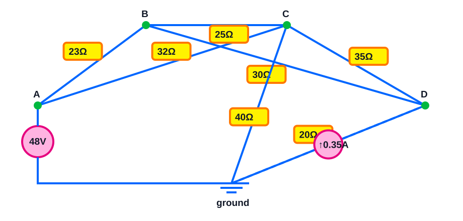

> [!tip] Interactive CircuitJS simulation
> Edit and run this circuit offline in Obsidian.

```circuitjs
$ 1 5.0E-6 0.005 63 10.0 62
r 70 250 220 80 0 23.0
r 70 250 430 80 0 32.0
r 220 80 430 80 0 25.0
r 220 80 580 250 0 30.0
r 430 80 580 250 0 35.0
r 580 250 325 410 0 20.0
r 430 80 325 410 0 40.0
v 325 410 70 250 0 0 40.0 48.0 0.0
g 325 410 325 438 0
i 325 410 580 250 0 0.35
x 58 234 88 234 0 24 A
x 208 64 238 64 0 24 B
x 418 64 448 64 0 24 C
x 568 234 598 234 0 24 D
x 313 394 343 394 0 24 GND
x 20 24 200 24 0 20 Interactive nodal-analysis circuit
```

Mixed three-node bridge with a $0.35\,\mathrm{A}$ current source from ground into D: solve nodal KCL for $V_B$, $V_C$, $V_D$. Then find B–C current, both source powers, and the total resistor power.

> [!answer]- Answer
> - $V_B=32.780\,\mathrm{V}$, $V_C=27.054\,\mathrm{V}$, $V_D=19.799\,\mathrm{V}$.
> - $I_{BC}=0.2290\,\mathrm{A}$ (B to C positive).
> - $P_{V_s}=-63.183\,\mathrm{W}$
> - $P_{I_s}=-6.930\,\mathrm{W}$
> - total resistor power $P_R=70.113\,\mathrm{W}$
> - check: $\sum P=0.00000\,\mathrm{W}\approx0$.

## Optional source library

These sources were used only to match the scope and difficulty. The note and its diagrams work offline.

- [All About Circuits — Ohm’s Law](https://www.allaboutcircuits.com/worksheets/ohms-law/)
- [All About Circuits — Series DC](https://www.allaboutcircuits.com/worksheets/series-dc-circuits/)
- [All About Circuits — Parallel DC](https://www.allaboutcircuits.com/worksheets/parallel-dc-circuits/)
- [All About Circuits — Kirchhoff’s Laws](https://www.allaboutcircuits.com/worksheets/kirchhoffs-laws/)
- [Fiore / LibreTexts circuit exercises](https://eng.libretexts.org/Bookshelves/Electrical_Engineering/Electronics/DC_Electrical_Circuit_Analysis_-_A_Practical_Approach_(Fiore)/05%3A_Series-Parallel_Resistive_Circuits/5.6%3A_Exercises)
